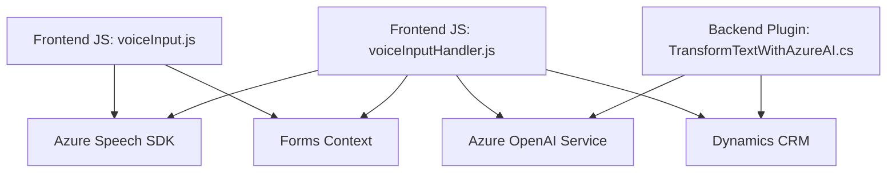

### Breve resumen técnico
Este repositorio parece estar enfocado en una solución que integra funciones avanzadas como entrada/salida de voz y soporte para inteligencia artificial (IA) con Microsoft Dynamics CRM. Incluye componentes frontend (JS), backend (.NET) y una clara integración con servicios externos como **Azure Speech SDK** y **Azure OpenAI**.

---

### Descripción de arquitectura
La arquitectura observada muestra una combinación de:
- **Frontend**: Componentes disponibles en JavaScript (readForm.js y speechForm.js) orientados a formularios dinámicos con interacción mediante entrada/salida de voz.
- **Backend/Plugins Dynamics**: Implementación de lógica personalizada en un plugin para Dynamics CRM utilizando servicios de Azure OpenAI para transformación de datos.
- **Integración modular**: Los componentes dependen de APIs externas y SDKs para realizar operaciones específicas, como el procesamiento y la generación de voz o respuestas automáticas.

El sistema combina principios de **arquitectura modular**, donde cada módulo tiene una responsabilidad clara, y **Service-Oriented Architecture (SOA)**, delegando a plataformas externas como Azure Speech SDK y Azure OpenAI.

---

### Tecnologías usadas
1. **Frontend**:
   - **JavaScript**: Para la manipulación de formularios y lógica cliente.
   - **Azure Speech SDK**: Entrada/salida de voz.
   - **HTML DOM**: Manipulación del DOM del navegador.
   
2. **Backend**:
   - **C# (.NET)**: Implementación del plugin.
   - **Dynamics CRM SDK**: Integración y manipulación de objetos Dynamics.
   - **Azure OpenAI Service**: Para generación de textos procesados con IA.

3. **Dependencias observadas**:
   - **Newtonsoft.Json** y **System.Net.Http**: Para manejar serialización y comunicación HTTP.
   - **Microsoft.Xrm.SDK**: Para manipular datos internos de Dynamics CRM.

---

### Diagrama Mermaid

---

### Conclusión final
La solución es una **aplicación híbrida** que combina interacción avanzada con formularios mediante entrada/salida de voz y funcionalidades extendidas soportadas por inteligencia artificial en Azure. Se integra dentro de la plataforma Microsoft Dynamics CRM y utiliza patrones conocidos como **modularidad**, **callbacks**, **asincronía** y **SOA** para conectar componentes distribuidos que interactúan con servicios externos como Azure Speech y Azure OpenAI.