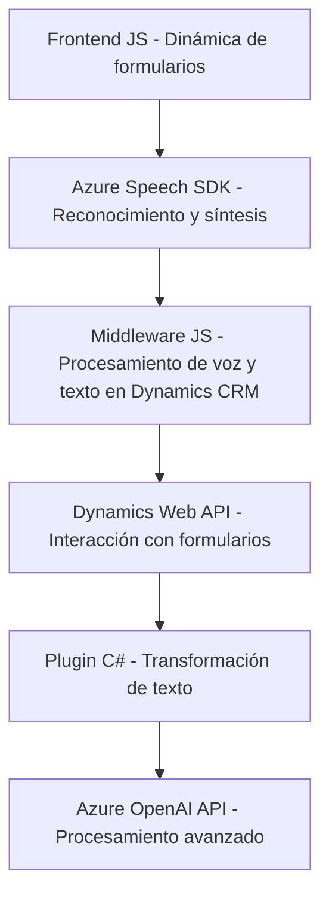

### Breve resumen técnico

El repositorio describe una solución que integra servicios de Dynamics 365 CRM con capacidades avanzadas de reconocimiento de voz, síntesis de voz y transformación de texto utilizando Azure Speech SDK y Azure OpenAI API. Los archivos presentados permiten capturar transcripciones habladas, procesar texto, interactuar con formularios dinámicos en CRM, y transformar datos según reglas predeterminadas.

---

### Descripción de arquitectura

La arquitectura parece ser de tipo **Modular con orientación a servicios, complementado con principios de arquitectura de Plugin** en Dynamics 365. Cada componente (frontend, reconocimiento de voz y backend CRM plugin) tienen responsabilidades específicas: 

1. **Frontend** (JS): Extrae datos del formulario en Dynamics 365 y sintetiza texto a voz usando Azure Speech SDK.
2. **Middleware para voz**: Manejo avanzado del reconocimiento de voz, interacción con APIs de Dynamics CRM, y procesamiento dinámico.
3. **Backend de Dynamics CRM**: Procesa texto transformándolo en estructuras JSON mediante el diseño de plugins y la API OpenAI.

---

### Tecnologías usadas

- **Frontend:**  
  - JavaScript para componentes del navegador.  
  - Azure Speech SDK para reconocimiento y síntesis de voz.  

- **Middleware (JS):**  
  - Dynamics 365 Web API (`Xrm.WebApi`) para manipulación de formularios.  
  - Azure Speech SDK para transcripción en tiempo real.  

- **Backend (c#):**  
  - Dynamically loaded plugins en Dynamics CRM.  
  - Azure OpenAI API para transformación de texto.  
  - Librerías estándar .NET (`System.Text.Json`, `Newtonsoft.Json.Linq`, `HttpClient`).

---

### Dependencias y componentes externos

1. **Dependencias externas:**
   - **Azure Speech SDK:** Reconocimiento y síntesis de voz.
   - **Azure OpenAI API:** Procesamiento avanzado de texto.
   - **Dynamics 365 CRM API (Web API y contextos):** Modificación/lectura de datos de formularios.
   - **Newtonsoft.Json:** Trabajar con objetos JSON en C#.

2. **Dependencias internas:**
   - Estructura de funciones que procesan datos del formulario en Dynamics 365 (`formContext`).
   - Plugin en C# para procesar texto dentro del contexto de Dynamics.

---

### Diagrama Mermaid válido para GitHub

---

### Conclusión final

La solución descrita se parece a una **arquitectura modular de servicios** donde cada parte tiene una responsabilidad clara (frontend, middleware, backend). Los archivos JS manejan interacciones con un contexto de formulario de Dynamics CRM y gestionan capacidades de voz/texto. Por otro lado, se complementa con un plugin en c# que aprovecha OpenAI para ampliar las capacidades de procesamiento, siguiendo el patrón típico de Dynamics Plugin Architecture.

Esta arquitectura es eficaz para integraciones en soluciones empresariales que requieran interacción avanzada con datos de voz, IA para transformación de texto, y manipulación dinámica de formularios CRM. Es una solución altamente extensible gracias a la modularidad y sus dependencias externas bien definidas.