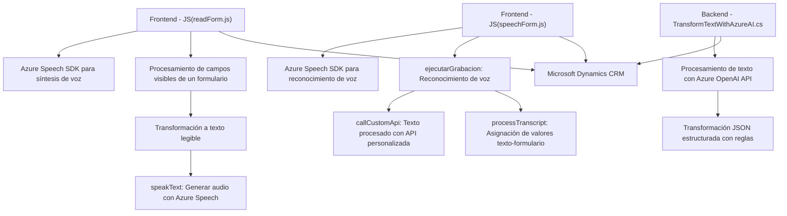

### Breve resumen técnico
El repositorio describe una solución que utiliza Azure Speech SDK y Azure OpenAI para integrar funcionalidades avanzadas de síntesis y reconocimiento de voz, junto con procesamiento de voz a texto y transformación semántica de texto en el contexto de Microsoft Dynamics 365 CRM.

---

### Descripción de arquitectura
**Tipo de solución:** La solución se centra en la integración de dos componentes principales:
1. *Frontend*: Funciones para el reconocimiento y síntesis de voz en formularios dinámicos.
2. *Backend (Plugins)*: Plugin para procesamiento de texto con Azure OpenAI en Dynamics CRM.

**Arquitectura predominante:**
- **Frontend** está implementado como una aplicación basada en scripts modularizada, con separación clara de responsabilidades.
- **Backend** utiliza una arquitectura de plugins en Dynamics CRM, que es orientada a eventos y patrones de inyección de dependencia.

La solución combina elementos de arquitectura **n capas** en el frontend y lógica basada en **API personalizada** en el backend, utilizando comunicación directa con servicios externos como Azure Speech SDK y Azure OpenAI.

---

### Tecnologías usadas
1. **Frontend**:
   - *JavaScript*: Para la lógica de reconocimiento de voz, síntesis de voz, y procesamiento de formularios.
   - *Azure Speech SDK*: Biblioteca principal para la interacción con servicios de voz (reconocimiento y síntesis).
   - *Microsoft Dynamics 365*: Modelo de datos del formulario para el contexto del CRM.

2. **Backend**:
   - *C# (Plugins para Dynamics CRM)*: Implementación de lógica bajo el framework CRM.
   - *Azure OpenAI API*: Transformación de texto según reglas predefinidas.
   - *Newtonsoft.Json*: Para el procesamiento de datos JSON.

**Patrones usados:**
- Patrón de fábrica: Inicialización dinámica del SDK de Azure Speech en el frontend.
- Event-driven architecture: Uso de eventos del formulario en Dynamics y flujos de proceso.
- Dependency Injection: Control de servicios en el plugin de C#.
- Adapter: Integración de servicios externos como Azure Speech y Azure OpenAI.

---

### Diagrama Mermaid válido para GitHub

---

### Conclusión final
El repositorio evidencia una solución completa que integra tecnologías avanzadas para el procesamiento de formularios mediante síntesis y reconocimiento de voz, y transformación semántica del texto utilizando inteligencia artificial. La arquitectura está bien diseñada para un ecosistema de CRM, proporcionando capacidades flexibles, escalables y extensibles.

Se utiliza una combinación de arquitectura basada en capas y lógica orientada a eventos que interactúan directamente con APIs clave como Azure Speech SDK y Azure OpenAI. Los patrones aplicados favorecen la modularidad y fácil mantenimiento a largo plazo.