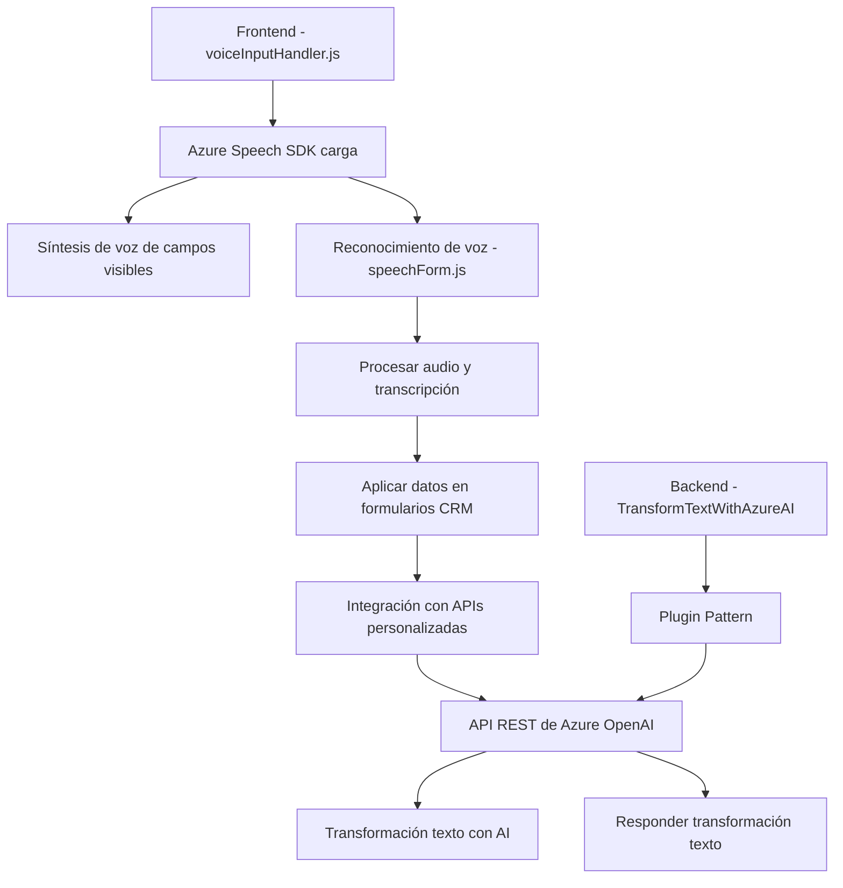

### Breve resumen técnico

El repositorio analiza una solución que implementa una integración avanzada entre Dynamics CRM y servicios de Microsoft Azure, como Azure Speech SDK y Azure OpenAI. Los archivos muestran funcionalidades en dos contextos: un **frontend** y un **plugin backend**, permitiendo convertir texto a voz, hacer reconocimiento de voz, modificar formularios dinámicos mediante el procesamiento de datos y transformar texto usando servicios de inteligencia artificial.

---

### Descripción de arquitectura

La solución global tiene una arquitectura híbrida basada en eventos. Desde el frontend, los formularios existentes del Dynamics CRM son extendidos mediante scripts en JavaScript que integran directamente el **Azure Speech SDK** para tareas de síntesis de voz y reconocimiento de voz en un modelo de arquitectura orientado a eventos. 

En el backend, se implementa un **plugin pattern** utilizando la funcionalidad nativa de Dynamics CRM (`IPlugin`). Este plugin conecta el entorno Dynamics CRM con el servicio **Azure OpenAI** para utilizar capacidades de inteligencia artificial y realizar transformaciones avanzadas de texto. El diseño del backend busca ser ejercicio y extensible, gracias a su modularidad y uso de integración con servicios REST.

La arquitectura combinada se clasifica como **Microkernel**. Dynamics CRM opera como un núcleo que se puede extender mediante plugins y scripts. El componente frontend extiende la experiencia del usuario directamente en el CRM, y el plugin backend expone capacidades de servicio avanzadas como integración de inteligencia artificial.

---

### Tecnologías y frameworks

1. **Frontend:**
   - **JavaScript:** Para implementar extensiones y lógica de procesamiento en el cliente.
   - **Azure Speech SDK:** Utilizado para síntesis de texto a voz y reconocimiento de voz.
   - **Dynamics CRM JavaScript API:** Manipulación de formularios en Dynamics 365 (`executionContext`, `formContext.data.entity.attributes`).

2. **Backend:**
   - **Dynamics CRM SDK** (`IPlugin`, `Microsoft.Xrm.Sdk`): Extensión personalizada del flujo del CRM.
   - **C# (.NET Framework):** Base para el desarrollo de plugins dentro de Dynamics CRM.
   - **Azure OpenAI REST API:** Servicio de IA proporcionado por Azure para procesar texto.
   - **Newtonsoft.JSON + System.Text.Json:** Para operaciones de serialización y deserialización JSON.
   - **HTTP Client:** Para comunicación REST con servicios externos.

3. **Operational Patterns:**
   - **Event-Driven Programming:** Código basado en eventos en el frontend usando callbacks.
   - **Dependency Injection:** Uso del contexto de ejecución como dependencia en las funciones.
   - **Dynamic Loaders:** Carga dinámica de SDKs y componentes en el frontend.
   - **Microservice-Like Endpoint:** Los plugins en el backend actúan como servicios que implementan lógicas específicas.

---

### Dependencias externas y componentes

1. Azure Speech SDK:
   - Necesario para las funciones de síntesis de voz y reconocimiento en el frontend.
   - Permite comunicación con los servicios Speech de Azure para procesamiento de voz.

2. Dynamics CRM APIs:
   - Para interacción y manipulación de datos en formularios: `executionContext`, `Xrm.WebApi`.

3. Azure OpenAI:
   - Utilizado desde el backend plugin para transformar texto utilizando inteligencia artificial.

---

### Diagrama Mermaid válido para GitHub

---

### Conclusión final

La solución combina un **frontend con JavaScript** y un **plugin backend en C#** para ofrecer una experiencia integrada de síntesis y reconocimiento de voz, así como procesamiento de datos mediante inteligencia artificial en formularios de Dynamics CRM. La arquitectura se alinea con un patrón **microkernel**, con Dynamics CRM como núcleo y servicios externos dinámicos (Azure Speech y Azure OpenAI) que amplían las capacidades del sistema. 

Sin embargo, sería prudente reforzar la seguridad alrededor del manejo de credenciales en el plugin, como la integración de un servicio de configuración segura o el uso de managed identities en Azure. El sistema demuestra un diseño modular, que facilita futuras expansiones.