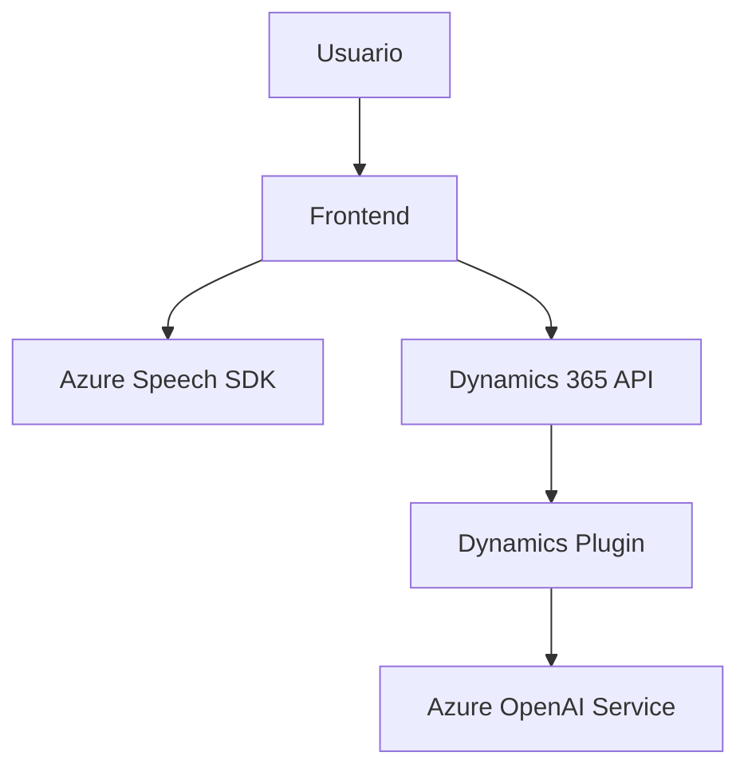

### Breve resumen técnico

El repositorio contiene tres archivos principales relacionados con la integración de tecnologías como Azure Speech SDK y Dynamics 365. El propósito general es implementar funcionalidades de procesamiento de voz y manipulación de formularios en un frontend, así como un backend (plugin en Dynamics) que interactúe con Azure OpenAI para transformar texto según reglas específicas.

---

### **Descripción de arquitectura**

1. **Tipo de solución:**  
   - **Frontend**: Implementa acciones en el cliente para procesar la entrada y salida de voz mediante Azure Speech SDK, además de manejar formularios de Dynamics 365.  
   - **Backend**: Un plugin de Dynamics 365 que actúa como middleware y procesador de texto mediante servicios de Azure OpenAI.  

2. **Arquitectura utilizada:**  
   - **Frontend:** Modular y client-side con patrones de separación por funciones específicas. Es una **arquitectura en capas lógica** para manejar las preocupaciones del cliente: manipulación de formularios, interacción con APIs externas y procesamiento local.  
   - **Backend (Dynamics plugin):** Implementa un patrón de arquitectura por **event-driven design** dentro de Dynamics 365, funcionalidad extendida en forma de plugin. La lógica está acoplada a Dynamics y opera basado en eventos de ejecución.  

---

### **Tecnologías, frameworks y patrones usados**

1. **Frontend:**
   - **Tecnología:** JavaScript.
   - **Frameworks/Librerías:** Azure Speech SDK.
   - **Patrones:**
     - Modularidad: Clases y funciones están separadas en diferentes archivos y se adhieren a SRP (Single Responsibility Principle).
     - Carga diferida: SDKs (como Azure Speech) son descargados y cargados dinámicamente según la necesidad, optimizando el desempeño.
     - Servicios externos (APIs): Integración directa con APIs de Dynamics CRM (callCustomApi) y Azure Speech SDK.

2. **Backend:**
   - **Tecnología:** C#.
   - **Frameworks/Librerías:** 
     - Dynamics CRM SDK.
     - Newtonsoft Json.NET.
     - Azure OpenAI services con el modelo "GPT-4o".
   - **Patrones:**
     - Plugin Architecture: Extiende la funcionalidad de Dynamics 365 mediante la interfaz `IPlugin`.
     - Separación de responsabilidades: Métodos están organizados de forma que cada función cumple con una tarea específica relacionada con el procesamiento de texto y la integración con OpenAI.
     - Delegador: El procesamiento de la respuesta del servicio OpenAI es gestionado por un método especializado (`GetOpenAIResponse`).

---

### **Dependencias o componentes externos**

1. **Azure Speech SDK**  
   - Permite convertir texto en voz dinámica y ejecutar procesamiento de reconocimiento de voz en el cliente.
   - Información relacionada:
     - URL de carga: `https://aka.ms/csspeech/jsbrowserpackageraw`.
     - Región y clave de suscripción (`azureKey`, `azureRegion`) necesarias para su uso.

2. **Microsoft Dynamics 365 SDK**  
   - Contextos de formularios (`formContext`).
   - APIs personalizadas para manipular datos (como `callCustomApi`).

3. **Azure OpenAI (GPT-4o)**  
   - Servicio de procesamiento de texto con entrada basada en reglas.
   - Conexión basada en `HttpClient` (C#) para enviar solicitudes POST con una clave de autenticación.

4. **Librerías complementarias en .NET**  
   - `Newtonsoft.Json` y `System.Text.Json`: Serialización y deserialización del JSON.
   - `System.Net.Http`: Envío de solicitudes HTTP.
   - Expresiones regulares (`System.Text.RegularExpressions`) para validación de texto.

---

### **Diagrama Mermaid**

---

### **Conclusión final**

La solución combina un enfoque **frontend modulado** para procesar entradas y salidas de datos basados en formularios en Dynamics 365 con Azure Speech SDK y un **backend plugin** que facilita la transformación de texto utilizando Azure OpenAI. La arquitectura en el cliente está diseñada para ser eficiente, modular y adherente a principios de diseño limpio como el SRP y la carga diferida. Por otro lado, el plugin en el backend implementa un diseño orientado a eventos, respondiendo a las ejecuciones en Dynamics 365 con integración directa a servicios de inteligencia artificial.

Aunque la solución está bien modularizada, la seguridad debería ser revisada, ya que las claves como la de Azure Speech SDK se cargan directamente desde la fuente externa y las claves de acceso a Azure OpenAI podrían estar expuestas si no se configuran adecuadamente. Es recomendable externalizar dichas credenciales a servicios gestionados de secreto como Azure Key Vault.