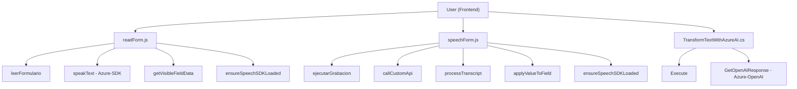

### Breve resumen técnico:
El repositorio contiene tres archivos principales relacionados con la interacción entre formularios de Dynamics CRM, reconocimiento de voz (front-end con Azure Speech SDK), y un backend/plugin que realiza transformaciones de texto utilizando Azure OpenAI. Estas funcionalidades interconectadas permiten una experiencia dinámica de reconocimiento e integración de voz, así como análisis avanzado de texto en un entorno CRM.

---

### Descripción de arquitectura:
La solución implementa arquitectura **orientada a servicios (SOA)** basada en una estructura híbrida:
1. **Frontend**: Consiste en archivos JavaScript para la interacción con usuarios. Utiliza Azure Speech SDK para síntesis y reconocimiento de voz.
2. **Plugin Backend**: Implementa un plugin de Dynamics CRM para transformar texto y realizar integración con Azure OpenAI.
3. **Event-driven**: Usa asincronía y callbacks para coordinar cargas dinámicas y procesamiento de datos en tiempo real.
4. **Microintegración**: El sistema interactúa con múltiples APIs (Azure Speech, Azure OpenAI).

La arquitectura general es de tipo **n capas**, donde cada módulo tiene responsabilidades específicas: front-end, lógica del plugin en el backend, y servicios externos.

---

### Tecnologías usadas:
1. **Frontend (JavaScript)**:
   - **Azure Speech SDK**: Reconocimiento y síntesis de voz.
   - **Browser APIs**: Dinámico manejo de scripts y DOM.
   - **Microsoft Dynamics CRM SDK (`Xrm.WebApi`)**: Manipulación de datos y formularios desde JS.

2. **Backend (C# Plugin)**:
   - **Microsoft Dynamics CRM Plugin SDK**: Extensión del entorno CRM.
   - **Azure OpenAI API**: Procesamiento avanzado de texto.

3. **Infraestructura**: Integración con servicios de Azure (Speech SDK, OpenAI).

---

### Diagrama validado (Mermaid):

---

### Conclusión final:
Este repositorio implementa una **modular solución para CRM systems** basada en voz e inteligencia artificial. La arquitectura es una combinación de front-end interactivo, integraciones API externas con Azure Speech SDK y OpenAI, y un backend fuertemente integrado con Dynamics CRM. Gracias a la modularidad y desacoplamiento en cada capa, la solución es extensible y permite adaptarse fácilmente a requisitos adicionales, manteniendo una estructura de arquitectura escalable y bien definida.