### Breve Resumen Técnico

El repositorio involucra un sistema que se integra con Microsoft Dynamics CRM y utiliza tecnologías de reconocimiento y síntesis de voz (Azure Speech SDK) junto con procesamiento de datos mediante Azure OpenAI. Se compone de dos módulos principales:

1. **Frontend (JavaScript)**: Scripts para la captura de datos desde el usuario, síntesis y reconocimiento de voz, y actualización de formularios dinámicos en tiempo real.
2. **Plugin (C#)**: Una implementación backend que toma texto como entrada, lo transforma utilizando las capacidades de Azure AI y devuelve el resultado estructurado en JSON.

---

### Descripción de Arquitectura

La solución tiene una **arquitectura híbrida basada en n capas**:
- **Frontend capa**: Aborda interacción con el usuario (captura, síntesis y reconocimiento de voz) y mapeo dinámico de datos para formularios, utilizando JavaScript.
- **Backend capa**: Contiene una integración como plugin en Microsoft Dynamics CRM que conecta con Azure OpenAI para el procesamiento avanzado de datos.

Este diseño externaliza funciones clave a servicios de terceros (Azure Speech SDK, Azure OpenAI API), lo que lo hace escalable y modular. Además, se basa en la división de responsabilidades (procesamiento en el front-end y backend).

---

### Tecnologías Usadas
1. **Frontend**:
   - **Core Language**: JavaScript.
   - **Framework/Library**:
     - **Azure Speech SDK**: Reconocimiento y síntesis de voz.
     - **CRM SDK**: Funcionalidades específicas del entorno Dynamics CRM.
   - **Patrones**:
     - Modularization: Cada función maneja una responsabilidad específica (reconocimiento, síntesis, mapeo de datos).
     - Callback Pattern: Asegura la carga de SDK y ejecuta funciones específicas posteriormente.
     - Client-event driven: Adopta programación basada en eventos para operaciones asincrónicas.

2. **Backend (Dynamics CRM Plugin)**:
   - **Core Language**: C# (.NET Framework).
   - **Frameworks/Technology**:
     - **Microsoft Dynamics CRM SDK**: Interacción con CRM para extracción/formateo de datos.
     - **Azure OpenAI mediante HTTP Client**: Conexión con el servicio de inteligencia artificial para transformación de datos.
     - **Newtonsoft.Json y System.Text.Json**: Manejo y manipulación de JSON.
     - **RESTful APIs**: Para llamadas a APIs externas.
   - **Patrones**:
     - Plugin Pattern: Implementación como plugin dedicado para extender la funcionalidad de Dynamics CRM.
     - Service Integration: Consumo de API externas que desacoplan procesamiento avanzado.

---

### Diagrama Mermaid Válido para GitHub

```mermaid
graph TD
    B["Frontend-JS-readForm"] --> C["VoiceInputHandler.js"]
    C --> D["Función - startVoiceInput"]
    C --> E["Función - leerFormulario"]
    C --> F["Función - getVisibleFieldData"]
    C --> G["Dependencia - Azure Speech SDK"]
    
    B --> H["Frontend-JS-speechForm"]
    H --> I["Función - processTranscriptIA"]
    H --> J["Función - processTranscript"]
    H --> K["Dependencia - Azure Speech SDK"]
    H --> L["Dependencia - Microsoft CRM-SDK"]
    H --> M["Dependencia - Azure Custom API"]
    
    A["Plugins"] --> N["TransformTextWithAzureAI.cs"]
    N --> Q["Función - Execute(IServiceProvider)"]
    N --> R["Función - GetOpenAIResponse"]
    N --> S["Dependencia - Microsoft Dynamics CRM"]
    N --> T["Dependencia - Azure OpenAI API"]
    N --> U["Dependencia - Newtonsoft & System.Text.Json"]
```

---

### Conclusión Final

La solución implementa prácticas modernas de arquitectura de software enfocadas en la modularidad y en la externalización de servicios. La estructura permite un flujo eficiente de entrada de voz desde el frontend con integración y validación de datos dinámicos, complementado por un backend que procesa texto utilizando inteligencia artificial. La arquitectura basada en n capas asegura un diseño limpio y escalable, mientras que la elección de tecnologías actuales como Azure Speech SDK y OpenAI destaca su capacidad para abordar casos de uso avanzados.

Entre las dependencias importantes, se destacan servicios especializados como Azure Speech SDK y OpenAI API, proporcionando capacidades de síntesis y procesamiento avanzadas que amplían la funcionalidad estándar del sistema CRM.