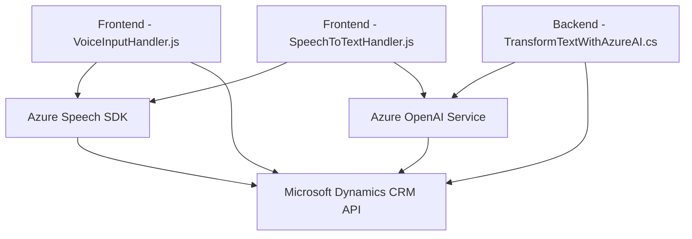

### Breve Resumen Técnico
El repositorio presentado incluye varios componentes: módulos frontend basados en JavaScript, que integran APIs externas (específicamente Azure Speech SDK), y un plugin backend escrito en C# para Microsoft Dynamics CRM que utiliza Azure OpenAI para transformar texto en formatos estructurados. Este sistema parece diseñado para una solución destinada a formularios dinámicos, permitiendo entrada por voz, síntesis de voz, reconocimiento de voz, y procesamiento de texto.

---

### Descripción de la Arquitectura
La solución combina una arquitectura **multicapa** para facilitar la interacción entre usuarios y los servicios externos, integrada tanto en el frontend como en el backend:
1. **Frontend**:
   - Contiene módulos de UI para capturar datos (por voz) y sintetizar texto en voz a través de Azure Speech SDK.
   - Se centra en operaciones del cliente con integración directa de APIs de Azure y DOM manipulación.

2. **Backend (Plugin)**:
   - Implementa transformación de datos con Azure OpenAI a través del modelo GPT-4.
   - Extiende funcionalidades de Microsoft Dynamics CRM mediante el patrón **Plugin-based extensibility**.

En conjunto, esto forma una arquitectura **cliente-servidor** propensa a expandirse hacia **microservicios**, dado el uso segmentado de APIs y lógica en módulos independientes. Sin embargo, por ahora parece más cercano a una arquitectura **multicapa** debido al dominio de CRM con lógica definida en plugins.

---

### Tecnologías Usadas
1. **Frontend**:
   - **JavaScript**, con programación funcional y estructuras modulares.
   - **Azure Speech SDK**, cargado dinámicamente para síntesis y reconocimiento de voz.
   - **HTML DOM API** para manipulación de formularios y datos.

2. **Backend**:
   - **C#**, con integración a **Microsoft Dynamics CRM SDK**.
   - **Azure OpenAI Service**, usando GPT-4 para procesamiento avanzado de texto.
   - **Newtonsoft.Json**, para parseo de objetos JSON.

3. **APIs**:
   - Azure Speech SDK para voz.
   - Azure OpenAI para transformación inteligente de texto.
   - Microsoft Dynamics Web API para manipulación de datos en el sistema CRM.

### Dependencias o Componentes Externos
- **Azure Speech SDK**: para síntesis de voz, y reconocimiento de texto desde audio.
- **Azure OpenAI Service**: para procesamiento de texto con GPT.
- **Microsoft Dynamics Web API**: para la integración y manipulación de datos del formulario dinámico.
- **Newtonsoft.Json**: para convertir datos entre objetos JSON y clases de C#.
- **Microsoft Dynamics CRM SDK**: para interacción con el sistema CRM como parte del flujo general.

---

### Diagrama Mermaid válido para GitHub

---

### Conclusión Final
Este repositorio se centra en integrar tecnologías modernas para formularios dinámicos avanzados, mostrando una fuerte dependencia en servicios en la nube como Azure (Speech y OpenAI) y Dynamics CRM. La arquitectura, aunque aún categorizada como multicapa, está diseñada modularmente, lo que facilita escalabilidad hacia microservicios en un entorno empresarial.

Las tecnologías seleccionadas son adecuadas para proporcionar funciones como síntesis, reconocimiento de voz, e interpretación avanzada de texto estructurado. Aunque la solución se encuentra muy integrada con Microsoft Dynamics CRM, el diseño modular del código permite que los componentes sean reutilizables para otros sistemas basados en servicios de Azure.