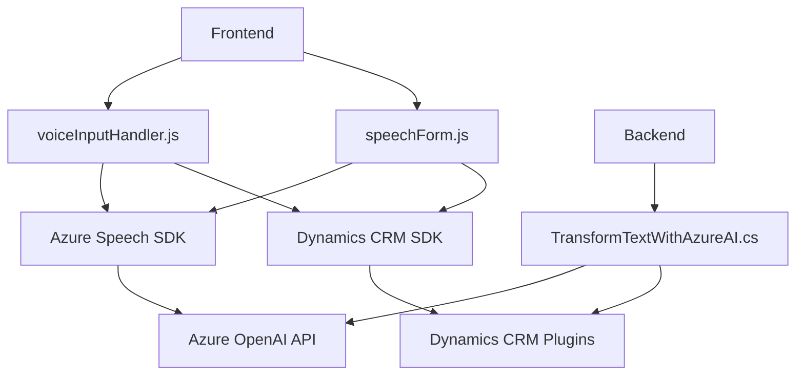

### Breve resumen técnico:
Los archivos presentados en el repositorio están diseñados para manejar funcionalidades relacionadas con el procesamiento de voz y texto, principalmente integrando servicios de Azure Speech SDK y OpenAI API dentro de un entorno Dynamics CRM. Estas soluciones apuntan a mejorar la interacción entre los usuarios y formularios, facilitando la entrada de datos mediante comandos de voz y la generación y transformación de texto mediante inteligencia artificial.

---

### Descripción de arquitectura:
La solución sigue una arquitectura híbrida que combina componentes propios de la arquitectura orientada a servicios (Service-Oriented Architecture - SOA) con elementos de arquitectura modular. Adicionalmente, en los archivos de procesamiento de voz y texto, se observa el uso de patrones de diseño como la arquitectura dirigida por eventos y API Gateway. La presencia de procesamiento separado para IA y manual indica la implementación del patrón de estrategia.

---

### Tecnologías y dependencias:
1. **Frontend (JavaScript)**:
   - **Azure Speech SDK**: Para síntesis y reconocimiento de voz.
   - **Dynamics CRM SDK** (`Xrm.WebApi`): Para interacción funcional con formularios y llamadas a APIs personalizadas en el sistema CRM.
   - **JavaScript**: Utilizado para el manejo de eventos, transformaciones de datos y ejecución de lógica en el navegador.

2. **Backend (.NET/C#)**:
   - **Dynamics CRM Plugins**: Extensiones personalizadas integradas en la arquitectura CRM.
   - **Azure OpenAI API**: Llamadas REST para transformar texto basado en inteligencia artificial.
   - **Newtonsoft.Json.Linq**: Procesamiento de JSON.
   - **System.Net.Http**: Para solicitudes HTTP.
   - **Service-Oriented Communication**: Diseño vinculado con servicios de Azure.

3. **Patrones identificados**:
   - **Event-driven Architecture**: Uso de funciones disparadas por eventos (e.g., inicio de transcripción de voz en formularios).
   - **API Gateway**: Encapsula la lógica de integración con APIs externas, reduciendo la dependencia directa de tecnologías específicas.
   - **Strategy Pattern**: Procesamiento por IA y manual, que separa las estrategias para modificar el texto.
   - **SDK Initialization**: Carga dinámica del Speech SDK garantiza la modularidad y evita dependencias previas.
   - **SOA**: Destacada en el plugin que actúa como intermediario con OpenAI.

---

### Diagrama Mermaid (compatible con GitHub Markdown):

---

### Conclusión final:
La solución combina procesamiento de voz, manipulación de formularios y transformación de texto mediante inteligencia artificial, integrando diferentes servicios externos como Azure Speech SDK y OpenAI API con componentes de Dynamics CRM. Su arquitectura modular y dirigida por eventos permite adaptabilidad y escalabilidad, mientras que su integración con SDKs y servicios externos resalta una dependencia sustancial en plataformas de terceros. Se recomienda optimizar el manejo de errores y expandir la capacidad de pruebas unitarias y de integración para garantizar escalabilidad e integridad operacional completa mientras se minimizan fallos en las dependencias externas.