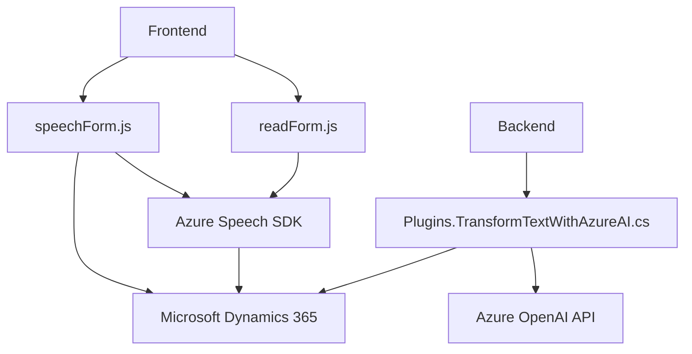

### Resumen técnico
Los archivos analizados pertenecen a una solución que integra servicios de Azure como el Speech SDK y OpenAI API con Microsoft Dynamics CRM. La funcionalidad principal está orientada a la interacción vía reconocimiento de voz y síntesis de texto a audio, además de incluir un plugin para transformación de texto en JSON estructurado mediante Azure OpenAI. La arquitectura está decididamente orientada hacia el uso de servicios externos (SaaS) y la modularización de funciones para interacción con formularios y APIs.

---

### Descripción de arquitectura
1. **Tipo de solución:** La solución implementa funcionalidades tanto del lado del ***frontend*** como del ***backend***:
   - Los archivos Javascript (`readForm.js` y `speechForm.js`) definen un ***frontend*** que interactúa con los formularios de Dynamics 365.
   - El archivo C# (`TransformTextWithAzureAI.cs`) implementa un ***plugin backend*** que extiende la funcionalidad de Dynamics CRM.

2. **Arquitectura:**
   - **Monolito acoplado a SaaS.** La solución se conecta directamente con servicios externos (Azure Speech SDK y Azure OpenAI API) en combinación con Dynamics 365 CRM. Está organizado en módulos/funciones y un plugin específico conectado con Dynamics CRM.
   - Utiliza una **arquitectura de capas** donde el backend (plugin en C#) realiza transformaciones de datos con la API Azure OpenAI, mientras que el frontend gestiona la interfaz de usuario y reconoce y sintetiza datos mediante servicios externos (Azure Speech SDK).

---

### Tecnologías, frameworks y patrones usados
#### Tecnologías:
- **Frontend**:
  - Javascript para lógica y manipulación de formularios.
  - Azure Speech SDK para reconocimiento y síntesis de voz en frontend.
  - Dynamics 365 APIs: Interacción con el CRM y operaciones en formularios.

- **Backend**:
  - C# para el desarrollo del plugin sobre Dynamics CRM.
  - .NET Framework y Dynamics SDK (`Microsoft.Xrm.Sdk`).
  - JSON librerías: `System.Text.Json` y `Newtonsoft.Json.Linq`.
  - Azure OpenAI API (GPT-based models) para procesamiento de lenguaje natural.

#### Patrones:
1. **Modularidad:** Las funciones dividen roles específicos y colaboran para llevar a cabo el flujo general del programa.
2. **Plugin Architecture:** En el backend, se utiliza un modelo plugin para extender la funcionalidad de Dynamics CRM.
3. **External Service Integration:** La solución se basa en APIs externas (Azure Speech SDK y OpenAI) para realizar tareas especializadas.
4. **Event-driven programming:** En el frontend, se utiliza el `executionContext` y el flujo de eventos basados en los formularios y dinámicas del sistema Dynamics 365.

---

### Dependencias o componentes externos presentes
1. **Azure Speech SDK**: Utilizado en el frontend para reconocimiento de voz y síntesis de texto a voz.
2. **Azure OpenAI API**: En el backend para transformar texto en estructuras JSON.
3. **Dynamics 365 CRM SDK & APIs**:
   - Integración profunda para manipulación de datos de los formularios de CRM.
4. **JavaScript libraries** (pueden estar presentes):
   - Utilizadas junto con el Speech SDK y operaciones asíncronas.
5. **HTTP Clients en C#**:
   - Realización de solicitudes REST hacia APIs externas.

---

### Diagrama Mermaid válido para GitHub

---

### Conclusión final
La solución combina el procesamiento de voz y texto mediante servicios externos como Azure Speech SDK y Azure OpenAI. La integración está estrechamente vinculada a Microsoft Dynamics CRM, lo que sugiere que está diseñada para enriquecer la experiencia y funcionalidad del CRM en sistemas empresariales. Utiliza una arquitectura basada en capas y modularidad, con un enfoque claro en servicios SaaS externos para realizar tareas especializadas como generación de audio y transformación de texto. Es apta para entornos empresariales que requieren operaciones en tiempo real y automatización inteligente en formularios.