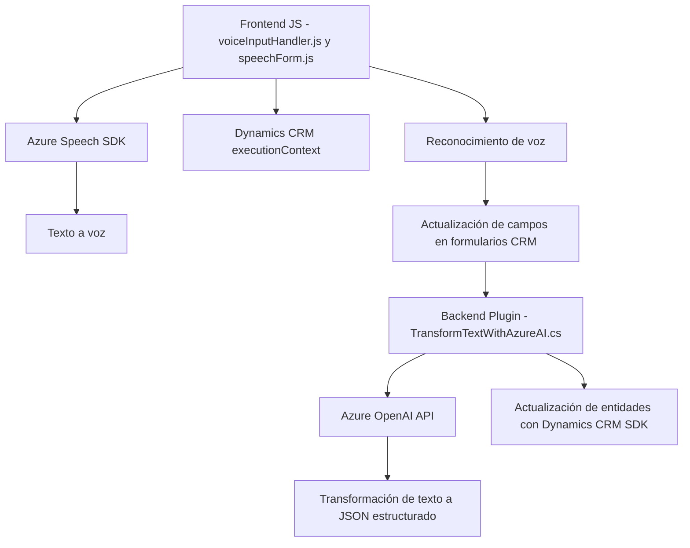

### Breve resumen técnico
El repositorio contiene tres archivos que forman parte de una solución orientada a integrar capacidades de voz y transformación de texto dentro de un entorno CRM (Dynamics CRM). Combina funcionalidades frontend (procesamiento de formularios y reconocimiento de voz) con procesamiento avanzado de texto vía inteligencia artificial utilizando servicios de Azure. 

---

### Descripción de arquitectura

1. **Tipo de solución**:
   - Solución híbrida: Combina un frontend JavaScript para interacción de usuario y un plugin .NET para lógica de negocio avanzada sobre Dynamics CRM.
   - Incluye interacción con servicios externos como Azure Speech SDK y Azure OpenAI.

2. **Arquitectura**:
   - **Distribuida n capas**:
     - **Frontend**: Procesa datos visuales y entrada de voz en tiempo real utilizando JavaScript.
     - **Backend/plugin**: Realiza transformaciones avanzadas de texto y se ejecuta como parte de la lógica de negocio en Dynamics CRM.
   - **Desacoplamiento mediante SDK/API**: Los componentes dependen fuertemente de servicios externos (Azure Speech SDK y Azure OpenAI) para funcionalidades clave.
   - Patrones observados:
     - **Modularización**: Código segmentado por características específicas (lectura, síntesis, actualización).
     - **Callback/Promesas asincrónicas**: Manejo de eventos dinámicos y lógica de espera en el frontend.
     - **Extensibilidad de CRM**: Uso de Dynamics plugins para personalización.

---

### Tecnologías y frameworks usados

1. **Frontend**:
   - **JavaScript vanilla** para lógica dentro del navegador.
   - **Azure Speech SDK**: Texto a voz y reconocimiento de voz.
   - **Dynamics CRM SDK**: Interacción con formularios y entidades contextuales (`executionContext`).

2. **Backend/plugin**:
   - **C# (.NET Framework)**: Lógica empresarial dentro de Dynamics CRM.
   - **Microsoft.Xrm.Sdk**: Interacción con Dynamics CRM SDK para obtener y manipular entidades.
   - **Azure OpenAI API**: Transformación de texto usando servicios externos.
   - **Newtonsoft.Json** y **System.Net.Http**: Serialización JSON y llamadas HTTP.

3. **Servicios externos**:
   - **Azure Speech SDK** (frontend): Reconocimiento de voz y texto a voz.
   - **Azure OpenAI** (backend): Procesamiento avanzado de texto.

---

### Dependencias y componentes externos

1. Dependencias internas:
   - `executionContext` y `formContext` (Dynamics CRM SDK): Definición del estado y estructura de formularios en tiempo de ejecución.
   - Utilidades JavaScript y C# específicas para serialización, validación y búsqueda contextual.

2. Dependencias externas:
   - Azure Speech SDK (`https://aka.ms/csspeech/jsbrowserpackageraw`): Reconocimiento de voz y síntesis de texto a voz.
   - Azure OpenAI API (`https://openai-netcore.openai.azure.com/`): Envío de texto y retorno de JSON estructurado como parte de transformaciones IA.
   - Dynamics CRM API (`Xrm.WebApi.online`): Actualización y consulta de datos.

---

### Diagrama **Mermaid** (100% compatible con GitHub Markdown)

---

### Conclusión final

Este repositorio corresponde a una solución que conecta interfaces de usuario dinámicas (frontend) con un backend empresarial en Dynamics CRM mediante una arquitectura distribuida de capas. Utiliza servicios avanzados de Azure (Speech y OpenAI) integrados con SDKs específicos para manipulación de datos en tiempo real. Su diseño modular y extensible lo adapta bien a escenarios de personalización de CRM que involucran reconocimiento de voz y transformación de texto por inteligencia artificial.