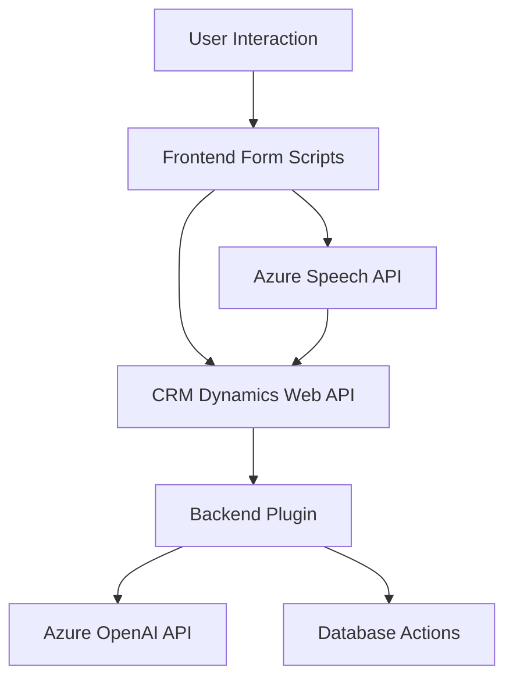

### Breve resumen técnico:
El repositorio parece estar diseñado para implementar una solución que combina **interacción por voz y texto** con un sistema CRM (Dynamics 365). Consta de módulos frontend en JavaScript para la síntesis y reconocimiento de voz usando Azure Speech SDK, junto con un plugin backend en C# que utiliza **Azure OpenAI** para transformar texto en estructuras JSON para operaciones adicionales en Dynamics 365.

---

### Descripción de la arquitectura:
La arquitectura está diseñada bajo un paradigma de **n capas**, donde cada capa tiene una separación de responsabilidades específica:

1. **Capa de presentación (frontend):** 
   - Implementada en JavaScript, interactúa directamente con el usuario a través de los formularios de Dynamics. Incluye manipulación e integración de la síntesis de voz y reconocimiento por voz.
   - Se integra con Azure Speech API para llevar a cabo tareas como sintetizar texto o convertir voz a texto.

2. **Capa lógica de negocio (backend plugin):**
   - Implementada en C# como un plugin de Dynamics CRM.
   - Realiza una integración directa con **Azure OpenAI** para transformar texto y realiza operaciones en los datos estructurados obtenidos.

3. **Servicios externos:**
   - API de Azure Speech para la síntesis y reconocimiento de voz.
   - **Azure OpenAI API** para la transformación automatizada del texto.
   - **Dynamics CRM Web API** para la interacción y procesamiento de datos en el sistema CRM.

---

### Tecnologías usadas:
1. **Frontend:**
   - **JavaScript:** Lenguaje principal para la funcionalidad en la capa de presentación.
   - **Azure Speech SDK:** Para tareas relacionadas con voz, como síntesis y reconocimiento.
   - **Dynamics 365 Web API:** Para operaciones directas en los datos del sistema CRM.

2. **Backend (plugin):**
   - **C#:** Lenguaje empleado para la lógica de negocio en el sistema Dynamics CRM.
   - **Microsoft.Xrm.Sdk:** Framework oficial para desarrollo de extensiones en Dynamics CRM.
   - **Azure OpenAI (GPT-4 API):** Utilizado para transformar texto en JSON estructurado conforme a normas específicas.
   - **Newtonsoft.Json:** Librería para manipular JSON.

---

### Diagrama Mermaid válido para GitHub:

- **Explicación del Diagrama:**
  - El usuario interactúa con formularios de Dynamics.
  - En el frontend, los scripts manejan la lectura de datos del formulario y envían solicitudes a Azure Speech API para síntesis o reconocimiento de voz.
  - El backend (plugin) en C# interactúa con Dynamics Web API, realiza operaciones necesarias y envía solicitudes de transformación de texto a la API de Azure OpenAI.
  - Los datos transformados se guardan o actualizan a través de operaciones en la base de datos del sistema CRM.

---

### Conclusión final:
La solución es una integración avanzada entre la capa de presentación dinámica (usando JavaScript con Azure Speech SDK) y la lógica del negocio (plugin en C# utilizando Azure OpenAI). Sigue el paradigma de **n capas** con integración de servicios externos clave. El diseño modular y el uso de patrones como el de carga dinámica, desacoplamiento y la aplicación de dependencias externas aseguran que la solución sea escalable y flexible.