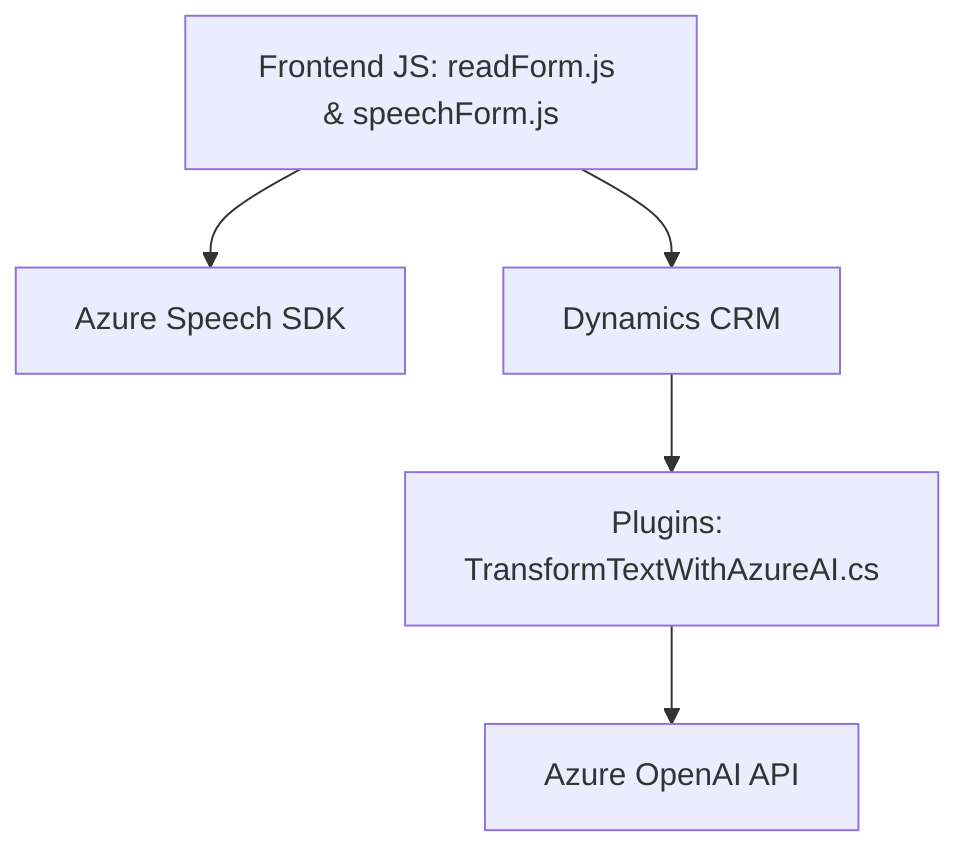

### Breve resumen técnico
El repositorio parece contener la implementación de un sistema orientado a la interacción por voz con formularios, utilizando servicios de Azure Speech SDK y Azure OpenAI. Se compone principalmente de:
1. **JavaScript archivos Frontend** para manejar y procesar voz desde un formulario en Dynamics 365.
2. **Plugin en C#** para interactuar con Azure OpenAI y transformar texto de acuerdo con reglas específicas.

---

### Descripción de arquitectura
Este sistema tiene una arquitectura híbrida:
1. **Front-end (Eventos de voz en el navegador)**: Recoge datos del formulario y sintetiza texto en voz. Procesa estas interacciones asíncronamente usando JavaScript y Azure Speech SDK.
2. **Back-end (Plug-in basado en Dynamics CRM)**: Utiliza un diseño basado en un plugin para transformar texto con Azure OpenAI, aprovechando el Dynamics CRM SDK y servicios web RESTful.

La solución sigue una **arquitectura por capas (n-capas)** combinada con **microservicios**. Los módulos están organizados por:
1. **Presentación (Frontend)**: Interacción con usuarios y procesamiento del contexto del formulario.
2. **Lógica de negocio (Backend)**: Ejecución de reglas transformadoras mediante Azure AI en Dynamics CRM.
3. **Integración con servicios externos**: Para voz y transformación avanzada de texto.

---

### Tecnologías usadas
1. **JavaScript y Azure Speech SDK**: Para captura, procesamiento y síntesis de voz.
2. **Dynamics CRM SDK**: Para manipulación de formularios y registros dinámicos en un sistema CRM.
3. **Azure OpenAI y REST APIs**: Para procesamiento y transformación avanzada de texto.
4. **C# (Plugin)**: Aplicación lógica utilizando `HttpClient`, `Newtonsoft.Json` y Dynamics SDK.
5. **Promesas y asincronía**: Para carga dinámica y procesamiento remoto.

---

### Diagrama Mermaid

---

### Conclusión final
El repositorio implementa una solución orientada a mejorar la interacción con formularios en Dynamics CRM a través de entradas y salidas por voz. Utiliza servicios avanzados como Azure Speech SDK y Azure OpenAI para proporcionar síntesis de voz dinámica y transformación de texto contextual. El diseño híbrido ofrece separación clara entre front-end, lógica empresarial y servicios externos, permitiendo modularidad y escalabilidad en la arquitectura.