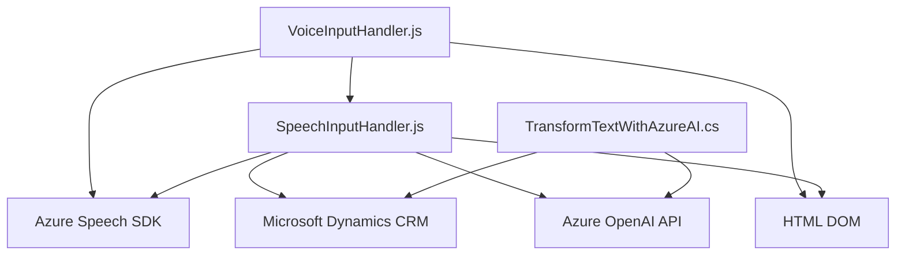

### Breve resumen técnico
El repositorio contiene una solución basada en varios componentes dirigidos a la integración entre formularios dinámicos (seguramente en un entorno web o Microsoft Dynamics 365), reconocimiento de voz e inteligencia artificial. Las piezas analizadas interactúan principalmente con un servicio externo (Azure Speech SDK y OpenAI API) para realizar síntesis y reconocimiento de voz, además de transformación de texto inteligente con inteligencia artificial. El enfoque es modular, multiplataforma y se mezcla con la capacidad de extender la funcionalidad de Microsoft Dynamics 365 mediante plugins personalizados.

---

### Descripción de arquitectura
La solución tiene al menos tres componentes principales:
1. **Frontend:** Scripts en JavaScript destinados a interacción directa con el usuario (formularios y reconocimiento de voz).
2. **Backend o plugins:** Código en C# para extender funcionalidad de Dynamics CRM mediante la integración con la API de Azure OpenAI.
3. **Servicio externo:** APIs como Azure Speech SDK y Azure OpenAI que se encargan de proporcionar funcionalidades como síntesis y reconocimiento de voz, procesamiento de texto con GPT-4, entre otras.

La arquitectura general parecería descentralizada con componentes que se integran con varias herramientas en un esquema **orientado a servicios** (SOA). Aunque podría considerarse un sistema en **n capas** en algunos aspectos, la integración fuertemente basada en APIs sugiere una transición hacia **microservicios** o servicios discretos.

---

### Tecnologías usadas
1. **Frontend:**
   - **JavaScript:** Para la interacción dinámica con el DOM y el manejo de formularios web.
   - **Azure Speech SDK:** Para operaciones de reconocimiento de voz y síntesis de texto a voz.
   - **Microsoft Dynamics 365 JavaScript API:** Elementos como `executionContext` y gestión de atributos permiten interacciones específicas con formularios y entidades de un CRM.

2. **Backend:**
   - **C# (.NET Framework):** Para desarrollar el plugin que interactúa con Dynamics CRM.
   - **Azure OpenAI API:** Procesamiento avanzado de texto con GPT-4.
   - **System.Text.Json y System.Net.Http:** Para manejar operaciones HTTP y serializar/deserializar datos JSON.
   - **Dynamics CRM SDK (IPluginExecutionContext, IOrganizationService):** Framework de extensibilidad dentro del entorno CRM.

3. **Patrones presentes:**
   - **Separación de responsabilidades:** Cada módulo y función tiene un propósito claro.
   - **Dependency Injection:** El patrón está visible en el uso dinámico de `executionContext` para manejar datos y métodos.
   - **Promesas y manejo asíncrono:** Para integrar APIs externas que operan mediante llamadas remotas.
   - **Builder Pattern:** Usado dentro del `SpeechConfig` y `AudioConfig` de Azure Speech SDK.
   - **Modular y eventos:** Los scripts separados y la integración vía funciones aseguran modularidad y adaptación al manejo de eventos.

---

### Diagrama Mermaid válido para GitHub

---

### Conclusión final
Esta solución integra componentes frontend basados en **JavaScript** con APIs de reconocimiento y síntesis de voz, además de un backend que amplifica funcionalidades mediante **plugins en Dynamics CRM**. Los scripts proporcionan una interacción avanzada con el usuario, mientras que el backend maneja operaciones más complejas como el procesamiento de texto con Azure OpenAI. El diseño promueve la modularidad y la interacción entre múltiples servicios externos (Azure). El enfoque principal de la arquitectura se inclina hacia **orientación a servicios (SOA)** y **microservicios**, aunque sigue ciertas características de **n capas**.