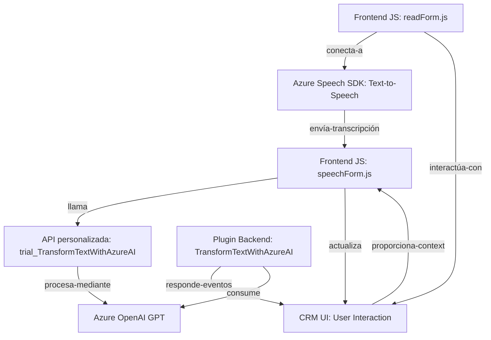

### Resumen Técnico

Este repositorio contiene archivos que forman parte de una solución conectada a un entorno CRM (Dynamics 365), donde se integran tecnologías de reconocimiento de voz y procesamiento de texto mediante servicios en la nube. La solución tiene tres componentes principales:
- **Frontend:** Scripts en JavaScript para gestionar interacción dinámica con formularios mediante entrada de voz (Azure Speech SDK).
- **Backend Plugin:** Plugins en C# que transforman texto mediante servicios Azure OpenAI, respondiendo a eventos específicos en Dynamics CRM.

### Descripción de Arquitectura

La arquitectura es **en capas**, típicamente encontrada en aplicaciones empresariales construidas sobre Microsoft Dynamics 365. Las capas son:
- **Presentación (Frontend):** Scripts interactúan directamente con los usuarios en la UI del CRM para capturar y procesar datos visibles.
- **Aplicación (Plugin Backend):** Plugins manejan lógica empresarial (e.g., transformación de texto) al responder a eventos configurados en el CRM.
- **Servicios Externos:** Arquitectura orientada a la nube, integrando SDKs y APIs externas para reconocimiento de voz y procesamiento de texto en Azure.

### Tecnologías Usadas

1. **Frontend:**
   - **JavaScript**: Lenguaje para manipulación de datos en formularios.
   - **Azure Speech SDK**: Used for text-to-speech (TTS) and speech-to-text (STT) functionalities.

2. **Backend:**
   - **C#, .NET Framework**: Part of a typical Microsoft Dynamics Plugin development.
   - **Microsoft Dynamics CRM SDK** (`IPluginExecutionContext`, `IOrganizationService`): API para eventos y manipulación de entidades CRM.
   - **Azure OpenAI GPT Services**: Para transformar texto usando inteligencia artificial.
   - **HTTP Integration**: Para consumir los servicios externos de Azure.

3. **External Dependencies:**
   - **Azure Speech SDK**: Para reconocimiento y síntesis de voz.
   - **Azure OpenAI GPT**: Para brindar servicios de IA.
   - **XRM Framework**: Para interactuar con el contexto de Dynamics CRM.

### Diagrama Mermaid

### Conclusión Final

Esta solución funciona como un híbrido **n-capas** que integra un frontend interactivo con formularios dinámicos en el CRM, un backend mediante plugins que procesan eventos del CRM, y servicios externos basados en la nube de Microsoft Azure (Speech SDK y OpenAI GPT). La arquitectura está diseñada para mejorar la experiencia humana mediante la interacción de voz y la automatización de tareas empresariales, apoyándose en herramientas centradas en IA y servicios conectados. Su implementación sigue buenas prácticas como la delegación modular, encapsulación lógica y el uso extensivo de APIs, permitiendo una integración escalable y operativa.