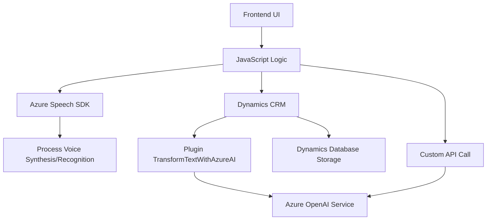

### Breve resumen técnico:
El repositorio examinado contiene archivos relacionados con un sistema integrado para formularios, control de entrada de datos mediante reconocimiento de voz y procesamiento de texto con servicios de IA, todo ello en entornos orientados a Dynamics 365 CRM. La solución utiliza SDKs externos (Azure Speech y OpenAI) para agregar funcionalidades avanzadas como reconocimiento y síntesis de voz, y estructuración de datos mediante inteligencia artificial.

---

### Descripción de arquitectura:
La arquitectura empleada sigue un enfoque modular y claramente distribuido entre frontend y backend. El frontend se encarga de intermediarios como la interfaz de usuario, captura de datos, y operaciones de manejo directo del SDK de reconocimiento y síntesis de voz mediante JavaScript. El backend está basado en plugins de Dynamics 365 que conectan el CRM directamente con servicios Azure OpenAI para el procesamiento avanzado de texto.

Es una arquitectura de **n capas**, con separación de responsabilidades:
1. **Frontend/UI**: Controla la lógica de interacción entre el usuario y los formularios de Dynamics 365.
2. **Backend/Plugin**: Procesamiento centralizado y delegación del procesamiento avanzado a microservicios externos mediante SDK/API.
3. **Servicios externos**: Integración directa con servicios de reconocimiento de voz (Azure Speech SDK) y procesamiento IA (Azure OpenAI).

---

### Tecnologías usadas:
#### Frontend:
- **JavaScript** para la lógica en el navegador.
- **Microsoft Azure Speech SDK** para reconocimiento y síntesis de voz.
- **Browser DOM API** para manipulación de atributos y controles del formulario.

#### Backend:
- **C#** como lenguaje de programación backend.
- **Microsoft Dynamics 365 SDK** para interacción directa con el contexto CRM (`IPlugin`, `IPluginExecutionContext`).
- **Azure OpenAI Service API**, para conectar con modelos IA como GPT-4.
- **System.Net.Http** para manejar solicitudes HTTP.
- **System.Text.Json** para el tratamiento de JSON.

#### Arquitectura:
- Patrón **Plugin** para eventos de Dynamics 365 CRM.
- **Integración basada en SDK** y llamada a APIs externas.
- **Modularidad funcional** en el diseño de código.

---

### Diagrama Mermaid:
El diagrama detalla flujos y dependencias entre componentes. Sigue las directrices de GitHub Markdown para garantizar compatibilidad.

---

### Conclusión final:
La solución representada en el repositorio combina tecnologías modernas como SDKs de Azure y servicios IA para enriquecer la experiencia en Dynamics 365 CRM. Con un enfoque de n capas, se logra separación de responsabilidades clara: el frontend interactúa con el usuario y procesa el reconocimiento/síntesis de voz, mientras el backend delega procesos complejos a servicios externos (Azure OpenAI). Este diseño mejora escalabilidad, mantenimiento y agrega inteligencia a la gestión de datos dentro de entornos corporativos.

Es robusta y modular, con un potencial alto para ser adaptada a otros sistemas que requieran procesamiento de lenguaje natural, reconocimiento de voz y manipulación dinámica de datos.