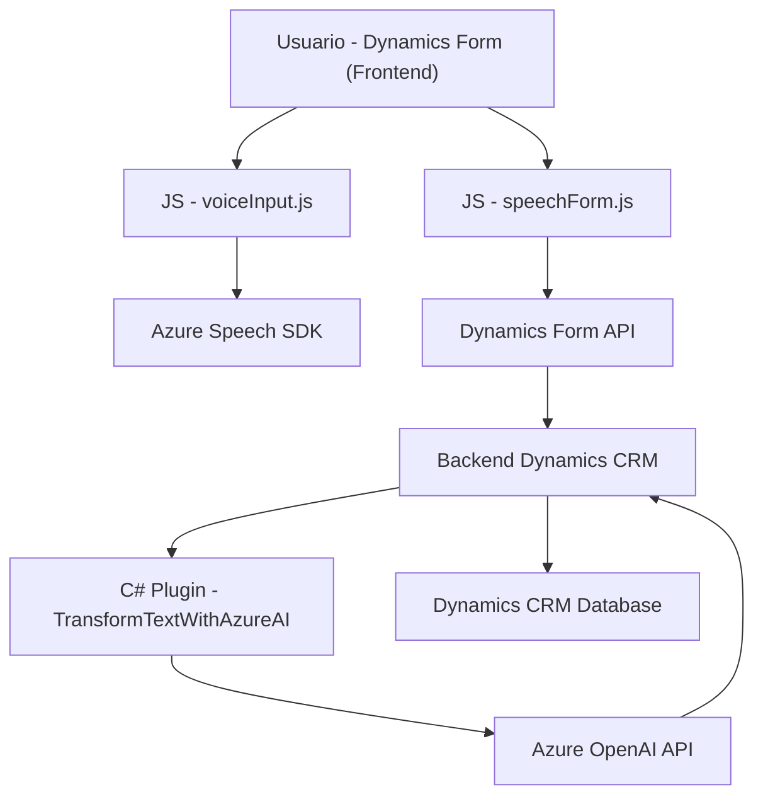

### Breve resumen técnico
El repositorio contiene los siguientes componentes principales que trabajan en conjunto:
1. Archivos JavaScript para frontend que integran con Dynamics 365 para manejo de formularios interactivos (principalmente relacionados a síntesis y reconocimiento de voz).
2. Un plugin en C# para extensiones en el backend de Dynamics CRM, que interactúa con Azure OpenAI para realizar transformaciones de texto.
3. Integraciones con servicios externos como **Azure OpenAI** y **Azure Speech SDK**.

---

### Descripción de arquitectura
La solución está diseñada como una integración modular entre un frontend interactivo basado en voz y un backend extensible que trabaja con Dynamics CRM/Dynamics 365. Los componentes están organizados para maximizar la reutilización y escalabilidad. Principalmente contiene:
- **Frontend con voz (JavaScript)**: Procesa datos visuales en formularios y sintetiza o reconoce voz mediante **Azure Speech SDK**. Funciona como una capa cliente directa integrada en Dynamics Forms.
- **Backend extensible (C# Plugin)**: Opera como extensiones dentro de Dynamics CRM. Utiliza Azure OpenAI para transformar texto dinámicamente y regresar los resultados.
- **Patrones utilizados**:
  - **Facade:** Funciones como `startVoiceInput` encapsulan llamadas al SDK (JS).
  - **Plug-in Pattern:** La clase en C# extiende el funcionalismo de Dynamics CRM con integración directa a API externa.
  - **Modularización:** Cada responsabilidad se divide en métodos altamente cohesivos.

---

### Tecnologías usadas
1. **Frontend (JavaScript)**:
   - **Azure Speech SDK**: Para síntesis de texto en voz y reconocimiento de comandos mediante voz.
   - **Dynamic Forms API (Dynamics 365)**: Para manipulación de datos en formularios.
   - **Promises/Callbacks**: Usados para operaciones asíncronas como cargar Azure Speech SDK y realizar transcripciones en tiempo real.
   
2. **Backend (C#)**:
   - **Azure OpenAI Service**: Para transformación de texto en formato JSON según reglas específicas.
   - **Microsoft Dynamics SDK**: Adapta el plugin al contexto del CRM.
   - **HttpClient**: Comunicación con servicios REST externos.

---

### Dependencias o componentes externos
1. **Azure Speech SDK** y **Azure OpenAI**:
   - **Azure Speech SDK** sirve para síntesis de voz en frontend.
   - **Azure OpenAI Service** transforma texto basado en IA en el backend.
2. **Dynamics 365 API**:
   - Para manipulación de datos en formularios y entidades CRM mediante `Xrm.WebApi`.
3. Bibliotecas auxiliares:
   - **Newtonsoft.Json** en C#: procesamiento de JSON.
   - **HttpClient**: para realizar peticiones al endpoint de OpenAI.

---

### Diagrama Mermaid válido para GitHub

---

### Conclusión final
La solución es una implementación **modular** que conecta un frontend interactivo con voz, apoyado por **Azure Speech SDK**, y un backend extensible dentro de Dynamics CRM (**plugin en C#**) integrando inteligencia artificial para la transformación de datos con **Azure OpenAI**. La arquitectura puede clasificarse como un **n-capas**, ya que presenta una diferenciación clara entre frontend, integración de API externas y lógica backend. Por las tecnologías empleadas y sus patrones, esta configuración resulta adecuada para entornos empresariales con necesidades de automatización y asistencia con inteligencia artificial mediante plataforma CRM.