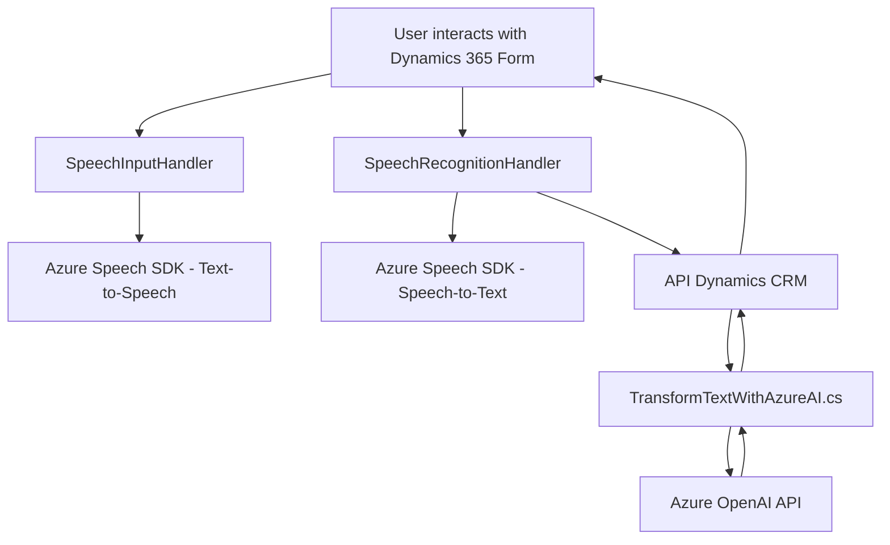

### **Breve resumen técnico**
El repositorio presentado forma parte de una arquitectura de software que integra múltiples componentes y tecnologías. Está compuesto por dos archivos JavaScript para el frontend (speech recognition y text-to-speech en Dynamics 365) y un archivo .NET C# orientado a la integración de Dynamics 365 con Azure OpenAI. Su propósito general es ofrecer funcionalidades avanzadas de reconocimiento de voz, síntesis de texto en voz y transformación de texto con inteligencia artificial para maximizar la interacción en un sistema CRM (Dynamics 365).

---

### **Descripción de arquitectura**

Esta solución tiene una arquitectura **híbrida basada en capas y una orientación hacia SaaS**. En el nivel lógico, se tienen las siguientes características:

1. **Capas funcionales**: Hay una clara separación de responsabilidades:
   - **Capa de frontend**: Implementada mediante JavaScript con funciones centradas en interacción con APIs externas y procesamiento de datos desde los formularios de Dynamics 365.
   - **Capa de integración**: Codificada en C# (plugin para Microsoft Dynamics CRM), se ocupa de transformar solicitudes hacia servicios de inteligencia artificial de Azure OpenAI.
   - **Servicios externos**: Alta dependencia con servicios SaaS como Dynamics 365, Azure Speech SDK y Azure OpenAI.

2. **Interfaz con APIs externas**: Los archivos integran capacidades avanzadas de Azure, como el Speech SDK y OpenAI, para realizar tareas como reconocimiento/síntesis de voz y procesamiento de datos mediante modelos GPT.

3. **Event-driven architecture**: Tanto la interacción dentro de Dynamics 365 como la carga del SDK se basan en eventos, como el inicio de sesión, la carga del formulario o la ejecución específica de plugins.

4. **Patrón de plugin**: El archivo en C# implementa una extensión del sistema Dynamics CRM mediante el patrón tradicional de plugin que interactúa con servicios de terceros.

5. **Modularización**: Cada archivo tiene funciones organizadas con un enfoque en responsabilidades específicas, como reconocimiento, síntesis de voz o transformación de texto.

---

### **Tecnologías usadas**

1. **JavaScript (frontend)**:
   - Azure Speech SDK: Para reconocimiento de voz y síntesis de texto en voz.
   - Interacción con Dynamics 365 APIs: Manipulación del contexto del formulario.

2. **C# (backend)**:
   - Microsoft.Xrm.Sdk: Framework SDK de Dynamics CRM para manipular datos del CRM.
   - Azure OpenAI API: Procesos avanzados de texto con GPT.
   - Newtonsoft.Json y System.Text.Json: Manejo de datos JSON.

3. **Servicios externos**:
   - Azure Speech (Text-to-Speech, Speech-to-Text).
   - Azure OpenAI (GPT-4 API).

---

### **Diagrama Mermaid**

---

### **Conclusión final**
La solución presentada combina capacidades avanzadas de reconocimiento de voz, síntesis de voz y procesamiento de texto mediante inteligencia artificial en un entorno CRM. Su arquitectura modular y orientada a eventos permite una interacción en tiempo real a través de servicios externos como Azure Speech SDK y Azure OpenAI.

Por otro lado, está fuertemente acoplada a la infraestructura de Dynamics 365, lo que puede limitar su portabilidad a otros sistemas. Aunque ofrece una separación funcional clara, carece de patrones como inyección de dependencias o desacoplamiento de servicios, que podrían facilitar la prueba unitaria de componentes. Sin embargo, la solución es elegante y cumple con el objetivo de implementar una interacción basada en voz y procesamiento automatizado con IA en sistemas empresariales.