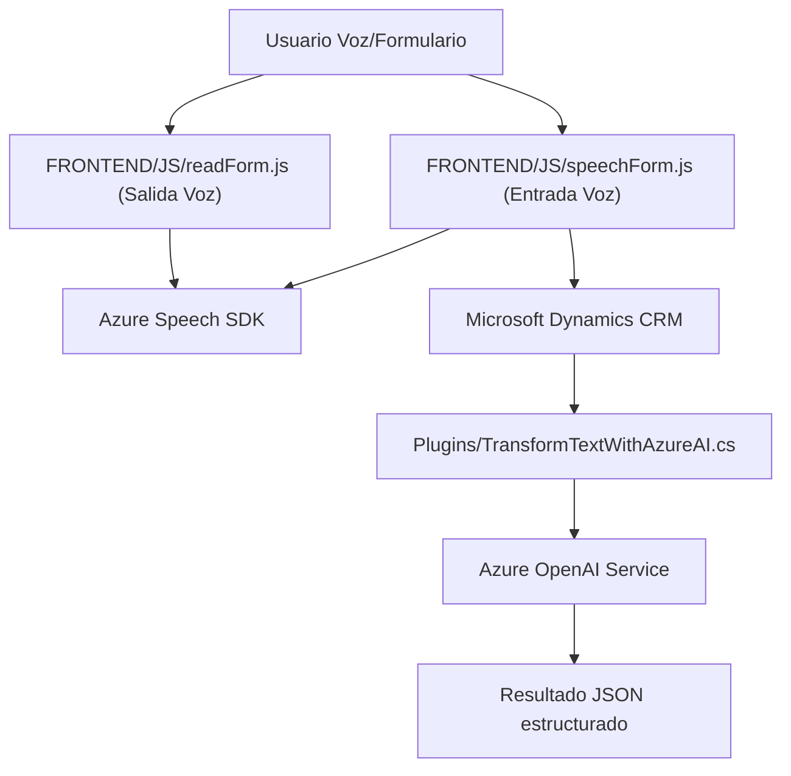

### Breve resumen técnico
En el repositorio se encuentran tres archivos, cada uno relacionado con funcionalidades de integración entre Microsoft Dynamics CRM, **Azure Speech SDK** y **Azure OpenAI**. La solución permite interactuar mediante entrada y salida de voz, vinculación de datos estructurados con formularios CRM dinámicos y procesamiento en tiempo real de texto para crear estructuras JSON. La solución apunta al procesamiento de datos estructurados y la interacción con servicios de IA de Azure.

---

### Descripción de arquitectura

La arquitectura apunta a una **arquitectura de evolución modular** dentro de una solución **n-capas**. Cada archivo se enfoca en una pieza específica:
1. **Gestión de entrada por voz** (`FRONTEND/JS/speechForm.js`).
2. **Generación de salida por voz** (`FRONTEND/JS/readForm.js`).
3. **Procesamiento avanzado de texto** con plugins en Dynamics CRM mediante **Azure OpenAI** (`Plugins/TransformTextWithAzureAI.cs`).

Las capas principales identificadas son:
- **Capa Frontend**: Maneja la interacción a nivel navegador con el usuario.
- **Capa de API/Servicios Externos**: Invoca SDKs y APIs externas como Azure Speech y OpenAI.
- **Capa de Integración**: Los plugins procesan datos para alimentar el contexto y la lógica dentro de Microsoft Dynamics CRM.

---

### Tecnologías usadas

1. **Frontend (JavaScript/HTML)**:
   - **Dynamics CRM SDK**: Para gestionar datos de formularios dinámicos.
   - **Azure Speech SDK**: Para reconocimiento de voz y síntesis.
   - **DOM Manipulation API**: Para interacción con elementos del navegador.

2. **Backend (C#)**:
   - **Microsoft.Xrm.Sdk**: Integración nativa con Dynamics CRM y creación de plugins.
   - **Azure OpenAI Service**: Procesamiento de texto estructurado (GPT).
   - **System.Net.Http**: Comunicación HTTP con servicios externos.
   - **Newtonsoft.Json.Linq/System.Text.Json**: Parseo y generación de JSON.

3. **Patrones usados**:
   - **Modularización**: Gestión de flujo modular mediante funciones específicas en los archivos JS y clases en C#.
   - **Plugin Pattern**: Implementación de lógica personalizada en Dynamics CRM vía `IPlugin`.
   - **API Gateway**: Cálculo y delegación de peticiones externas hacia servicios de Azure.
   - **Field-Mapping Pattern**: Mapeo explícito entre campos hablados y atributos de formulario CRM.

---

### Diagrama Mermaid válido para GitHub

---

### Conclusión final
El repositorio representa una solución basada en una arquitectura **n-capas modular**, enfocada en extender las capacidades de Microsoft Dynamics CRM. Utiliza **Azure Speech SDK** para interacción por voz y el servicio **Azure OpenAI** para transformación de texto en JSON estructurado. Los archivos JS facilitan la integración de entrada y salida por voz en formularios personalizados, mientras que el archivo C# permite agregar lógica avanzada al CRM mediante el patrón de **plugin**. 

En términos de diseño, emplea buenas prácticas como modularización y desacoplamiento al delegar tareas complejas a servicios externos, asegurando escalabilidad y mantenibilidad. Esta arquitectura sería particularmente útil en soluciones empresariales que busquen mejorar la accesibilidad mediante la integración de voz y la automatización impulsada por IA con Microsoft Dynamics CRM.