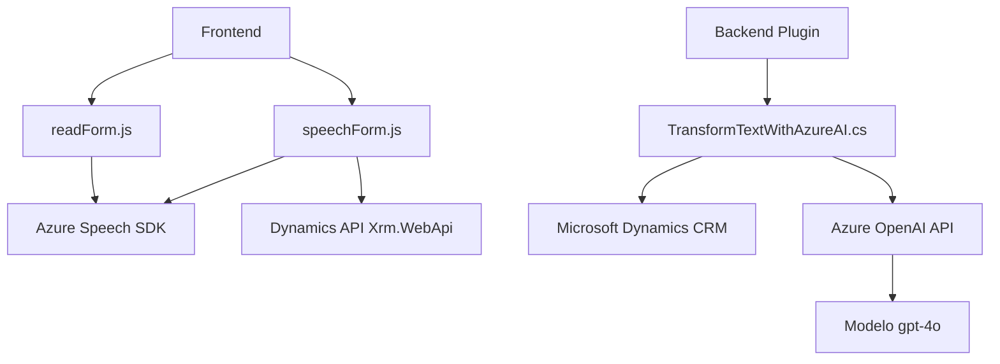

### Breve resumen técnico:
El repositorio consta de tres componentes principales:
1. Un grupo de archivos JavaScript orientados al manejo de formularios en frontend (`readForm.js`, `speechForm.js`).
2. Un plugin en C# diseñado para integrarse con Microsoft Dynamics CRM y Azure OpenAI API (`TransformTextWithAzureAI.cs`).

La solución presenta una integración entre una interfaz basada en interacción mediante voz y texto en formularios dinámicos, junto con una extensión a nivel backend para transformación avanzada de texto, apoyándose en servicios de Azure (Speech SDK y OpenAI).

---

### Descripción de arquitectura:
La arquitectura se alinea con un **modelo híbrido**:
- **Frontend modular:** Múltiples archivos organizados en funciones que implementan procesamiento por eventos y manejo del DOM.
- **Backend Plugin:** Sigue el paradigma *plugin-based architecture*, donde el componente se integra al entorno CRM, funcionando dentro de la arquitectura orientada a servicios (SOA).
- **Integración de servicios externos:** Dependencia de múltiples APIs externas: Speech SDK, Dynamics API y OpenAI.
- **N-capas:** Aunque no explícito, los módulos frontend actúan como capa de presentación y lógica de cliente, mientras el plugin en backend aborda la lógica empresarial y conectividad con Azure OpenAI.

---

### Tecnologías usadas:
**Frontend:**
- **Tecnologías:** JavaScript (+ ES6/ESNext), APIs de Microsoft Dynamics (Xrm.WebApi).
- **Frameworks:** No se mencionan frameworks explícitos, pero se ejecuta en un entorno compatible con API Microsoft Dynamics.
- **Servicios:** Azure Speech SDK, utilizando su paquete de navegador.

**Backend:**
- **Lenguaje:** C# (.NET Framework/Standard).
- **Bibliotecas:** Newtonsoft.Json para manejo avanzado de JSON, System.Net.Http para comunicaciones HTTP.
- **Servicios:** Azure OpenAI API, Dynamics CRM SDK.

---

### Diagrama **Mermaid**:

---

### Conclusión final:
Esta solución combina funcionalidades de accesibilidad y automatización mediante servicios de Azure y Dynamics CRM. La integración de voz (en frontend) y procesamiento contextual avanzado de texto (en backend) proporciona una arquitectura robusta y extensible. Aunque el enfoque modular facilita la escalabilidad, hay espacio para mejorar:
- Mayor documentación para manejo de errores dentro del plugin.
- Potencial adopción de frameworks modernos como React/Vue en el frontend para una estructura más coherente y mantenible.