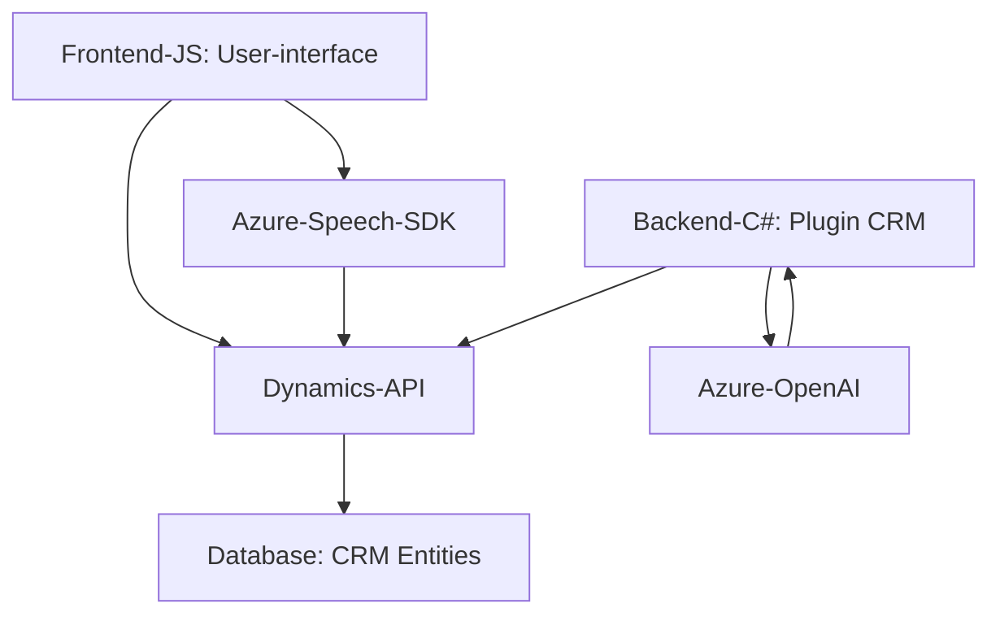

### Breve Resumen Técnico

Este repositorio parece estar enfocado en la accesibilidad y la interacción avanzada entre usuarios y un sistema CRM (Dynamics 365) utilizando herramientas modernas como el **Azure Speech SDK** y **Azure OpenAI**. Los archivos se dividen en dos grandes grupos: una interfaz de usuario basada en web (frontend) que incorpora accesibilidad de voz, y un componente backend (plugin en C#) para procesar texto con inteligencia artificial.

---

### Descripción de Arquitectura

La solución tiene componentes tanto frontend como backend:

1. **Frontend**:
   - **Estructura Modular**: Organiza funciones en bloques independientes con responsabilidades exclusivas para lectura de datos, entrada de voz, y comunicación con APIs externas.
   - **Patrón de MVC-like**: La integración de lógica como extracción de datos desde formularios y síntesis de voz implica roles similares a Model, View y Controller.
   - **Orientación a SDKs (Azure Speech)**: Toda la integración se basa en el manejo de eventos y callbacks para interactuar con el SDK de Azure Speech, aplicando un modelo asíncrono.

2. **Backend**:
   - **Plugin CRM**: Utiliza una configuración estándar en Microsoft Dynamics 365 mediante `IPlugin`, para transformar texto en JSON estructurado con Azure OpenAI. Esto presenta una arquitectura basada en microservicios ya que interactúa con servicios externos para el procesamiento de IA.

**Arquitectura General**:
- **Multicapa Desacoplada**:
  - Frontend (Captura/Entrada de Datos).
  - Backend (Procesamiento robusto con plugins en Dynamics).
  - Servicios externos (Azure Speech SDK y Azure OpenAI).

---

### Tecnologías Usadas

1. **Frontend**:
   - **JavaScript** para funciones en el navegador.
   - **Azure Speech SDK** como herramienta de síntesis y reconocimiento de voz.

2. **Backend**:
   - **Microsoft Dynamics CRM**: Maneja objetos, contextos y lógica del sistema.
   - **Azure OpenAI**: Procesamiento avanzado de datos de texto.
   - **C#**: Manipulación de lógica backend y comunicación con servicios.
   - **HTTP Client y JSON Serialization/Deserialization** (en C#) para comunicación con APIs REST.

3. **Patrones Comunes**:
   - Modularización de funciones.
   - SDK Wrapper para encapsular detalles de implementación.
   - Plugin architecture (extensible backend logic).
   - Event-driven design en la captura de voz.
   - API Gateway pattern para gestionar llamadas al sistema CRM y a servicios externos.

---

### Diagrama Mermaid

---

### Conclusión Final

Esta solución es un sistema distribuido con una arquitectura multicapa que integra herramientas modernas para accesibilidad (Azure Speech SDK en frontend) y procesamiento avanzado de texto (Azure OpenAI en backend). El enfoque hacia desacoplamiento y modularidad asegura una fácil adaptabilidad y escalabilidad, mientras que los patrones de diseño utilizados (como event-driven y SDK wrappers) optimizan la gestión de dependencias y la interacción entre componentes.

Es ideal para aplicaciones orientadas a accesibilidad y automatización avanzada, aunque se recomienda fortalecer la seguridad en la gestión de claves API.