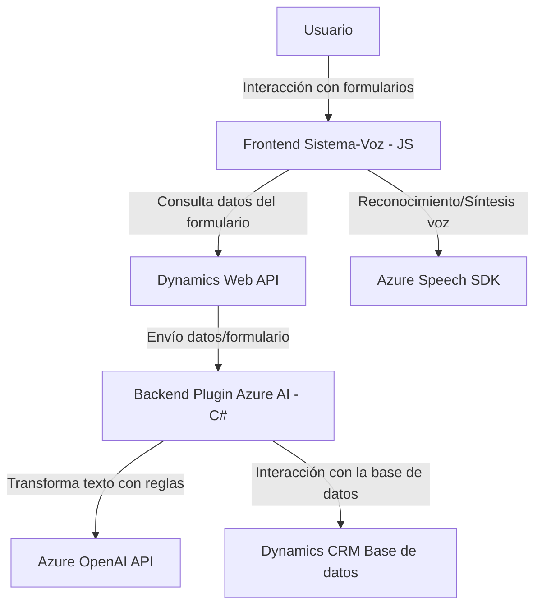

### Breve Resumen Técnico

El repositorio proporciona tres archivos que implementan distintas funcionalidades dentro de una solución basada en **Dynamics CRM** y **Azure**:

1. **Frontend/JS/readForm.js y speechForm.js**: 
   - Impulsan dos características principales relacionadas con la entrada y síntesis de voz, integrando el **Azure Speech SDK** y manipulaciones de formularios dinámicos en el frontend.
2. **Plugins/TransformTextWithAzureAI.cs**: 
   - Define un plugin para Dynamics 365 que interactúa con la **Azure OpenAI API**. Este plugin procesa textos según los parámetros y reglas definidas por el usuario.

---

### Descripción de Arquitectura

La solución tiene una **arquitectura híbrida basada en n-capas con integración de servicios externos**. A continuación, se detallan los distintos elementos de su diseño:

1. **Capa de Presentación**:
   - Implementada en archivos `readForm.js` y `speechForm.js` que manejan la entrada y salida interactiva con el usuario mediante la interfaz del formulario, utilizando tecnologías como HTML, JavaScript y APIs para comunicación con servicios externos.
   
2. **Capa de Aplicación**:
   - El archivo `TransformTextWithAzureAI.cs` actúa como un plugin que procesa datos y conecta con servicios externos (Azure OpenAI). Es responsable de transformar datos y realizar validaciones antes de enviarlos como respuesta a Dynamics CRM.

3. **Integración con APIs externas**:
   - Conexión directa con **Azure Speech SDK** en el frontend para manejo de síntesis y reconocimiento de voz.
   - Llamadas HTTP hacia el servicio **Azure OpenAI API** desde el plugin. 

4. **Datos**:
   - La solución está designada para interactuar con **formularios dinámicos de Dynamics CRM**, incluyendo búsquedas (lookups), actualización de valores y obtención de datos del contexto de ejecución.

5. **Patrones**:
   - **Modularidad**: Separación de responsabilidades para que cada archivo y función realice tareas específicas.
   - **Callback**: En el frontend, particularmente en la función `ensureSpeechSDKLoaded` para manejar la asincronía.
   - **Facade**: Encapsulación de la lógica compleja (Azure SDK/Lookups) en funciones simples.
   - **Plugin**: Implementación específica para Dynamics CRM dentro del archivo C# como una solución que maneja una ejecución en el servidor CRM.
   - **Arquitectura híbrida**: El sistema combina las capas de presentación (frontend), negocio/aplicación (lógica de plugins) y servicios externos (Azure APIs).

---

### Tecnologías Usadas

1. **Frontend**:
   - **JavaScript**: Lenguaje principal utilizado para la manipulación de formularios y lógica de interacción con voz.
   - **Azure Speech SDK**: Para sintetizar texto en voz y realizar reconocimiento de voz.
   - **Dynamics Web API (`Xrm`)**: Para comunicación con entidades y operaciones en la base de datos del CRM.

2. **Backend**:
   - **C# usando Dynamics SDK**: Para implementar el plugin que interactúa con el sistema de CRM, manipula datos y se conecta con la **Azure OpenAI API**.

3. **Servicios Externos**:
   - **Azure OpenAI**: API utilizada para análisis de texto y generación de contenido en el backend.
   - **Microsoft Speech SDK**: Para gestionar la comunicación en el frontend.
   
4. **Herramientas para Serialización en C#**:
   - **Newtonsoft.Json**: Para manipular JSON en el lado servidor.
   - **System.Text.Json**: Para operaciones de serialización y deserialización.

---

### Diagrama Mermaid

---

### Conclusión Final

La solución descrita tiene como objetivo mejorar las funcionalidades de **Dynamics CRM** mediante el uso combinado de servicios de inteligencia artificial (Azure OpenAI API, Azure Speech SDK) y plugins personalizados. Se apoya en una arquitectura basada en **n-capas**, con alta modularidad y extensibilidad, lo que permite la implementación de futuras funciones. Además, la utilización de **Patrones de Diseño** como Facade y Callback potencia la legibilidad y mantenimiento del código.

Finalmente, el uso de APIs externas como Azure garantiza capacidades avanzadas en el manejo de voz e inteligencia artificial, mientras que la integración con Dynamics CRM asegura un flujo efectivo de datos y colaboración en el contexto empresarial.