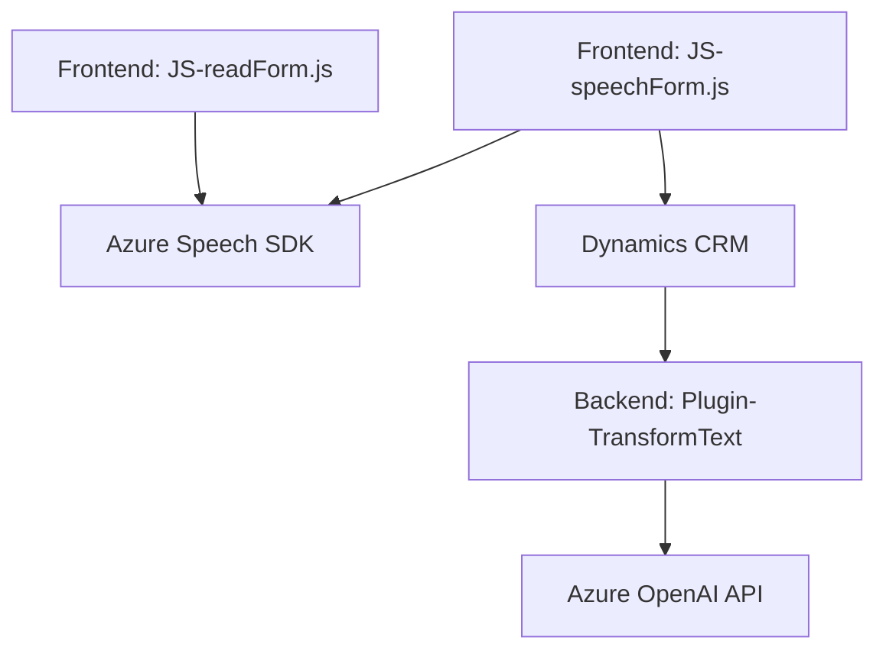

### Breve resumen técnico

El repositorio contiene tres módulos clave que interactúan entre sí y con servicios externos. Los módulos `JS/readForm.js` y `JS/speechForm.js` implementan lógica para interactuar con formularios de Dynamics CRM utilizando entrada y salida de voz a través del servicio **Azure Speech SDK**. Además, el archivo `Plugins/TransformTextWithAzureAI.cs` actúa como un plugin para Dynamics 365 y utiliza **Azure OpenAI** para procesar texto de manera avanzada, siguiendo reglas predefinidas. 

La solución combina frontend basado en JavaScript y un backend con plugins de Dynamics 365. Se enfoca en sintetizar texto, reconocer y transcribir voz, procesar transcripciones con IA, y actualizar dinámicamente formularios de CRM.

---

### Descripción de Arquitectura

La arquitectura se clasifica como **n capas** con integración de servicios externos. Estas capas son:
1. **Frontend** (Interfaz de usuario): Utiliza `JS/readForm.js` y `JS/speechForm.js` para interacción con entrada y salida de voz.
2. **Backend** (Plugin en Dynamics 365): El archivo `TransformTextWithAzureAI.cs` comunica Dynamics 365 con Azure OpenAI, manteniendo una lógica de procesamiento en tiempo real.
3. **External Services**:
   - **Azure Speech SDK**: Reconocimiento y síntesis de voz.
   - **Azure OpenAI GPT API**: Procesamiento avanzado de texto.

Los componentes interactúan de manera modular utilizando integraciones API y SDK. También se aplica el patrón de **external service integration** para delegar capacidades al entorno de Azure.

---

### Tecnologías Usadas

1. **Frontend**:
   - Lenguaje: **JavaScript**.
   - SDKs: **Azure Speech SDK**.
   - Servicios: Dynamics CRM (manipulación del DOM y atributos del formulario).

2. **Backend**:
   - Lenguaje: **C#**.
   - Framework: **Dynamics 365 SDK**.
   - API: **Azure OpenAI API**.
   - Librerías: `Newtonsoft.Json`, `System.Text.Json`.

3. **Servicios Externos**:
   - **Azure Speech SDK**: Para síntesis y reconocimiento de voz, cargado dinámicamente.
   - **Azure OpenAI GPT**: Para procesamiento de texto avanzado.

4. **Patrones de diseño**:
   - **Modular function-based design**: Cada función se dedica a tareas específicas.
   - **Integration patterns**: Comunicación configurada con APIs externas y servicios SDK.
   - **Plugin architecture**: El backend utiliza el estándar de Dynamics 365.

---

### Diagrama Mermaid (válido para GitHub)

---

### Conclusión Final

La solución está diseñada para realizar tareas relacionadas con la interacción de voz, procesamiento de textos, y actualización dinámica de formularios en un entorno corporativo como Dynamics CRM. Utiliza una arquitectura bien definida n capas, donde el frontend maneja la interacción, el backend utiliza plugins de CRM, y los servicios externos, como Azure Speech SDK y Azure OpenAI, proporcionan capacidades avanzadas (sintetización, reconocimiento y procesamiento).

La elección de tecnologías, SDKs, y APIs deja claro que el diseño está orientado a sistemas empresariales y respaldado por el ecosistema de Azure. A pesar de su modularidad, la solución aún depende en gran medida de integraciones externas, lo que puede considerarse para futuras refactorizaciones si se requiere aumentar la autonomía del sistema.