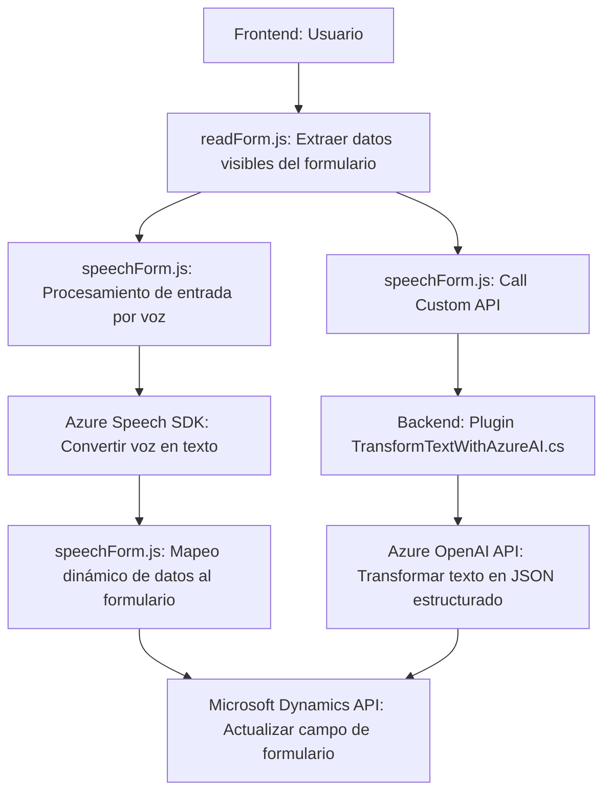

### Breve resumen técnico

El repositorio parece estar diseñado como una solución integrada entre un frontend y un backend. Su propósito principal es integrar el poder del reconocimiento de voz y procesamiento del lenguaje natural (PLN) de Azure Speech SDK y Azure OpenAI API con formularios dinámicos en una plataforma CRM, muy probablemente Microsoft Dynamics 365. 

---

### Descripción de arquitectura

La arquitectura muestra características de **n-capas**, donde se tiene:
1. **Capa de presentación (Frontend):**
   - Incluye archivos como `readForm.js` y `speechProcessing.js` para una interfaz interactiva centrada en formularios y entrada/salida por reconocimiento de voz.
   - Esta capa procesa eventos directamente desde el usuario y mueve información hacia el backend.

2. **Capa de negocio (Backend):**
   - Se encuentra representada por el plugin `TransformTextWithAzureAI.cs`, alojado en la infraestructura de Microsoft Dynamics CRM. Este plugin actúa como el nodo de interacción con la API de Azure OpenAI y aplica negocio sobre los datos.
   - La arquitectura de este plugin usa el patrón de contexto de ejecución estándar en Dynamics 365.

3. **Integración con servicios externos:**
   - Integración con **Azure Speech SDK** y **Azure OpenAI API**, delegando tareas complejas como síntesis de voz y procesamiento de texto al servicio de Azure.

A pesar de ser una solución **n-capas**, contiene algunas características que pueden ser usadas en microservicios; sin embargo, sigue principalmente un esquema acoplado.

---

### Tecnologías usadas

1. **Frontend:**
   - **JavaScript:** Para las funciones de interacción y síntesis de voz, especialmente en formularios.
   - **Azure Speech SDK:** Framework para reconocimiento y síntesis de voz.
   - **Microsoft Dynamics Web API (`Xrm.WebApi`):** Para integrar datos directamente en el contexto del formulario.

2. **Backend:**
   - **C#:** Lenguaje utilizado en el plugin de Dynamics.
   - **Azure OpenAI API:** Para procesamiento de texto basado en modelos de Inteligencia Artificial.
   - **System.Net.Http:** Biblioteca estándar de .NET para realizar solicitudes HTTP al endpoint de OpenAI API.
   - **Microsoft Dynamics SDK:** Para desarrollar plugins y gestionar el entorno CRM.

---

### Diagrama Mermaid

A continuación se presenta un diagrama que explica la interacción entre los componentes del sistema:

---

### Conclusión final

El repositorio implementa una solución integrada de n-capas con interacción entre frontend y backend para capturar datos por voz, sintetizar salida de texto y realizar transformación de datos con Azure OpenAI API. Aprovecha frameworks como Azure Speech SDK para reconocimiento/síntesis de voz y Dynamics 365 para gestionar contexto de formularios. Aunque su arquitectura es extensible, muestra una dependencia a la plataforma específica. 

Esta solución es adecuada para escenarios donde se necesite añadir capacidades basadas en voz e inteligencia artificial sobre formularios dinámicos en entornos empresariales (e.g., Dynamics CRM). Sin embargo, podría ajustarse para ser más modular y orientada a microservicios distribuidos, mejorando su escalabilidad y desacoplamiento.