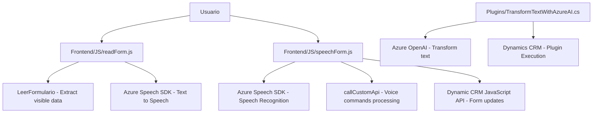

### Breve resumen técnico
El repositorio presenta un sistema que integra capacidades de síntesis y reconocimiento de voz mediante el **Azure Speech SDK**, junto con un plugin de Dynamics CRM que interactúa con el servicio **Azure OpenAI**. Está diseñado para potenciar formularios en una solución de CRM al integrar reconocimiento de voz, comandos en lenguaje natural, y un servicio de inteligencia artificial para transformación de datos.

---

### Descripción de la arquitectura
1. **Tipo de solución:**  
   Un sistema orientado a la automatización de formularios dentro de un CRM con procesamiento de voz e inteligencia artificial (IA). Es una solución híbrida que combina frontend para formularios web (JavaScript) con backend extendido mediante plugins en Dynamics CRM.

2. **Arquitectura:**  
   El diseño combina arquitecturas de:  
   - **Multicapa (n capas):** En el frontend, los datos se procesan mediante integración directa con Azure Speech SDK y API Dynamics, estructurando las capas de presentación y lógica de negocios.  
   - **SOA (Service-Oriented Architecture):** En el backend, el plugin actúa como un servicio que se conecta a **Azure OpenAI** para manejar transformación de textos, extendiendo las funcionalidades del CRM mediante servicios REST externos.

---

### Tecnologías usadas
1. **Frontend:**  
   - **JavaScript:** Maneja interacción directa con formularios CRM.  
   - **Azure Speech SDK:** Para síntesis de voz y reconocimiento de comandos de lenguaje natural.  

2. **Backend:**  
   - **C# (.NET):** Desarrollado como plugin para Dynamics CRM.  
   - **Microsoft Dynamics CRM SDK:** Para manipulación de formularios y registros.  
   - **Azure OpenAI API:** Para transformar texto basado en reglas avanzadas de IA.

3. **Servicios externos y APIs:**  
   - Azure Speech SDK (sintetización y reconocimiento de voz).  
   - Azure OpenAI (transformación de texto de alta precisión).  

4. **Dependencias:**  
   - **Newtonsoft.Json:** Para manejo de estructuras JSON.  
   - **Microsoft Xrm SDK y System.Linq:** Para lógica CRM.  
   - **System.Net.Http:** Para comunicación con servicios externos (Azure Speech y OpenAI).

---

### Diagrama Mermaid

---

### Conclusión final
Este sistema combina tecnologías modernas para automatizar la interacción con formularios en CRM, extendiendo sus capacidades mediante reconocimiento de voz y procesamiento en lenguaje natural. Los archivos muestran:  
- Estructura modular eficiente con separación entre frontend y backend.  
- Integración con servicios de Azure, tanto en el frontend (Speech SDK) como en el backend (OpenAI).  
- Uso de estándares de Dynamics CRM como base para extensibilidad con plugins.  

Se recomienda seguir buenas prácticas como encriptación de claves de API y configuración dinámica de endpoints para mejorar la seguridad y escalabilidad del sistema.