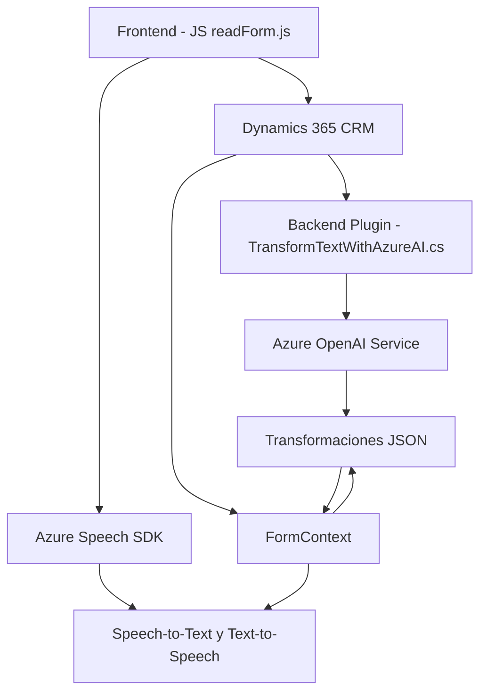

### Breve resumen técnico:
El repositorio implementa una solución híbrida que combina procesamiento de datos de formularios con interacción avanzada con servicios externos como Azure Speech SDK y Azure OpenAI, apuntando a mejorar la experiencia de usuario en formularios dinámicos de Dynamics 365. Utiliza funcionalidades de síntesis y reconocimiento de voz junto con transformación de texto mediante IA.

---

### Descripción de arquitectura:
El sistema tiene una arquitectura modular de **n capas**, donde cada capa tiene responsabilidades específicas:
1. **Frontend JS**:
   - Recoge datos y los transforma en síntesis de voz o permite entrada mediante reconocimiento de voz.
2. **Backend Plugin**:
   - Procesa datos y llama servicios externos (Azure OpenAI para JSON estructurado).
3. **Servicios externos**:
   - Integración con Azure Speech SDK para funcionalidades de voz y Azure OpenAI para transformación avanzada.

Se apoya también en patrones de **arquitectura de servicios**, interactuando con APIs externas para extender la lógica.

---

### Tecnologías usadas:
1. **JavaScript**:
   - Para el frontend, maneja acciones en formularios y sintetiza/reconoce voces con Azure Speech SDK.
2. **Azure Speech SDK**:
   - Síntesis y reconocimiento de voz.
3. **Dynamics 365 WebAPI**:
   - Lógica empresarial del formulario CRM.
4. **Azure OpenAI**:
   - Transformación avanzada de texto.
5. **C# - .NET Framework:**
   - Para el plugin `TransformTextWithAzureAI.cs` que actúa como middleware entre Dynamics CRM y el servicio OpenAI.
6. **Newtonsoft.Json** y **System.Text.Json**:
   - JSON para comunicación entre APIs.
7. **HTTP Client**:
   - Para ejecutar solicitudes HTTP hacia Azure OpenAI.

---

### Dependencias o componentes externos:
1. **Azure Speech SDK**:
   - Necesita la clave de API de Azure y configuración de región.
2. **Azure OpenAI**:
   - Servicio requerido para ejecutar transformaciones del plugin, usando endpoint, despliegue y clave API.
3. **Dynamics 365**:
   - Dependencia directa para manipular formularios del CRM.
4. **API personalizada**:
   - `trial_TransformTextWithAzureAI` permite enviar comandos de transcripción para análisis avanzado.
5. **JavaScript browser environments**:
   - Para cargar dinámicamente scripts como el SDK.

---

### Diagrama Mermaid

---

### Conclusión final:
Podemos identificar que esta solución es una **integración ampliada para formularios en Dynamics 365**. Implementa una arquitectura **modular de n capas** con interacción explícita con APIs externas (Azure Speech SDK y Azure OpenAI). Las dependencias externas como los servicios Azure complementan las funciones avanzadas de reconocimiento y transformación de texto con IA. La solución está bien estructurada siguiendo principios de modularidad y responsabilidad única, siendo una base sólida para aplicaciones de automatización en entornos empresariales.