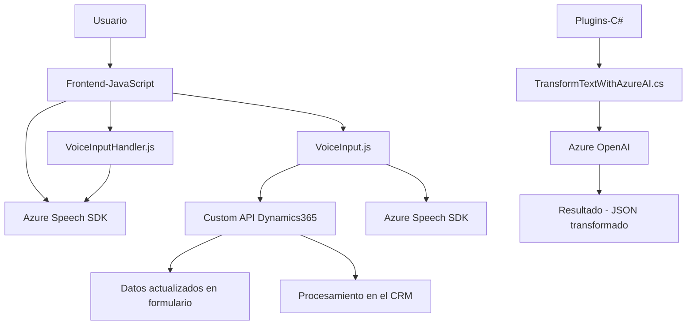

### Breve resumen técnico
El repositorio parece ser un conjunto de funcionalidades orientadas a la interacción de usuarios mediante voz (entrada y salida) y a integraciones con APIs en la nube, principalmente Azure Speech SDK y Azure OpenAI. Principalmente, implementa interacción con servicios de Dynamics CRM, manejo de formularios y procesamiento avanzado de voz y texto mediante APIs inteligentes.

---

### Descripción de arquitectura
1. **Tipo de solución:** 
   - Un híbrido orientado a servicios, compuesto por módulos frontend y plugins backend de Dynamics CRM para extender su funcionalidad.
   - Proporciona automatización en plataformas de Dynamics 365 mediante entrada y salida por voz, así como procesamiento de texto por IA.

2. **Arquitectura:**
   - Arquitectura **n-capas**, dividiendo la solución en: 
     - Capa frontend: Manejo de voz en HTML+JS.
     - Plugins backend (C#): Conexión con Azure OpenAI y lógica de CRM.
   - Integración con servicios en la nube para funcionalidades específicas (procesamientos cognitivos de Azure).

---

### Tecnologías usadas
1. **Frontend (JavaScript):**
   - **Azure Speech SDK**: Para sincronización de voz.
   - Manejo del DOM para trabajar con formularios y campos visibles.
   - JavaScript puro sin dependencias adicionales, aprovechando patrones modulares.
   - Llamadas síncronas/asíncronas para interacción con APIs externas.

2. **Backend (C#):**
   - **Dynamics CRM SDK**: Extensiones a través de plugins (`IPlugin`).
   - **Azure OpenAI Service**: Procesamiento de texto mediante IA.
   - **HTTP Client**: Para realizar solicitudes a servicios de Azure.
   - JSON: Manejo de mensajes y respuestas.
   - Patrón Event-Driven: El plugin responde al contexto de eventos del CRM.

3. **Patrones arquitectónicos:**
   - Modularidad en el frontend: Cada funcionalidad está claramente dividida, con funciones reutilizables.
   - Event-driven en plugins backend: Activación basada en cambios en el estado CRM.
   - Integración con APIs externas: Abstracta e independiente, utilizando controladores.

4. **Dependencias externas:**
   - **Azure Speech SDK**: Reconocimiento y síntesis de voz.
   - **Azure OpenAI Service**: Interpretación avanzada de texto.
   - **Dynamics CRM SDK**: Extensión del modelo de plugin en C#.

---

### Diagrama Mermaid

---

### Conclusión final
El repositorio presenta una solución robusta para extender funcionalidades de Dynamics CRM mediante un diseño modular en frontend (manejo de formularios por interacción de voz) y un plugin backend con integración de servicios cognitivos de Azure. La arquitectura n-capas logra una separación clara entre el cliente, las aplicaciones frontales, los servicios externos y el backend dedicado al procesamiento de datos.

La elección de tecnologías como Azure Speech SDK y Azure OpenAI Service garantiza que el sistema sea capaz de manejar entrada y salida por voz, transformar texto mediante IA, y sincronizar dichas funcionalidades dentro de Dynamics CRM. Su diseño modular asegura extensibilidad y manejo efectivo de dependencias.