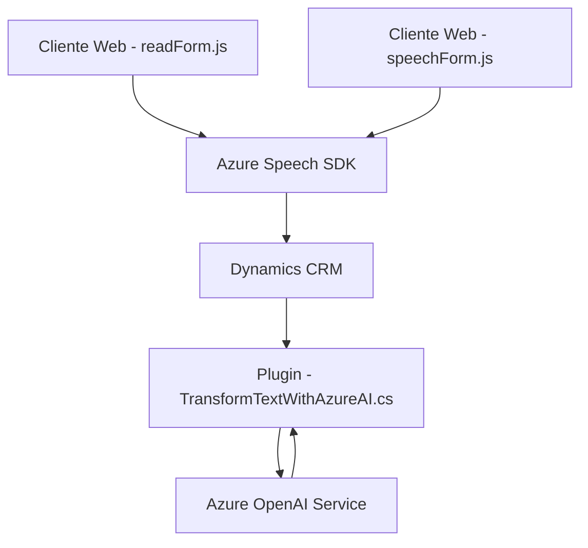

### Breve Resumen Técnico
El repositorio incluye diferentes archivos que proporcionan una funcionalidad específica para interactuar con formularios de Dynamics CRM utilizando servicios avanzados de Microsoft Azure. Los componentes principales están centrados en la integración de un sistema de reconocimiento de voz y procesamiento del texto con Azure Speech SDK y Azure OpenAI Service. 

### Descripción de Arquitectura
La solución utiliza una arquitectura basada en **n capas**, donde cada componente cumple un rol específico:
- **Frontend**: `readForm.js` y `speechForm.js` implementan las funciones de extracción y síntesis de voz de los campos del formulario visible en Dynamics CRM.
- **Backend/Plugin**: `TransformTextWithAzureAI.cs` define la lógica del plugin de Dynamics CRM para transformar textos mediante el servicio Azure OpenAI.

La arquitectura aprovecha servicios externos como:
- **Azure Speech SDK**: Captura y síntesis de voz del usuario para interactuar verbalmente con los formularios.
- **Azure OpenAI Service**: Transformación de contenido utilizando el modelo GPT.

La modularización es clave en la implementación, asegurando una separación clara de responsabilidades. Los archivos en JavaScript establecen un puente entre la UI y las acciones de procesamiento de voz, mientras que el plugin en C# ejecuta la lógica principal de transformación de texto.

---

### Tecnologías Utilizadas
1. **Frontend**:
   - Lenguaje: JavaScript.
   - Framework: Dynamics CRM JavaScript.
   - API externa: Azure Speech SDK.
   - Patrones detectados: Modularización, event-driven programming, data mapping.

2. **Backend/Plugin**:
   - Lenguaje: C#.
   - Framework: Microsoft Dynamics CRM SDK.
   - Librerías externas: Newtonsoft.Json, System.Text.Json, System.Net.Http.
   - API externa: Azure OpenAI Service.
   - Patrones detectados: Plugin design pattern, microservicio integración.

---

### Diagrama **Mermaid** (Compatible con GitHub Markdown)

---

### Conclusión Final
La solución propuesta combina un frontend en JavaScript y Azure Speech SDK con un backend que utiliza plugins de Dynamics CRM en C#. Se aplica una arquitectura de **n capas** donde los diferentes elementos se comunican mediante las APIs de Dynamics CRM y servicios externos. La solución es robusta y escalable, proporcionando una funcionalidad innovadora que incluye reconocimiento de voz y procesamiento de texto natural mediante Azure Speech SDK y Azure OpenAI. Esto permite a los usuarios interactuar de manera más intuitiva con formularios de Dynamics CRM.