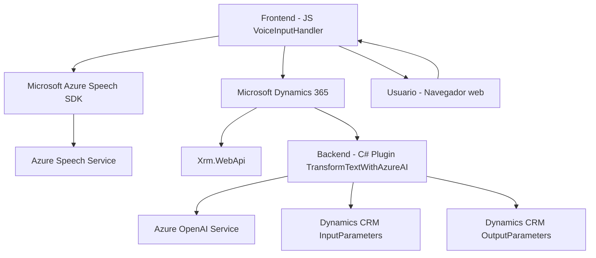

### Resumen técnico del repositorio

Este repositorio combina un **frontend en JavaScript** con funcionalidades avanzadas de entrada y salida de voz y un **plugin backend para Dynamics CRM**. Utiliza servicios de **Azure Speech** y **Azure OpenAI** para realizar tareas de síntesis y transcripción de voz, procesamiento de entrada, y transformación AI del texto. Los archivos están organizados en áreas funcionales (Frontend y Plugins), cada cual con una interacción específica hacia servicios externos y dependencias internas.

---

### Descripción de arquitectura

1. **Tipo de solución:** API integrada con Dynamics CRM, cliente ligero para registro dinámico basado en voz, y funcionalidad avanzada con Azure Speech SDK y Azure OpenAI.
  
2. **Arquitectura usada:**
   - **En el frontend:**
     - Arquitectura de cliente ligero basada en interacción con servicios externos (Azure Speech SDK y APIs de Dynamics 365).
     - Uso de callbacks y delegación para cargar de forma dinámica recursos según sea necesario.
   - **En el backend (Plugin en C#):**
     - Arquitectura basada en eventos de Dynamics CRM mediante la interfaz `IPlugin`.
     - Modelo de solicitud/respuesta hacia servicios externos (Azure OpenAI API).
  
   En general, sigue el patrón **n-capas** para desacoplar la lógica de negocio del procesamiento externo (frontend y backend), integrando microservicios como componentes externos para IA y manejo de voz.

---

### Tecnologías usadas

1. **Frontend:**
   - **Lenguaje:** JavaScript (Vanilla)
   - **Frameworks/SDKs:** Azure Speech SDK
   - **Dependencias dinámicas:** Clientes web (DOM), Azure Speech SDK (integración directa desde navegador).
  
2. **Backend/Plugin:**
   - **Lenguaje:** C#
   - **Framework:** Dynamics CRM Plugin SDK (`Microsoft.Xrm.Sdk`)
   - **Api externa:** Azure OpenAI Service

3. **Externos:**
   - `Microsoft Speech SDK`: Reconocimiento y síntesis de voz.
   - `Azure OpenAI`: Procesamiento de texto asistido con IA.
   - `Xrm.WebApi`: Para manejo y consulta de Dynamics 365.

---

### Diagrama Mermaid de arquitectura

El siguiente diagrama muestra las interacciones entre frontend, plugin backend y los componentes externos con servicios de Azure y Dynamics CRM.

---

### Conclusión Final

El repositorio implementa una **solución n-capas híbrida**, donde el frontend facilita la interacción dinámica con el usuario, transformando entradas de voz en texto mediante **Azure Speech SDK**, mientras que el backend integra la lógica avanzada de procesamiento AI con **Azure OpenAI**, trabajando como un plugin de Dynamics CRM. Esto permite una experiencia enriquecida y extensible en aplicaciones comerciales que dependen de sistemas ERP como Microsoft Dynamics 365, haciendo uso de servicios en la nube y patrones modernos de integración con microservicios.