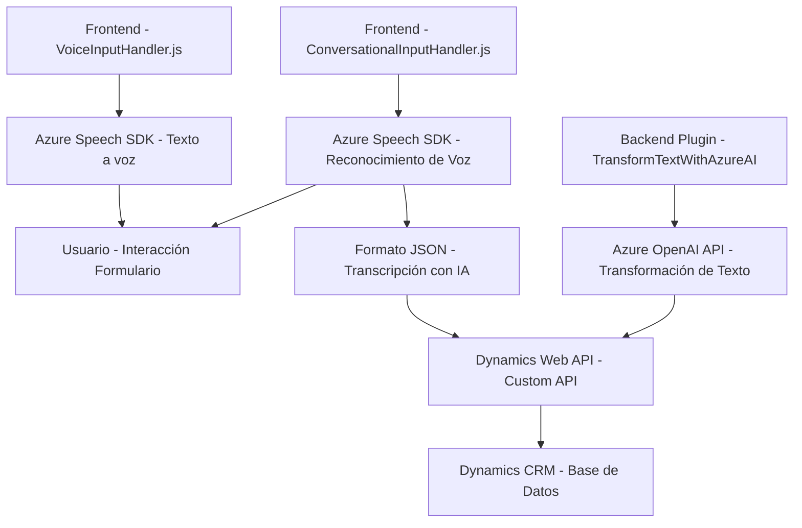

# Análisis Detallado

### Breve resumen técnico:
Este repositorio implementa funcionalidades basadas en **Azure Speech SDK** y **Azure OpenAI**, con integración directa en sistemas como **Microsoft Dynamics CRM**. Proporciona módulos especializados para la conversión de texto en voz, reconocimiento de voz y integración de datos entre formularios dinámicos y un modelo de lenguaje basado en IA.

---

### Descripción de la arquitectura:
1. **Enfoque organizacional del repositorio**:
   -  Está segmentado en tres áreas principales: **Frontend (JS)** y **Backend Plugins (.NET)**. Esto sugiere una separación entre el cliente (interacción del usuario) y la lógica empresarial alojada en el servidor.
   - El frontend utiliza JavaScript para gestionar la interacción del usuario con formularios junto al procesamiento de voz y visualización.
   - El plugin backend (`TransformTextWithAzureAI.cs`) extiende Microsoft Dynamics CRM añadiendo lógica personalizada basada en la IA de Azure OpenAI.

2. **Tipo de arquitectura**:
   - **Desarrollo en capas (n capas)**: Aunque no explícito, la separación entre Frontend, Backend y servicios externos (Azure APIs y Dynamics) resulta ser un desarrollo multicapas (Presentación - Lógica de negocio - Integración con servicios externos/API).
   - **Integración de servicios externos**: La lógica de negocio depende de servicios en tiempo real como Azure Speech para voz y Azure OpenAI para IA, lo que posiblemente se ajuste a un enfoque de **arquitectura orientada a servicios**.

3. **Estilo de patrones de diseño**:
   - **Modularización**: Tanto en el frontend como en el backend, las operaciones están encapsuladas en funciones o clases con una responsabilidad específica (Single Responsibility Principle).
   - **Adapter Pattern**: En el plugin se adapta la interacción entre Dynamics CRM, datos de usuario y la API de Azure OpenAI.
   - **Factory Pattern**: En el frontend, objetos como `speechConfig` y `recognizer` son creados dinámicamente mediante un esquema predefinido.

---

### Tecnologías y frameworks usados:
1. **Frontend**:
   - **JavaScript (Vanilla)**: Implementación del procesamiento de voz y manipulación de DOM.
   - **Azure Speech SDK**: Para síntesis de voz y reconocimiento de voz interactivo.
   - **HTML DOM Manipulation**: Carga dinámica de scripts y manejo de elementos.

2. **Backend (Plugins)**:
   - **C# (.NET Framework)**: Desarrollo de plugins como parte de Dynamics CRM.
   - **Microsoft Dynamics CRM SDK**: Extensión de servicios nativos como `IOrganizationService`.
   - **Azure OpenAI API**: Procesamiento y transformación de texto según directrices.
   - **Newtonsoft.Json**: Parsing de datos en JSON.

---

### Dependencias y componentes externos:
1. **Externos**:
   - **Azure Speech SDK**: Para conversión de texto en audio hablado y análisis de transcripciones.
   - **Azure OpenAI API**: Uso de GPT para transformar texto según parámetros específicos.
   - **Dynamics Web API**: Extensiones y consultas a datos en Microsoft Dynamics CRM.
   - **Servicios HTTP**: Llamadas dinámicas hacia endpoints de Azure durante ejecución.

2. **Internos**:
   - No parece haber dependencias internas cruzadas entre los módulos descritos, pero los scripts del frontend posiblemente compartan configuraciones relacionadas con SDKs.

---

### Diagrama Mermaid
A continuación, se presenta un diagrama para describir la interacción entre componentes del sistema.

---

### Conclusión final:
El repositorio representa una solución tecnológica integrada que combina procesamiento de datos de voz, servicios de inteligencia artificial y sistemas empresariales como CRM. La estructura modular facilita la sostenibilidad, escalabilidad y mantenimiento del proyecto. Adicionalmente, con la separación entre frontend y backend, se observa una arquitectura multi-capas orientada a la interacción con servicios externos, en este caso Azure Speech SDK y OpenAI.