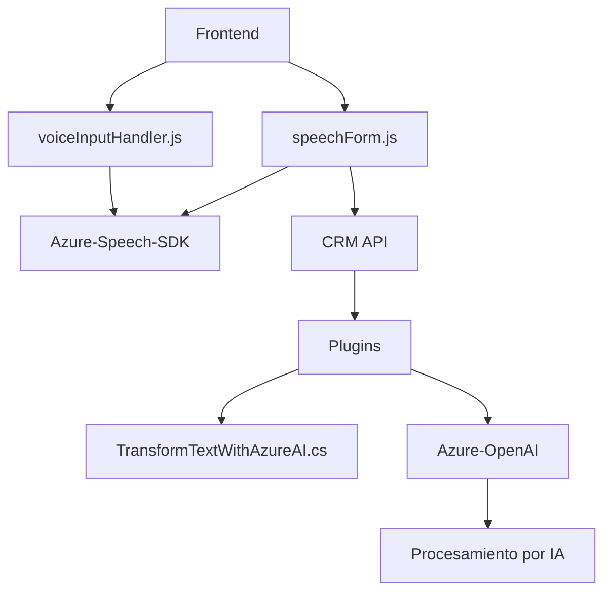

### Breve Resumen Técnico
El repositorio se relaciona con una solución integrada para formularios en un CRM que habilita interacciones por voz y la utilización de tecnologías de inteligencia artificial en la nube. Utiliza Azure Speech SDK y Azure OpenAI para generar y procesar datos de voz y texto, ofreciendo una capacidad avanzada de manejar información en formularios con una arquitectura orientada a servicios y plugins.

---

### Descripción de Arquitectura
La solución tiene una combinación de **arquitectura modular** y **n-capas** dentro de un entorno CRM. Las capas son distribuidas de acuerdo con las responsabilidades:
- **Capa de Interfaz:** Archivos del frontend (`voiceInputHandler.js`, `speechForm.js`) que interactúan con el usuario.
- **Capa de Servicios:** Azure Speech SDK y Azure OpenAI Service son llamados en módulos específicos para reconocimiento de voz y procesamiento textual.
- **Capa de Plugins (Backend):** Utilización del SDK de Dynamics CRM para ejecutar configuraciones específicas, como reglas personalizadas y transformación de datos.
- **Integración con APIs externas:** A través de las APIs de Azure (Speech y OpenAI), se proporciona la capacidad de síntesis y reconocimiento de voz, procesamiento por IA y transformación de texto estructurado.

---

### Tecnologías Usadas
1. **Microsoft Dynamics CRM SDK**: Soporte para interacción directa con la base de datos y lógica del CRM.
2. **JavaScript**: Aplicación en el cliente para procesar datos del frontend.
3. **Azure Speech SDK**: Permite el reconocimiento y síntesis de voz.
4. **Azure OpenAI Service**: Se utiliza para transformación y procesamiento de texto.
5. **.NET Framework** (C#): Implementación de plugins en el lado del servidor para gestionar eventos del CRM.
6. **Librerías externas**:
   - `System.Text.Json` y `Newtonsoft.Json` para manipulación de datos estructurados (JSON).
   - `System.Net.Http` para realizar solicitudes REST hacia APIs.
   - Métodos LINQ para trabajar con colecciones de datos.

---

### Diagrama Mermaid válido para GitHub

---

### Conclusión Final
La solución tiene una arquitectura híbrida que combina **integración de servicios externos** (Azure Speech SDK y Azure OpenAI) con la funcionalidad propia de un **CRM basado en plugins**. El diseño modular facilita el desacoplamiento de las distintas capas y asegura escalabilidad, permitiendo que la funcionalidad de voz y procesamiento IA sea extendible sin afectar la estructura core del CRM. La integración con APIs externas otorga capacidades avanzadas de reconocimiento de voz y transformación de texto, optimizando la interacción del usuario con el sistema CRM.