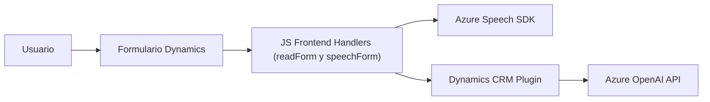

### Resumen técnico
El repositorio examinado incluye tres archivos principales que forman parte de un sistema que interactúa con formularios dinámicos en Dynamics 365, incorporando capacidades avanzadas de reconocimiento y síntesis de voz mediante Azure Speech SDK. Además, se integra con Azure OpenAI para transformar texto en dinámicas personalizadas. El sistema parece tener componentes de frontend en JavaScript y plugins en C# conectados a Dynamics CRM.

---

### Descripción de arquitectura
La arquitectura del sistema puede clasificarse como **n capas** con integración hacia servicios externos. La capa de frontend está basada en JS y Azure SDK, mientras que la capa de backend/CRM implementa funcionalidades como un plugin en C# que comunica Dynamics con Azure OpenAI, funcionando como un intermediario con servicios externos. El diseño del sistema sigue principios de modularidad y enfoque basado en patrones orientados a dependencias externas:

1. **Capa de presentación** (Frontend JS): Gestión de interacción entre usuarios y formularios.
2. **Capa lógica** (Speech SDK y plugins CRM): Funciones específicas que manipulan formularios y consumen APIs.
3. **Arquitectura CRM Plugin**: Extensibilidad modular mediante Dynamics CRM.

---

### Tecnologías usadas
#### Frontend
- **JavaScript**: Lenguaje principal para toda la interacción en la capa de presentación del sistema.
- **Azure Speech SDK**: Utilizado para reconocimiento de voz y síntesis de texto a voz.
- **APIs del navegador**: Manejo de scripts dinámicos y comunicación con servicios externos.
- **Dynamics 365 Web API**: Para realizar operaciones dentro del contexto de CRM.

#### Backend (Plugins)
- **C# (.NET framework)**: Desarrollo del plugin para Dynamics.
- **Microsoft.Xrm.Sdk**: SDK de Dynamics CRM que facilita la integración y manipulación de datos dentro del sistema.
- **Azure OpenAI API**: Utiliza GPT-4o para procesar texto y devolver respuestas transformadas en JSON.

---

### Diagrama Mermaid

---

### Conclusión final
El sistema analizado es una solución integrada que une el procesamiento de formularios dinámicos en Dynamics 365 con capacidades avanzadas de reconocimiento de voz (Azure Speech SDK) y personalización de datos mediante Azure OpenAI (GPT-4o). El diseño sigue una arquitectura basada en **n capas**, con un enfoque modular y de integración dinámica con servicios externos. Además, adopta patrones de carga bajo demanda para el SDK de Azure Speech, optimizando la gestión de dependencias. Este sistema es flexible y extensible, ideal para entornos que requieren interacción con usuarios mediante voz y personalización de datos a gran escala.