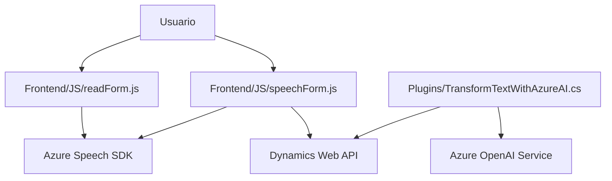

### Análisis del Repositorio

#### 1. Breve resumen técnico
El repositorio incluye tres archivos que en conjunto ofrecen una solución para procesar formularios en una plataforma CRM mientras integran funcionalidades avanzadas de reconocimiento de voz y transformación de texto mediante APIs de Azure. La funcionalidad está dividida en: 
1. Captura de datos visibles de formularios (frontend).
2. Procesamiento de comandos de voz y datos asociados al formulario.
3. Transformación del texto con las APIs de Azure en el backend, operando como un plugin para Microsoft Dynamics CRM.

---

#### Descripción de Arquitectura
La solución presenta una arquitectura basada en **n capas**:
- **Frontend**: Archivos como `readForm.js` y `speechForm.js` corresponden a una capa de presentación para la interacción con formularios y captación/síntesis de voz. Está implementada en JavaScript y utiliza el **Azure Speech SDK** para las capacidades de procesamiento de voz en el navegador.
- **Backend**: El archivo `TransformTextWithAzureAI.cs` actúa como un servicio especializado dentro del framework del plugin de **Microsoft Dynamics CRM**, ofreciendo una capa de procesamiento en la que se conecta con la API de Azure OpenAI para transformar texto en JSON estructurado.
- **Integración con servicios externos**: Se aprovechan servicios en la nube (Azure Speech SDK y Azure OpenAI Service) a través de llamadas HTTP para procesamiento de voz y texto respectivamente.

#### 2. Tecnologías, frameworks y patrones usados
**Tecnologías:**
- **Frontend**: 
  - Lenguaje: JavaScript.
  - Azure Speech SDK: Para síntesis y reconocimiento de voz.
  - Microsoft Dynamics Web API: Gestión de formularios y datos del CRM.
- **Backend**:
  - Lenguaje: C#.
  - Framework: `Microsoft.Xrm.Sdk` para integración como plugin en Dynamics CRM.
  - Azure OpenAI Service: Para procesamiento de texto avanzado mediante Inteligencia Artificial.
  - Bibliotecas JSON: `Newtonsoft.Json.Linq`, `System.Text.Json`.
  - HTTP Client (`System.Net.Http`): Consumir servicios externos.

**Patrones utilizados:**
- **Modularización**: Cada funcionalidad está encapsulada en funciones con responsabilidad específica, favoreciendo la reutilización y el mantenimiento.
- **Event-Driven Architecture**: Uso de callbacks para gestionar eventos (cuando el SDK de Azure Speech se carga).
- **Lazy Loading**: Carga dinámica del SDK de Azure mejora la eficiencia del frontend.
- **Proxy Pattern**: Encapsulación de solicitudes a Azure OpenAI mediante el método `GetOpenAIResponse`.
- **Plugin Architecture**: Un componente backend implementado como plugin que se integra al flujo de trabajo del CRM.

---

#### 3. Tipo de solución
La estructura corresponde a una solución de software distribuida, con las siguientes características:
- **Frontend (JavaScript)**: Orientado a la interacción del usuario con formularios y reconocimiento de voz.
- **Backend (C# Plugin)**: Desarrollado para extender la funcionalidad de Microsoft Dynamics CRM mediante la integración de servicios avanzados de IA ofrecidos por Azure.

En conjunto, la solución puede considerarse una integración de **API + frontend** con servicios en la nube.

---

#### 4. Dependencias o componentes externos
- **Servicios de Microsoft Azure**:
  1. **Azure Speech SDK**: Facilita la síntesis y el reconocimiento de voz.
  2. **Azure OpenAI Service**: Utilizado para transformar texto con inteligencia artificial avanzada.
  
- **CRM Web API** (Microsoft Dynamics): Gestión de formularios y almacenamiento de datos en el entorno de CRM.

- **Bibliotecas JSON**:
  1. `Newtonsoft.Json` y `System.Text.Json` para el manejo de objetos y estructuras JSON en C#.
  
- **HTTP Client (`System.Net.Http`)**: Utilizado en el plugin para consumir la API de Azure OpenAI.

---

#### 5. Diagrama **Mermaid** compatible con GitHub Markdown

> **Explicación del diagrama**:  
- El usuario interactúa con el frontend que comprende dos scripts: `readForm.js` (lectura de datos sobre el formulario) y `speechForm.js` (procesamiento y control de comandos por voz).
- Ambos scripts usan **Azure Speech SDK** para gestionar funcionalidades de reconocimiento y síntesis de voz.
- `speechForm.js` se comunica con la **Dynamics Web API** para realizar cambios en los formularios visibles del CRM.
- El plugin `TransformTextWithAzureAI.cs` en el backend extiende la funcionalidad del CRM mediante el uso de la API de **Azure OpenAI Service** para transformar texto según reglas específicas.

---

### Conclusión final
La solución analiza y gestiona datos de formularios en una plataforma CRM usando funcionalidades avanzadas de reconocimiento y síntesis de voz, además de incorporar procesamiento AI (mediante Azure OpenAI). Está diseñada siguiendo patrones modernos de programación y arquitectura en capas, integrando servicios cloud (Azure) con interfaces frontend y backend. Es ideal para aplicaciones que buscan mejorar la experiencia de usuario con tecnologías como speech-to-text y procesamiento AI. Sin embargo, sería recomendable mejorar la seguridad al evitar hardcoding de configuraciones sensibles como claves API en el código.