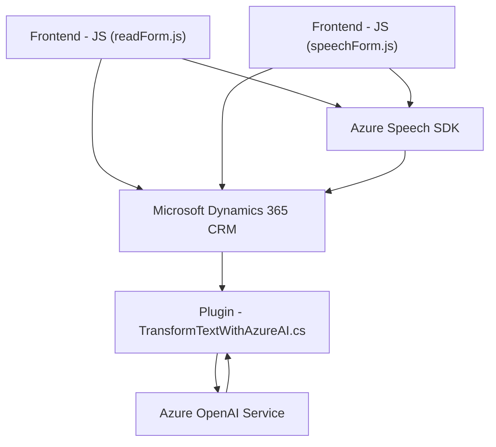

# Análisis Detallado

### Breve Resumen Técnico
El repositorio describe un sistema que integra funcionalidades avanzadas de voz y procesamiento de texto utilizando el **Azure Speech SDK** y el **Azure OpenAI Service**. Los archivos implementan la captura, procesamiento, y conversión del texto hablado a formatos legibles y aplican estos valores a un formulario interactivo dentro de un contexto de ejecución de Microsoft Dynamics CRM.

---

### Descripción de Arquitectura
La solución identifica patrones de diseño modernos y está organizada en módulos específicos:

1. **Tipo de solución:** Este es un sistema híbrido que parece formar parte de una suite de productos de Dynamics 365 CRM, con una **integración directa con APIs externas (Azure Speech SDK y Azure OpenAI)**. Es un componente de backend y frontend.
   - *Frontend:* Scripts en JavaScript ofrecen la interfaz para capturar voz y realizar transcripciones mediante un servicio externo (Azure Speech SDK).
   - *Backend/Plugins:* El código ejecuta plugins en el contexto del CRM, que permiten procesar texto usando Azure OpenAI Service.

2. **Tecnologías, Frameworks y Patrones**:
   - **JavaScript**: Para manejo de frontend, eventos y ejecución en navegadores.
   - **Azure Speech SDK**: Proceso de síntesis de texto a voz y transcripción de voz a texto en tiempo real.
   - **Dynamics CRM framework**: Uso de `executionContext` y `IPlugin` en los plugins para la integración CRM/ERP y manejo de datos empresariales.
   - **Azure OpenAI Service**: Se usa para transformar texto basado en reglas específicas usando modelos GPT (como GPT-4).
   - **Patrones de diseño**:
     - *Factory*: La creación de objetos como `SpeechConfig` y `AudioConfig`.
     - *Data Mapper*: Traducción de datos (etiquetas y valores) a campos específicos dentro del formulario.
     - *Separación de responsabilidades*: La lógica de SDK, mapeo y APIs externas está bien distribuida en el sistema.
     - *Modularización*: División de tareas en distintas funciones con propósitos definidos.
     - *Integración con APIs externas*: Como Azure y Dynamics Web APIs.

3. **Arquitectura del sistema:** La solución sigue un enfoque **n capas basado en servicios**. Integra múltiples capas: 
   - **Capa de presentación**: Scripts en frontend que interactúan con usuarios y servicios, procesando inputs de voz y asignándolos a formularios.
   - **Capa de aplicación**: Plugins en Dynamics CRM gestionando inputs y realizando transformaciones con la API de OpenAI.
   - **Capa externa**: Uso de servicios externos como Azure Speech SDK y Azure OpenAI Service.

4. **Dependencias o componentes externos**:
   - Azure Speech SDK para síntesis y reconocimiento de voz.
   - Azure OpenAI Service para transformación avanzada de texto.
   - Dinámicas de `Microsoft Dynamics CRM` presentes como contexto de ejecución (`executionContext` y uso directo de `Xrm.WebApi`, lo que denota una integración con las APIs REST del CRM).
   - Uso de bibliotecas de manejo de JSON como `Newtonsoft.Json.Linq` y `System.Text.Json`.
   - Librerías de .NET (presentes en los plugins) para realizar peticiones HTTP.

---

### Diagrama Mermaid 100 % compatible con GitHub Markdown

---

### Conclusión Final
El repositorio presenta un sistema bien diseñado para integrar funcionalidades basadas en voz y texto en el entorno de Dynamics 365 CRM. Utiliza servicios externos avanzados como Azure Speech SDK y Azure OpenAI para ofrecer experiencias mejoradas en la interacción con formularios y el procesamiento de texto dictado. La arquitectura n capas basada en servicios asegura modularidad, escalabilidad y claridad en la separación de responsabilidades.