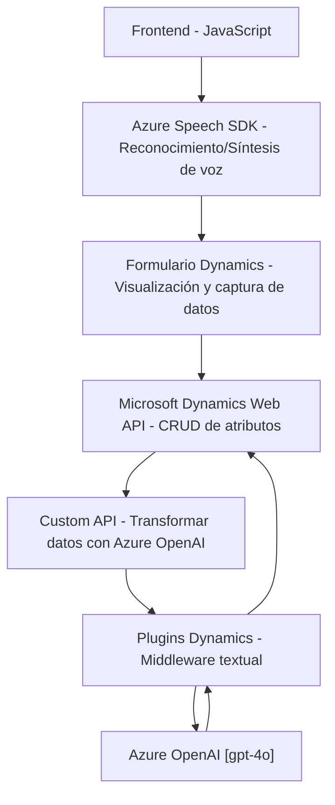

### Breve resumen técnico
El repositorio se enfoca en la integración entre **Microsoft Dynamics CRM** y **Azure Speech/OpenAI** para gestionar formularios con interacción mediante voz. La solución parece ser una extensión modular de Dynamics CRM, permitiendo transcripciones de voz, síntesis de texto en audio y transformación de datos con aportes de inteligencia artificial.

---

### Descripción de arquitectura
1. **Arquitectura General**:
   - **Multicapa**: El frontend (JavaScript) interactúa con Dynamics CRM usando APIs y SDKs, mientras que los plugins en backend procesan datos y servicios de AI.
   - Uso de **patrones de integración**:
     - SDK externo en frontend (Azure Speech SDK).
     - Custom API en Dynamics CRM, que actúa como middleware para transformar datos usando Azure OpenAI Service.
   - El diseño modular separa funcionalidades específicas (gestión de voz, síntesis de audio, transformación de texto).
   - Énfasis en la reutilización con funciones encapsuladas tanto en el frontend como en el backend.

---

### Tecnologías usadas
1. **Frontend (JavaScript)**:
   - **Azure Speech SDK**: Utilizado para entrada por voz, síntesis de texto en audio y transcripción en tiempo real.
   - **Dynamics Web API**: Para operaciones CRUD en los formularios y manejo de Custom APIs.

2. **Backend (.NET - Plugins)**:
   - **Microsoft Dynamics SDK**: Framework para implementar plugins que interactúan directamente con entidades de Dynamics CRM.
   - **Azure OpenAI Service**: Utilizado para transformar texto en JSON mediante modelos GPT.
   - Dependencias comunes en .NET:
     - `Newtonsoft.Json.Linq` y `System.Text.Json` (para manejar estructuras de JSON).
     - `System.Net.Http` (para realizar peticiones HTTP a Azure OpenAI).

3. **Patrones**
   - **Capa de servicio/SDK externo dinámico**: El SDK se carga dinámicamente en frontend solo cuando es requerido.
   - **Plugin de middleware**: Backend actúa como intermediario entre Dynamics CRM y Azure OpenAI.

---

### Dependencias o componentes externos
- **Azure Speech SDK**: Para procesamiento de voz y síntesis de audio.
- **Azure OpenAI (gpt-4o)**: Para transformar texto en JSON estructurado según reglas.
- **Microsoft Dynamics CRM APIs**:
  - Custom APIs desarrolladas internamente.
  - Integración con entidades de Dynamics (formularios, atributos, búsqueda de valores).
- **Newtonsoft.Json**: Para manipulación de JSON en el lado de backend.

---

### Diagrama Mermaid

---

### Conclusión final
El repositorio implementa una solución híbrida para el manejo de formularios mediante voz en **Microsoft Dynamics CRM**, utilizando una combinación de tecnologías modernas como **Azure SDK** y servicios de AI (OpenAI GPT). La arquitectura multicapa permite una clara separación de responsabilidades entre frontend (interacción de usuario), APIs (integración dinámica) y plugins backend (procesamiento de datos con AI).

El diseño modular, las dependencias externas dinámicas y los patrones usados favorecen la extensibilidad y el mantenimiento de la solución, haciendo que sea adecuada para escenarios corporativos que requieran personalización en CRM con interacción avanzada mediante voz e inteligencia artificial.