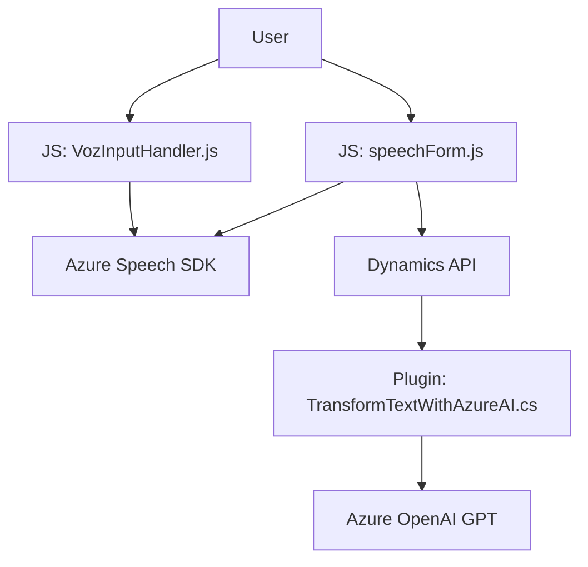

### Breve resumen técnico:

El repositorio contiene tres componentes clave:  
1. **Frontend**: JavaScript para manejar formularios dinámicos con entrada y salida de voz. Esto incluye interacción directa con **Azure Speech SDK**.  
2. **API personalizada (Plugin)**: Un plugin de Dynamics CRM para procesar texto con **Azure OpenAI GPT**, transformándolo en objetos JSON estructurados.  
3. **Integración entre estos elementos**: El frontend usa APIs integradas y llamadas hacia Dynamics plugins, mientras el plugin interactúa con servicios externos para procesamiento de IA.

---

### Descripción de arquitectura:

La solución presenta una arquitectura **n capas (multitier)** combinada con un enfoque **cliente-servidor**. Las capas incluyen:
1. **Frontend** (presentación): Manejo de lógica de interfaz con interacción directa del usuario.  
2. **Backend API en Dynamics CRM** (lógica de negocio): Procesamiento del texto ingresado mediante un plugin `TransformTextWithAzureAI.cs`.  
3. **Servicios externos**:
   - **Azure Speech SDK**: Para reconocimiento de voz en tiempo real en el cliente (frontend).  
   - **Azure OpenAI GPT**: Para transformación avanzada de texto en el backend.  

---

### Tecnologías usadas:

1. **Frontend (JavaScript)**:
   - Azure Speech SDK: Reconocimiento de voz y síntesis de texto.  
   - Módulos JavaScript para estructurar funciones específicas.  
   - Xrm framework de Dynamics para manipulación de formularios.  

2. **Backend (Dynamics CRM)**:
   - .NET Framework con C#: Plugin basado en `IPlugin`.  
   - Dependency Injection vía `IServiceProvider`.  
   - HTTP REST API para consumir el servicio de Azure GPT.  
   - Microsoft Dynamics SDK: Interacción y manipulación de datos en CRM.  

3. **Servicios cloud**:
   - Azure Speech para texto a voz.  
   - Azure OpenAI para generación y transformación de texto.  

---

### Dependencias o componentes externos:
- **Azure Speech SDK**: Gestión de voz en frontend, cargado dinámicamente.  
- **Azure OpenAI GPT**: Análisis e interpretación avanzada de texto.  
- **Xrm SDK (Dynamics CRM)**: Manipulación directa del modelo de datos del formulario.  
- **System.Net.Http y Newtonsoft.Json**: Para facilitar llamadas REST y manipulación JSON en el plugin backend.  

---

### Diagrama **Mermaid**:

---

### Conclusión final:

Esta solución implementa una arquitectura modular utilizando tecnologías de vanguardia como **Azure Speech SDK** y **Azure OpenAI GPT** con **Microsoft Dynamics SDK** para integrar reconocimiento de voz y procesamiento de texto en un contexto de formularios dinámicos. El uso de **n capas** garantiza una separación eficaz entre las capas de presentación (frontend) y negocio (backend API). Sin embargo, aspectos como **seguridad** (gestión de credenciales directamente en los archivos fuente) y monitoreo de excepciones pueden mejorarse para garantizar su robustez y escalabilidad al interactuar con servicios externos.