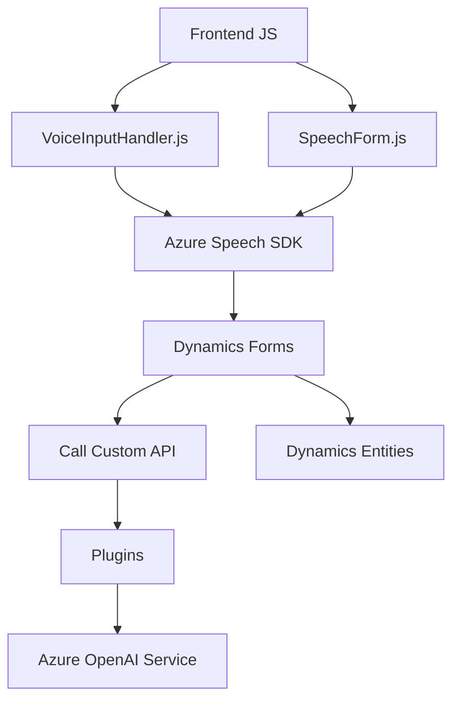

### Resumen técnico:

El repositorio parece contener la implementación de un sistema que utiliza herramientas de Microsoft Dynamics 365 y Azure para integrar procesamiento de voz, texto y datos mediante IA. Los archivos analizados sugieren que el sistema incluye una mezcla de front-end con soporte para análisis de datos en tiempo real y un desarrollo back-end basado en plugins para automatizar procesos y realizar operaciones de transformación.

---

### Descripción de arquitectura:

La solución tiene una arquitectura de tipo **n capas**, distribuidas en:

1. **Capa de presentación** (frontend/JS):
   - Procesamiento de entrada de voz con Azure Speech SDK.
   - Interacción directa con formularios en Dynamics 365, recolectando datos visibles y sintetizando voz o procesando transcripciones.

2. **Capa de lógica de negocio** (plugins/cs):
   - Implementación de plugins en Dynamics 365 que procesan datos con Azure OpenAI para transformar texto y devolver respuestas en formato JSON.

3. **Capa de datos**:
   - Uso de Dynamics 365 CDS (Common Data Service), posiblemente con referenciación a los nombres internos de campos de formularios y entidades relacionadas, como en "lookup" o búsquedas avanzadas.
   - Se aprovecha el acceso a servicios web de API customizadas y mapeo de datos CRM.

---

### Tecnologías usadas:

- **Microsoft Dynamics 365**: Marco utilizado para la gestión de datos y lógica de negocio.
- **Azure Speech SDK**: Reconocimiento y síntesis de voz desde el front-end.
- **Azure OpenAI Service**: Procesamiento avanzado de texto utilizando modelos de AI.
- **JavaScript (frontend):**
  - Implementación modular para gestionar eventos, datos y capacitación en tiempo real.
  - Funciones con asincronía manipulando Promesas y modelos de modularidad.
- **Back-end (C#)**:
  - `System.Net.Http`: Comunicación con APIs externas (Azure y servicios internos).
  - `Dynamics 365 SDK`: Extensiones y plugins personalizados.
- **JSON** para la estructuración de datos interactuados entre servicios.

---

### Dependencias y componentes externos:

1. **Dependencias externas:**
   - SDK de Azure Speech (cargado dinámicamente desde URL pública).
   - Azure OpenAI (para procesamiento IA avanzado).
   - Dynamics CRM APIs como `Xrm.WebApi`.
   - External APIs y HTTP Requests, ejemplo en los plugins y llamadas a través de APIs customizadas.

2. **Dependencias internas:**
   - Implementación de lógica interna basada en el contexto de ejecución de Dynamics 365, como `executionContext` y mapeo con formularios (`formContext`).

---

### Diagrama Mermaid:

---

### Conclusión final:

La solución es una integración robusta de Azure Speech y Azure OpenAI en formularios de Dynamics 365. Su arquitectura de **n capas** permite dividir funcionalidades entre frontend (procesamiento de datos y transcripción en tiempo real) y backend (automatización de transformación y sincronización de datos). Aunque la estructura es sólida, puede mejorarse la seguridad y flexibilidad del manejo de credenciales y parámetros estáticos, así como la preparación para ajustar normas definidas en el futuro.