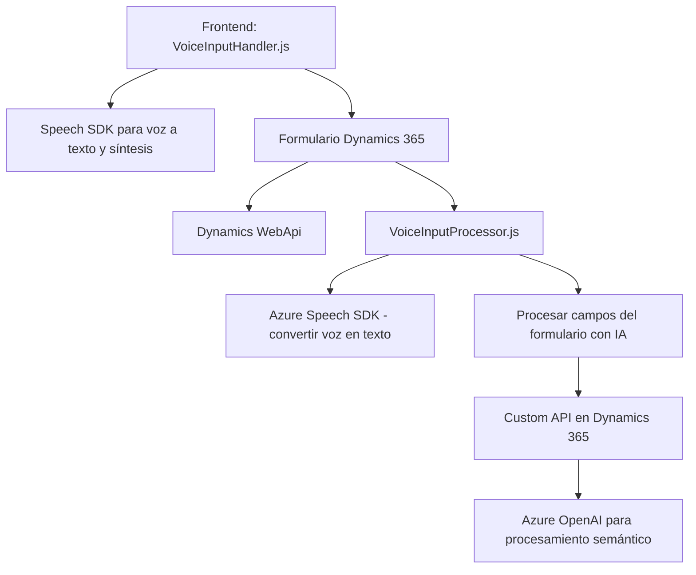

### Breve resumen técnico
Este repositorio presenta una solución mixta que combina un frontend en JavaScript para la interacción dinámica con formularios de Dynamics 365 y un plugin de backend en C# que realiza procesamiento avanzado de texto utilizando Azure OpenAI. Esto permite una integración fluida entre la entrada por voz, el procesamiento de datos en tiempo real y su transformación semántica hacia una estructura dinámica.

---

### Descripción de arquitectura
La solución utiliza una **arquitectura de n capas** donde:
1. **Capa de presentación (frontend)**: Implementada en JavaScript; maneja la interacción del usuario mediante formularios y la captación de voz.
2. **Capa de negocio (backend)**: Diseñada como un plugin para Dynamics CRM basado en C#, encargado de realizar procesamiento inteligente mediante Azure OpenAI y proporcionar datos estructurados a los sistemas cliente.
3. **Capa de integración**: Utiliza APIs externas (Azure Speech SDK y Azure OpenAI) para manejar entradas por voz y operaciones semánticas avanzadas.

Patrones observados:
- **Modularidad**: Separación de funciones en archivos organizados por responsabilidad (voz, procesamiento, backend).
- **Service Integration Pattern**: Integración de servicios externos como Speech SDK y OpenAI API.
- **Plugin Architecture**: Extensibilidad específica para Dynamics 365.

---

### Tecnologías usadas
1. **Frontend**:
   - Javascript (Vanilla JS).
   - APIs estándar del DOM.
   - Azure Speech SDK.
   - Programación basada en eventos y callbacks.

2. **Backend**:
   - C# con Dynamics CRM SDK.
   - Librerías de procesamiento JSON (`Newtonsoft.Json`, `System.Text.Json`).
   - HTTP Client para integrarse con Azure OpenAI.

3. **Servicios externos**:
   - Microsoft Azure Speech SDK.
   - Microsoft Azure OpenAI.

---

### Diagrama Mermaid válido para GitHub

---

### Conclusión final
Este repositorio corresponde a una **solución híbrida** con características propias de una arquitectura de **n capas**, diseñada para un ecosistema Dynamics 365. Combina elementos de frontend (interacción por voz y formularios) con procesamiento avanzado en backend (OpenAI). La integración con servicios de Azure refuerza la capacidad para interactuar con usuarios en tiempo real y transformar inputs en datos estructurados, empleando tecnologías modernas de IA y reconocimiento de voz.