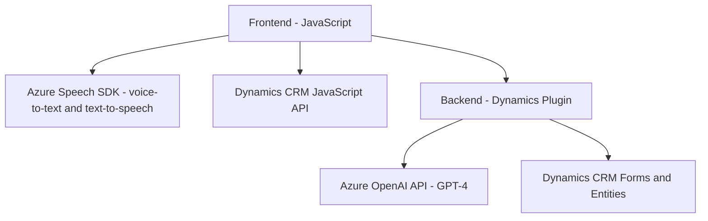

### Breve resumen técnico
El repositorio en cuestión se centra en la integración de funcionalidades de voz y procesamiento de lenguaje natural (PNL) utilizando servicios de **Azure Speech SDK** y **Azure OpenAI** principalmente en entornos de **Dynamics 365**. Incluye un frontend en JavaScript para interactuar con formularios y un backend basado en un plugin de Dynamics CRM para transformar datos utilizando modelos avanzados de inteligencia artificial.

---

### Descripción de arquitectura
La solución implementada parece seguir una **arquitectura híbrida basada en n capas**, donde:
1. La capa de presentación (frontend) gestiona la interacción de usuarios a través de formularios dinámicos vinculados a Dynamics CRM.
2. Existe una capa intermedia que realiza llamadas a servicios externos (Azure Speech SDK y Azure OpenAI) como parte de la lógica en el frontend (JavaScript) y en el backend (plugin).
3. La capa de datos se basa en Dynamics CRM, con adaptaciones específicas para interacción con entidades, atributos, mapeo de campos y APIs personalizadas.

Se utiliza **Service-Oriented Architecture (SOA)**, dado que gran parte de las operaciones están delegadas a servicios externos especializados (Azure Speech SDK, Azure OpenAI API).

---

### Tecnologías usadas
1. **Frontend:**
   - **JavaScript**: Lógica del cliente en los archivos `readForm.js` y `speechForm.js`.
   - **Dynamics 365 JavaScript API**: (`Xrm.WebApi`) para interacción con las entidades de CRM.
2. **Azure Speech SDK**: Manejo de síntesis y reconocimiento de voz en los archivos del frontend.
3. **Backend:**
   - **Microsoft Dynamics 365 Plugin API**.
   - **Azure OpenAI API**: Lógica para procesar datos de entrada con GPT (posiblemente GPT-4).
   - **.NET Framework/C#**: Para desarrollar plugins.
   - **HTTP client libraries**: Realizan solicitudes a servicios externos.

---

### Dependencias o componentes externos
- **Azure Speech SDK**: Utilizado para entrada de voz (speech-to-text) y salida de voz (text-to-speech) en el frontend.
- **Azure OpenAI API**: Para procesamiento PNL avanzado desde el backend plugin.
- **Dynamics 365 JavaScript API**: Especialmente para realizar operaciones en formularios y llamadas a Custom APIs.
- **Custom APIs dentro de Dynamics CRM**.
- **Microsoft.Xrm SDK y .NET Libraries**: Servicios para interactuar con el contexto del CRM y la comunicación HTTP.
- **Newtonsoft.Json**: Facilita la serialización de datos con formato JSON.
- Potencial uso de servicios secundarios como consultas SQL (no confirmado por documentación).

---

### Diagrama Mermaid válido para GitHub

---

### Conclusión final
La solución implementa una integración entre Dynamics CRM, Azure services (Speech SDK y OpenAI), y custom plugins en Dynamics CRM. La arquitectura empleada permite extender las funcionalidades de Dynamics CRM usando IA y capacidades avanzadas de procesamiento de lenguaje y voz desde servicios de Azure. La estructura del código muestra una orientación al desacoplamiento, con funciones organizadas por responsabilidades específicas, y el uso de patrones como **callback** y **service-oriented**. 

Sin embargo, se recomienda agregar pruebas unitarias tanto al frontend como al backend para garantizar la resistencia ante fallos en los servicios externos, además de incorporar mecanismos de registro de errores y fallos en el plugin backend cuando no logre comunicarse exitosamente con el servicio de Azure OpenAI.