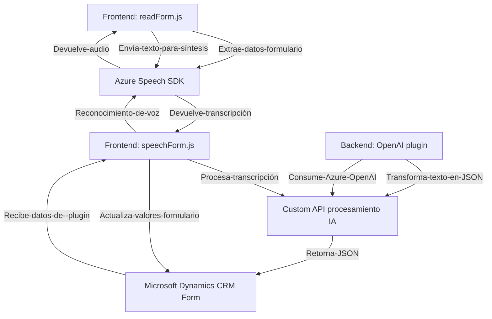

**Breve resumen técnico:**

El repositorio analiza tres archivos de código distintos (en JavaScript y .NET), cada uno con una funcionalidad específica:

- **Integración con reconocimiento de voz (Azure Speech SDK) y síntesis de voz.**
- **Interacción dinámica con formularios en Microsoft Dynamics CRM.**
- **Procesamiento de texto con inteligencia artificial (Azure OpenAI) consumida como servicio externo.**

Se implementan patrones como integración con servicios externos, abstracción lógica, procesamiento asíncrono y desacoplamiento modular en algunos casos.

---

**Descripción de la arquitectura:**

1. **Tipo de solución:** 
   El repositorio corresponde a una **integración de servicios** principalmente orientado a la manipulación de formularios y comunicación con servicios de procesamiento de texto a través del **Azure Speech SDK** y **Azure OpenAI**. Puede ser parte de una solución más grande en el contexto de Microsoft Dynamics CRM para mejorar la interacción del usuario mediante reconocimiento de voz y transformación de datos.

2. **Arquitectura:**  
   Sigue un diseño de solución **n-Capas/modular**, donde cada archivo del repositorio cumple roles específicos. No es estrictamente un monolito porque depende de múltiples servicios externos, pero tampoco puede considerarse una solución de microservicios. 

3. **Patrones observados:**  
   - **Plug-in Pattern:** El archivo en .NET se implementa como un plugin estándar dentro del ecosistema Dynamics CRM.  
   - **Cliente API:** Los archivos JavaScript interactúan con servicios externos como Azure Speech y APIs de procesamiento JSON.  
   - **Abstracción de servicios externos:** Cada archivo desacopla la lógica de interacción con Azure Speech SDK y los formularios de Dynamics CRM usando funciones específicas.  
   - **Facade Pattern:** Se observa en la lógica simplificada de funciones principales, como `startVoiceInput`.  

---

**Tecnologías usadas:**

- **Frontend (JavaScript):**
   - Azure Speech SDK.
   - Microsoft Dynamics context APIs (para manejar `formContext`, etc.).
   - Xrm.WebApi para integrar APIs externas (en particular, una Custom API).

- **Backend (.NET):**
   - Microsoft Dynamics CRM SDK (`Microsoft.Xrm.Sdk`).
   - Azure OpenAI en el contexto de transformación de texto (via `System.Net.Http`).

- **External Dependencies:**
   - Azure Speech SDK (reconocimiento y síntesis de voz).
   - Azure OpenAI para procesamiento avanzando de texto y generación de JSON.

---

**Diagrama **Mermaid** para GitHub Markdown:**

---

**Conclusión final:**

El repositorio representa un **ecosistema integrado** en torno a Microsoft Dynamics CRM con añadidos de reconocimiento de voz y procesamiento de IA. Utiliza una arquitectura **basada en abstracción de servicios externos y modularidad**, dividiendo responsabilidades en tres enfoques principales: manejo de formularios, síntesis/reconocimiento de voz y transformación avanzada de texto con IA.

Aunque la modularidad se encuentra bien implementada en cada componente, recomendaciones incluyen: 

1. **Seguridad de las claves:** Eliminar las claves y configuraciones sensibles en texto plano del código fuente y trasladarlas a un sistema seguro como Key Vault o variables de entorno.
2. **Mejor desacoplamiento:** Crear una capa adicional de abstracción para los servicios externos, con lógica centralizada en un módulo uniforme que maneje todos los servicios (ej. Azure Speech, OpenAI).