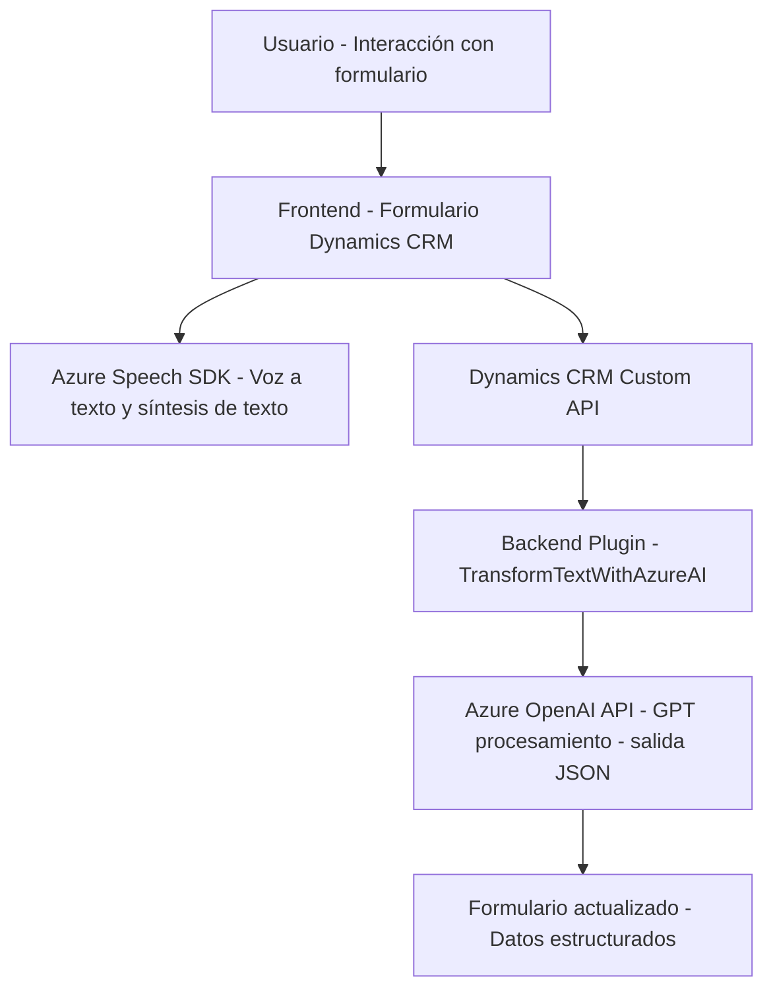

### Breve resumen técnico:

Este repositorio contiene una solución integrada que combina **frontend** y **backend** para procesamiento de datos en formularios de Dynamics CRM con ayuda de **Azure Speech SDK** y **Azure OpenAI**. El frontend maneja la interacción entre usuarios y formularios mediante entrada de voz y síntesis de texto en español, mientras que el backend (plugin) extiende funcionalidades del CRM para estructurar datos mediante reglas definidas con Azure OpenAI. 

---

### Descripción de arquitectura:

La solución emplea una arquitectura de **n capas** con componentes distribuidos entre:
1. **Frontend JS** interactivo**: Se encarga de gestionar la interfaz del formulario y comunicación directa con el usuario mediante entrada y salida de texto/voz. Utiliza funciones independientes y patrones orientados a eventos y helpers.
2. **Backend Plugin**: Implementa lógica personalizada dentro de Dynamics CRM, aplicando un patrón de **Plugin Extensibility**. El plugin transforma dinámicamente los datos ingresados con reglas configuradas y los integra al CRM.
3. **Servicios externos**: Utiliza servicios de **Azure Speech SDK** y **Azure OpenAI** para síntesis de voz, transcripción y transformación de texto en JSON estructurado.

---

### Tecnologías usadas:

1. **Frontend**:
   - **JavaScript**: Para lógica interactiva y entrada de datos con el formulario.
   - **Azure Speech SDK**: Para entrada por voz, síntesis de texto y reconocimiento.
   - **Dynamics CRM APIs** (`Xrm.WebApi`): Para manipular datos del formulario.

2. **Backend**:
   - **C#**: Lenguaje principal del plugin.
   - **Dynamics CRM SDK**: Para ejecución de lógica dentro del contexto de Dynamics CRM.
   - **Azure OpenAI API**: Para transformar contenido en JSON estructurado.

3. **Complementos**:
   - **HttpClient (C#)**: Consumir servicios REST de Azure.
   - **System.Text.Json**: Serialización/deserialización de JSON en el backend.
   - **Promesas y async/await (JS)**: Para manejo eficiente de operaciones asíncronas.

---

### Diagrama Mermaid válido para GitHub:

---

### Conclusión final:

La solución es una implementación de **n capas** que distribuye la lógica a nivel de **frontend** (gestión de formularios y voz) y **backend** (transformación automatizada de datos). Utiliza servicios como **Azure Speech SDK** para voz y **Azure OpenAI** para IA, integrados eficientemente a través de plugins personalizados en Dynamics CRM. Aunque no hay uso de microservicios, esta arquitectura integra dependencias externas robustas, destacándose por su capacidad para procesar datos en tiempo real y ofrecer interacción a los usuarios mediante entrada/salida de voz.