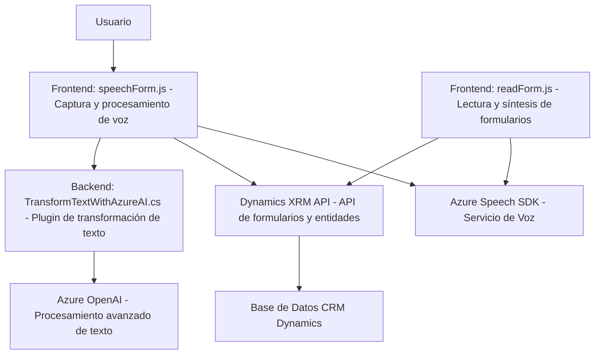

### Breve resumen técnico
Este repositorio contiene múltiples archivos organizados en subdirectorios que implementan funcionalidades específicas en un entorno basado en Microsoft Dynamics CRM y servicios de Azure. Los archivos mencionados abarcan funcionalidades tanto para cliente (frontend JavaScript) como para backend (plugin de Dynamics CRM en C#). El núcleo de la solución es la interacción con tecnologías emergentes y servicios en la nube, como Azure Speech SDK y Azure OpenAI, para proporcionar procesos de reconocimiento de voz y síntesis, procesamiento de texto y manipulación de formularios dinámicos.

---

### Descripción de arquitectura

1. **Tipo de solución:**  
   La solución es una integración entre una frontend interactiva con JavaScript que comunica con servicios de reconocimiento de voz y un backend basado en plugins de Dynamics CRM. La arquitectura está orientada al procesamiento dinámico de datos de formularios y texto con servicios de inteligencia artificial (Azure OpenAI).

2. **Arquitectura:**  
   - **Frontend:** Modular y orientado a servicios externos, donde cada funcionalidad se implementa mediante funciones independientes en JavaScript. La carga dinámica de dependencias externa (Azure SDK) es un indicio de desacoplamiento.
   - **Backend (con Dynamics Plugin):** Construido sobre una arquitectura de **n capas**, el plugin se registra en Dynamics CRM como un gestor que escucha eventos y aplicará lógica adicional integrada con servicios externos.

   La solución puede ser categorizada como una arquitectura "híbrida" debido a la combinación de interacción con servicios externos (Azure APIs) y un sistema centralizado (Microsoft Dynamics CRM).

---

### Tecnologías usadas

1. **Frontend:**
   - **JavaScript ES6+:** Base del código de los formularios.  
   - **Azure Speech SDK:** Reconocimiento de voz y síntesis vocal.  
   - **Dynamics XRM API:** Para manipulación de datos del formulario dentro del ecosistema Dynamics 365.  

2. **Backend:**
   - **C# en .NET Framework:** Plugin registrado como `IPlugin`.  
   - **Azure OpenAI:** Procesamiento avanzado de texto mediante llamadas HTTP utilizando normas especificadas.  
   - **Microsoft Dynamics SDK:** Para interacción con el ecosistema CRM, como flujo de eventos y manejo de datos.

---

### Dependencias o componentes externos

**Frontend:**  
- **Azure Speech SDK:** Proporciona capacidades de síntesis y reconocimiento de voz (cargado dinámicamente desde un CDN).  
- **Dynamics XRM API:** Para operaciones CRUD en formularios y ejecución de APIs personalizadas.  

**Backend:**  
- **Azure OpenAI API:** Para procesamiento de texto avanzado.  
- **Librerías estándar de .NET:** Para manejo de solicitudes HTTP y manipulación de JSON.  
- **Microsoft Dynamics SDK:** Interacción directa con la base de datos y eventos del sistema CRM.  

---

### Diagrama **Mermaid** válido para GitHub

---

### Conclusión final
La solución integra tecnología avanzada de IA y procesamiento de voz con una plataforma de CRM como Dynamics 365. En el frontend, se emplea JavaScript para interactuar directamente con el usuario y conectar con servicios como Azure Speech SDK. En el backend, el plugin utiliza Azure OpenAI para transformar texto en tiempo real. Esta arquitectura es adecuada para escenarios donde se requiere una interacción ágil con servicios de IA y un CRM robusto, aunque podría beneficiarse de mejores prácticas como la gestión segura de credenciales y configuraciones.