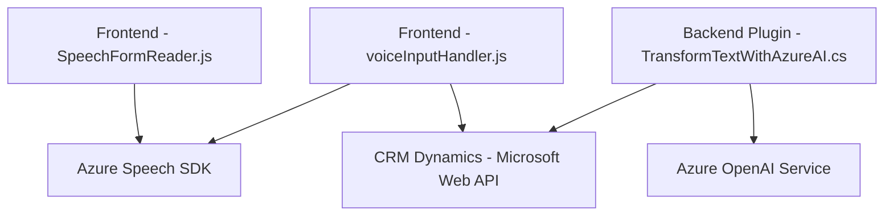

### Breve resumen técnico

El repositorio presenta tres archivos principales que componen una solución integrada para el manejo de formularios y reconocimiento/transformación de voz utilizando servicios de **Azure** en el contexto de **Microsoft Dynamics CRM**. Los archivos están divididos en lógica de frontend (JavaScript) y plugins backend (.NET), con fuerte dependencia de servicios externos como **Azure Speech SDK** y **Azure OpenAI**.

---

### Descripción de arquitectura

La arquitectura de la solución tiene las siguientes características:
1. **Capas**:
   - **Frontend**: Los scripts JavaScript se encargan de gestionar e interactuar con formularios dinámicos, para obtener valores visibles, reconocer voz y ejecutarla como transcripción. Incluyen funciones reutilizables y generación de prompts para APIs.
   - **Backend**: El plugin .NET encapsula la interacción con el servicio **Azure OpenAI** y cumple con la lógica de procesamiento y transformación de texto.
2. **Modelo Distribuido**:
   - Cada uno de los componentes (frontend y backend) interactúa de forma autónoma con servicios externos, como **Azure Speech SDK** y **Azure OpenAI**, utilizando APIs REST y SDK.
3. **Patrones de diseño**:
   - **Modularidad**: Funciones específicas organizadas en módulos reutilizables.
   - **Facade**: Las funciones abstraen la complejidad de servicios externos (como llamadas HTTP o SDK).

---

### Tecnologías usadas
1. **Frontend (JavaScript)**:
   - **Azure Speech SDK**: Para reconocimiento de voz y síntesis.
   - **Microsoft Dynamics CRM WebAPIs**: Para manipulación de campos del formulario CRM.
2. **Backend (C#)**:
   - **Microsoft Dynamics SDK**: Para implementar plugins y trabajar en el contexto de Dynamics CRM.
   - **Azure OpenAI GPT-4o**: Para procesamiento de texto avanzado.
   - **System.Net.Http** y **System.Text.Json**: Para manejo de peticiones y respuestas HTTP.
3. **External services**:
   - **Azure Speech SDK**
   - **Azure OpenAI Service**

---

### Diagrama Mermaid válido para GitHub

---

### Conclusión Final

La solución implementa una arquitectura híbrida que combina dos capas principales (frontend en JavaScript y backend en C#) distribuidas y desacopladas, que juntas integran herramientas avanzadas como el **Azure Speech SDK** para reconocimiento y síntesis de voz y **Azure OpenAI Service** para procesar y transformar texto. Las capacidades de esta arquitectura permiten de manera efectiva interactuar con Dynamics CRM, personalizando formularios dinámicos mediante la entrada de voz y la inteligencia artificial.

Se recomienda:
- Reforzar el almacenamiento de credenciales/API keys mediante servicios como **Azure Key Vault**.
- Asegurar la carga dinámica de SDK externos para una mejor gestión de recursos.
