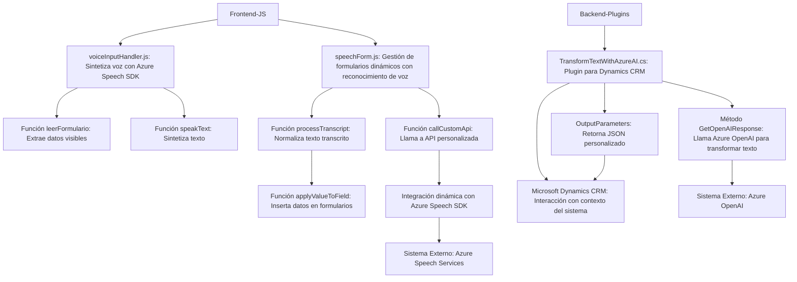

### Breve resumen técnico

El repositorio contiene diversos componentes que implementan la integración con **Azure Speech SDK**, **Azure OpenAI**, y APIs de **Microsoft Dynamics CRM**. Está diseñado para procesar y transformar datos en escenarios de interacción con formularios dinámicos y gestión de voz en aplicaciones web basadas en **JavaScript** y complementos de CRM.

---

### Descripción de arquitectura

La solución opera como un sistema híbrido que combina un **frontend** y componentes de procesamiento backend para Microsoft Dynamics CRM. Las partes analizadas indican el uso de una arquitectura **modular y orientada a servicios**, con el enfoque de un sistema **n capas** aplicado tanto en el cliente web como en el backend CRM, pero con principios cercanos a la **arquitectura hexagonal** por la fuerte integración de dependencias externas (Azure Speech SDK y Azure OpenAI). Además, la integración con SDKs y APIs externas apunta también a características de **arquitectura orientada a servicios (SOA)**.

---

### Tecnologías utilizadas

**Frontend**
1. **Lenguaje principal**: JavaScript.
2. **Frameworks/Librerías**:  
   - Azure Speech SDK: Para reconocimiento y síntesis de voz en tiempo real.
   - Asynchronous programming (`async/await`): Gestión de operaciones remotas.
   - Xrm.WebApi.online: Conexión con las APIs de Dynamics CRM.

**Backend (Plugins)**
1. **Lenguaje principal**: C#.
2. **Frameworks/Librerías:**  
   - `Microsoft.Xrm.Sdk`: Framework de Microsoft Dynamics CRM.  
   - `Newtonsoft.Json.Linq` y `System.Text.Json`: Procesamiento de JSON.  
   - `System.Net.Http`: Integración con APIs REST.  

**Externo**
1. **Integración de API**:  
   - Azure OpenAI Service: Transformación dinámica del texto en estructuras definidas (JSON).  
   - Azure Speech SDK: Reconocimiento y síntesis de voz.  

**Patrones utilizados**
1. **Modularización**: Decoupling lógico del código en funciones específicas.  
2. **Delegación**: Distribución en callbacks para cargar bibliotecas como Speech SDK.  
3. **Síncrono/Asíncrono**: El código se adapta a operaciones basadas en promesas y asincronía.  
4. **Service-Oriented Architecture (SOA)**: Consumo explícito de servicios externos (Azure Speech y OpenAI Services).  
5. **Plugin Architecture**: Extensión funcional de Dynamics CRM utilizando plugins C#.

---

### Diagrama Mermaid

---

### Conclusión final

La solución analizada combina **frontend** basado en **JavaScript** con integración de SDKs de Azure, y un **backend** extensible mediante **plugins de Dynamics CRM** en **C#**. Su arquitectura es modular y está diseñada para interactuar dinámicamente con formularios, ofreciendo funcionalidades avanzadas como reconocimiento de voz, síntesis de voz y transformación de texto con IA. La arquitectura híbrida, junto con la integración de servicios externos, reafirma los principios de SOA y el comienzo de una posible evolución hacia arquitecturas más hexagonales.