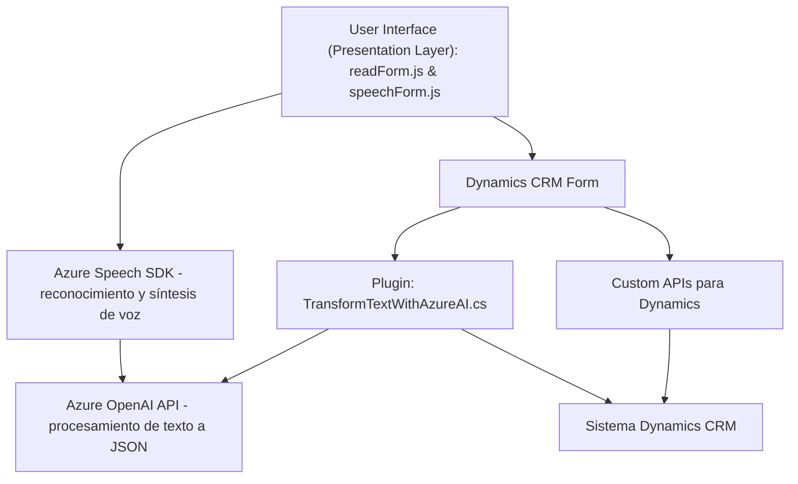

### Breve Resumen Técnico
Este repositorio contiene una solución que implementa la interacción con un formulario mediante voz y servicios cloud. Los archivos muestran una combinación de un frontend basado en JavaScript que integra servicios como Azure Speech SDK y el SDK de Dynamics 365, junto con un backend desarrollado en C# que utiliza Microsoft Dynamics CRM y Azure OpenAI. 

La solución utiliza herramientas de inteligencia artificial (AI) para comprender y transformar texto. Proporciona un sistema de interacción rica para formularios en Dynamics 365. La arquitectura está diseñada para ser modular con separación de responsabilidades.

---

### Descripción de Arquitectura
1. **Tipo de Solución**:  
   Esta solución consiste en dos elementos principales: 
   - Un **frontend** implementado en JavaScript: Maneja la entrada y salida de voz, permitiendo la interacción natural mediante comandos hablados. 
   - Un **backend** implementado como un **plugin**: Amplía las capacidades de Microsoft Dynamics CRM, integrado con Azure OpenAI para procesar y transformar texto a JSON estructurado.

2. **Patrones de Arquitectura**:  
   - **Plug-in Architecture**: Aplicado al archivo `TransformTextWithAzureAI.cs`, siguiendo las convenciones del SDK de Dynamics CRM.
   - **Modular Design**: Separación lógica de funcionalidad en módulos independientes, como procesamiento por voz, extracción de datos y transformación con AI. 
   - **Decoupling**: Uso de servicios externos (Azure Speech SDK, Azure OpenAI) mediante APIs para desacoplar funcionalidades específicas.
   - **MVC Pattern**: Evidente en el manejo de `formContext` en los archivos frontend, que actúan como el controlador de datos en el CRM.

3. **Arquitectura General**:  
   La solución puede categorizarse como una arquitectura de **n capas**, donde:
   - La capa de presentación está orientada a la interacción por voz con formularios.
   - La capa lógica aplica transformaciones mediante plugins y externaliza la funcionalidad complexa con Azure APIs. 
   - La capa de datos está representada por el CRM Dynamics 365 y otros servicios asociados.

---

### Tecnologías y Frameworks Usados
1. **Frontend**:
   - **JavaScript**: Lógica para el manejo del formulario y síntesis de voz.
   - **Dynamics CRM API**: Para la interacción y configuración del formulario en el contexto de Dynamics 365.
   - **Azure Speech SDK**: Reconocimiento y síntesis de voz.

2. **Backend**:
   - **Microsoft Dynamics CRM SDK (C#)**: Extensión mediante un plugin para interceptar eventos y manejar la interacción con datos del CRM.
   - **Azure OpenAI API**: Para transformar texto en formatos estructurados (como JSON) según reglas definidas.
   - **HttpClient**: Para realizar solicitudes HTTP hacia Azure APIs desde el backend.

3. **Otros**:
   - **Newtonsoft.Json.Linq** - Procesamiento de datos JSON.
   - **System.Text.Json** - Manejo de serialización y deserialización JSON.

---

### Dependencias o Componentes Externos
1. **Azure Speech SDK**:
   - Para reconocimiento de voz y síntesis de texto.
   - Requiere configuración de claves API y región.
2. **Azure OpenAI API**:
   - Para transformación avanzada de texto a JSON.
   - Depende de una suscripción activa y una clave de acceso.
3. **Microsoft Dynamics 365 SDK**:
   - Para manejo de formularios y lógica asociada a entidades y controladores.
4. **Custom APIs para Dynamics**:
   - APIs personalizadas conectadas a Dynamics para lógica específica del negocio (por ejemplo, búsqueda de datos en entidades).
5. **Librerías para procesamiento JSON**:
   - `Newtonsoft.Json.Linq` y `System.Text.Json` para manejar datos estructurados.

---

### Diagrama **Mermaid** Válido para GitHub Markdown

---

### Conclusión Final
Esta solución integra interacción por voz con formularios de **Microsoft Dynamics 365** mediante el **Azure Speech SDK** y un plugin backend complementado por **Azure OpenAI API**. La arquitectura modular de n capas brinda extensibilidad y desacoplamiento funcional, facilitando la adaptación para usuarios que requieran interacción natural y procesamiento avanzado en formularios.