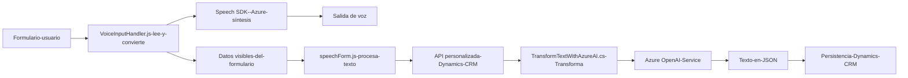

### Breve resumen técnico

El repositorio contiene archivos cuya funcionalidad central gira en torno a la integración entre la entrada de voz, visualización/formulario y procesamiento avanzado de texto mediante servicios externos como **Azure Speech SDK** y **Azure OpenAI**. Incluye componentes frontend orientados al cliente (JavaScript) y un backend (plugin de Dynamics CRM codificado en C#).

### Descripción de arquitectura

La arquitectura adoptada es **cliente-servidor con integración de servicios externos**, combinando:
1. **Frontend**: Modular y event-driven, interactuando con interfaces del usuario en Dynamics CRM.
2. **Backend**: Plugin en Dynamics CRM diseñado como middleware para transformar datos mediante Azure OpenAI.

Claramente, el sistema presenta una **arquitectura n capas**:
1. **Capa de presentación**: JS interactúa directamente con los formularios visibles.
2. **Capa de lógica y eventos**: JS contiene procesamiento en el cliente (transcripción, síntesis, reglas locales).
3. **Capa de APIs/servicios externos**: Invocación de Azure Speech SDK y Azure OpenAI Service.
4. **Capa de persistencia/formularios**: Integrada mediante Dynamics CRM y actualización de datos.

### Tecnologías utilizadas

#### Frontend:
- **JavaScript** para lógica cliente.
- **Azure Speech SDK** para la entrada y síntesis de voz.
- **Dynamics CRM** (acceso a `formContext`, objetos visibles del formulario).

#### Backend:
- **C#** para el desarrollo del plugin.
- **Azure OpenAI Service** para operaciones avanzadas de procesamiento de texto.
- **System.Net.Http** y **Newtonsoft.Json.Linq** en la interacción API.
  
#### Patrones:
- **Event-driven programming** para asincronía y callbacks.
- **Modular design** para funciones aisladas y mantenibles.
- **Integration pattern** con servicios externos vía REST APIs.

### Diagrama Mermaid

### Conclusión final

El sistema utiliza una arquitectura **n capas**, integrando servicios avanzados de Azure para implementar funcionalidades de entrada de voz y procesamiento de texto. Es ideal como componente para aplicaciones empresariales en Dynamics CRM. Sin embargo, sería beneficioso externalizar parámetros sensibles (API keys, endpoints) y realizar refactorización para simplificar lógica redundante.