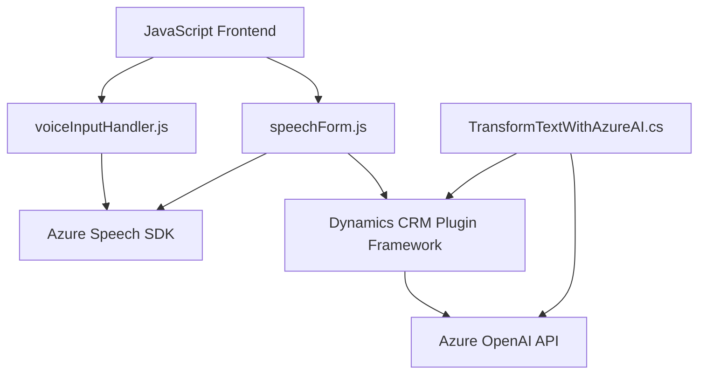

### Breve resumen técnico

El repositorio contiene un sistema orientado a **Dynamics CRM** que integra tecnologías como **Azure Speech SDK** y **Azure OpenAI API** para mejorar la interacción entre usuarios y formularios de la plataforma. Se trata de una solución híbrida con componentes **frontend** en JavaScript para la interfaz de usuario y **backend (plugins)** basados en C# para la lógica del sistema y el consumo de servicios externos.

---

### Descripción de arquitectura

La solución presenta una arquitectura basada en **n capas**, donde cada componente está separado por su funcionalidad:

1. **Frontend (JavaScript)**:
   - Enfocado en el cliente, permite procesamiento y gestión de datos del formulario, además de soportar reconocimiento de voz y síntesis de texto a voz.
   - Interactúa directamente con APIs como Azure Speech SDK y utiliza funciones personalizadas.

2. **Backend (Plugins en C#)**:
   - Basado en Dynamics CRM, implementa plugins específicos para transformar datos ingresados usando **Azure OpenAI API** y reglas predeterminadas.
   - Encapsula la lógica de negocio al interactuar con APIs externas y proporcionar respuestas formateadas en JSON.

3. **Servicios Externos**:
   - Incluye integración con **Azure Speech SDK** para voz y **Azure OpenAI API** para procesamiento de texto inteligente mediante IA.

Por lo tanto, el diseño arquitectónico combina características de **n capas** y una **orientación a servicios externos** mediante API para enriquecer la experiencia en Dynamics CRM.

---

### Tecnologías usadas

1. **Frontend**:
   - Lenguaje: **JavaScript**.
   - Frameworks: Depende de Dynamics CRM/XRM JavaScript Framework (e.g., `executionContext`).
   - Servicio Externo: **Azure Speech SDK** para procesamiento de voz.

2. **Backend**:
   - Lenguaje: **C#**.
   - Frameworks: **Dynamics CRM SDK** (`Microsoft.Xrm.Sdk`) para desarrollo de plugins.
   - Servicio Externo: **Azure OpenAI API** (GPT, texto inteligente).

3. **Dependencias Comunes**:
   - **System.Text.Json** y **Newtonsoft.Json**: Manejo avanzado de estructuración JSON.
   - **System.Net.Http**: Comunicación HTTP con APIs externas.

4. **Patrones de diseño**:
   - **Modelo plugin** para integración de Dynamics CRM.
   - **Encadenamiento funcional** para el flujo de procesamiento (lectura → voz → actualización).
   - **Delegación reactiva** a través de callbacks en carga dinámica (`ensureSpeechSDKLoaded`).

---

### Diagrama Mermaid

---

### Conclusión Final

La solución es un **ecosistema híbrido** orientado a **Dynamics CRM**, que utiliza tecnologías modernas como **Azure Speech SDK** para reconocimiento y síntesis de voz y **Azure OpenAI API** para transformar texto utilizando inteligencia artificial. Presenta una arquitectura **n capas** donde las responsabilidades están claramente delimitadas: **frontend dinámico**, **backend de negocio** y **capas de integración con servicios externos**.

Esta elección arquitectónica es adecuada para lograr una mayor modularidad, flexibilidad y capacidad de escalar. Además, el diseño de plugins para Dynamics CRM asegura facilidad de extensión y adecuación al entorno corporativo. Sin embargo, existen factores que podrían mejorarse, como la implementación más avanzada de control de errores y optimización en la gestión de dependencias externas para reducir tiempos de respuesta.