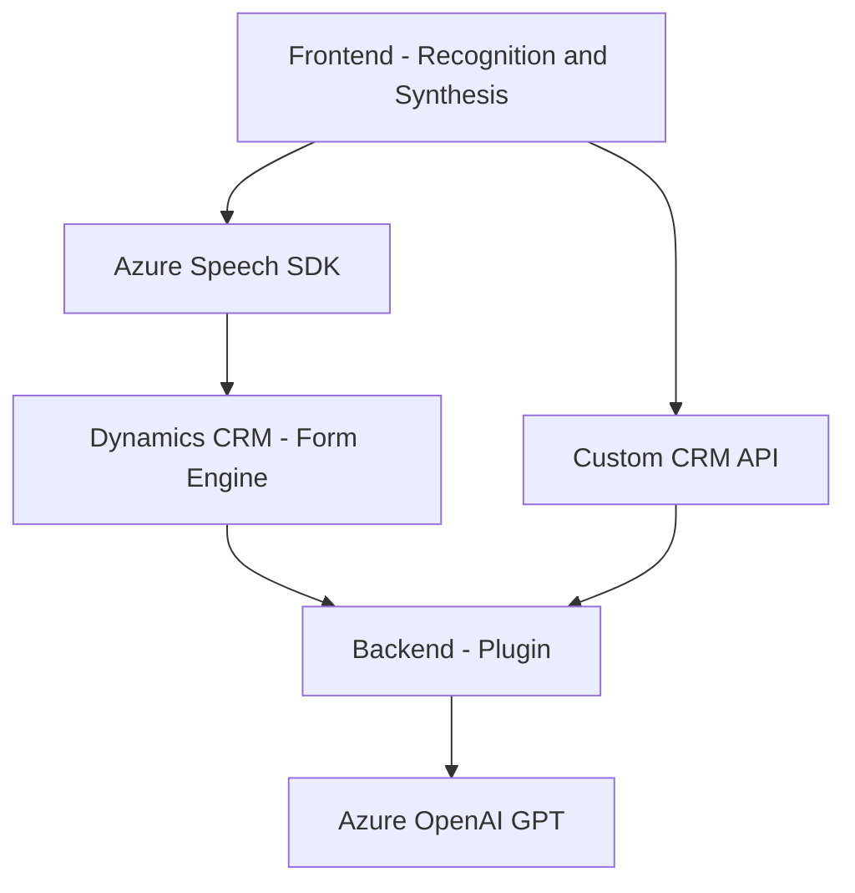

### Breve Resumen Técnico
El repositorio incluye múltiples archivos para una solución tecnológica que gestiona entradas de voz usando **Azure Speech SDK**, realiza transformaciones de texto con **Azure OpenAI GPT** y está integrado a **Microsoft Dynamics 365 CRM**. Los archivos abarcan tanto el frontend (JavaScript) como el backend (C#). La solución se centra en el reconocimiento de voz, procesamiento con IA y actualización dinámica de formularios.

---

### Descripción de la Arquitectura
La arquitectura empleada es híbrida:
1. **Frontend modular**: Se enfoca en procesar entradas de voz (captura y síntesis) y enviar datos a un sistema en la nube.
2. **Backend basado en plugins**: Amplía las capacidades de Dynamics 365 CRM mediante un plugin que interactúa con Azure OpenAI GPT para procesar texto.
3. **Event-driven**: La comunicación con APIs externas y SDK se basa en eventos y callbacks.
4. **Servicios externos desacoplados**: Utilización de servicios como Azure Speech SDK y OpenAI GPT en Azure como microservicios externos.

---

### Tecnologías Usadas
1. **Frontend (JavaScript)**:
   - **Azure Speech SDK** para manejo de voz (input/output).
   - **Dynamics 365 CRM APIs** (`Xrm.WebApi.online.execute` y `Xrm.WebApi.retrieveMultipleRecords`).
   - Comunicación asincrónica mediante `Promise` y `async/await`.

2. **Backend (C#)**:
   - **Microsoft Dynamics CRM Plugin Framework**: Para extender funcionalidades mediante `IPlugin`.
   - **Azure OpenAI GPT API**: Para transformación de texto asistida por IA.
   - Serialización de JSON con `System.Text.Json` y `Newtonsoft.Json`.

3. **APIs externas**:
   - Azure Speech SDK para reconocimiento y síntesis de voz.
   - Azure OpenAI GPT para generación de contenido estructurado (JSON).

---

### Diagrama **Mermaid**

---

### Conclusión Final
El repositorio define una arquitectura orientada a integrar capacidades avanzadas de IA (Azure Speech y OpenAI GPT) con Microsoft Dynamics 365 CRM, optimizando la gestión de formularios mediante reconocimiento de voz, transcripción, y actualizaciones automáticas. La implementación utiliza una combinación de **patrones de diseño** (Facade, Command y Event-driven) y microservicios para escalabilidad y desacoplamiento. Sin embargo, podrían mejorarse aspectos como la seguridad (uso de Key Vault para acceder a claves API) y validación robusta de datos.