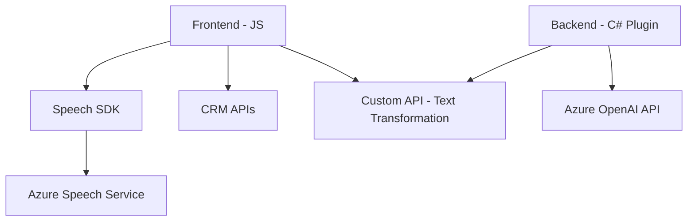

### Resumen técnico

El repositorio contiene archivos que implementan tecnologías relacionadas con interacción de voz (speech-to-text y text-to-speech), manejo de datos de formularios, y transformación de texto con inteligencia artificial utilizando **Azure Speech SDK** y **Azure OpenAI**. Los componentes están diseñados para interactuar con formularios y un entorno Dynamics CRM personalizado. El enfoque está orientado hacia una integración clara entre los servicios externos y la lógica del cliente.

---

### Descripción de arquitectura

1. La solución combina **Frontend** en JavaScript con **BackOffice** en forma de plugins para Dynamics CRM. Esto implica una arquitectura basada en "cliente API-servicio" donde el cliente (navegador) interactúa directamente con APIs externas y CRM.
2. La solución utiliza patrones de arquitectura como:
   - **Modularización y Componentización**: Separación funcional de tareas en pequeños módulos en los archivos `JS` y backend.
   - **Patrón de Plugins**: Extiende Dynamics CRM mediante la interfaz `IPlugin` para integrar personalizaciones con servicios de Azure.
3. Aunque se encuentra fragmentada en múltiples archivos, corresponde a una arquitectura de **n capas** debido a la separación entre cliente (`readForm.js`, `speechForm.js`) y servicios backend (`TransformTextWithAzureAI.cs`).

---

### Tecnologías usadas

1. **Frontend (JS):**
   - **Azure Speech SDK**: Para reconocimiento de voz (speech-to-text) y síntesis de voz (text-to-speech).
   - **JavaScript ES6**: Modularización de funcionalidades.
   - **APIs del CRM (Xrm.WebApi)**: Para interacción directa con datos de formularios.

2. **Backend:**
   - **C#**:
     - **Microsoft Dynamics CRM SDK (`IPlugin`)**: Para extensiones personalizadas del CRM.
     - **Integration with Azure OpenAI**: HTTP API para transformación avanzada de texto usando modelos generativos.

3. **Servicios externos:**
   - Azure Speech SDK y Azure OpenAI API para procesamiento basado en IA.

---

### Dependencias o componentes externos presentes

1. **Azure Speech SDK**:
   - Cargado dinámicamente en frontend mediante un script externo (`https://aka.ms/csspeech/jsbrowserpackageraw`).
   - Para funciones de reconocimiento y síntesis de voz en español.
   
2. **Azure OpenAI API**:
   - Servicio RESTful usado en el backend para procesar texto y generar JSON con modelos de lenguaje.

3. **Microsoft Dynamics CRM (Xrm SDK)**:
   - Utilizado para integraciones con datos empresariales en formularios.

4. **Librerías adicionales**:
   - `Newtonsoft.Json` y `System.Text.Json` para manejo avanzado de JSON en C#.

---

### Diagrama **Mermaid**

---

### Conclusión final

La solución presentada implementa una estructura distribuida, orientada hacia la integración de servicios en la nube (Azure) mediante programación modular y dinámicas de procesamiento en tiempo real. Es adecuada para aplicaciones empresariales que requieren interacciones de voz y manejo de datos con formularios en un sistema CRM. Aunque la arquitectura combina múltiples capas, es relativamente sencilla y bien integrada, facilitando futuras extensiones como nuevas funciones basadas en IA.