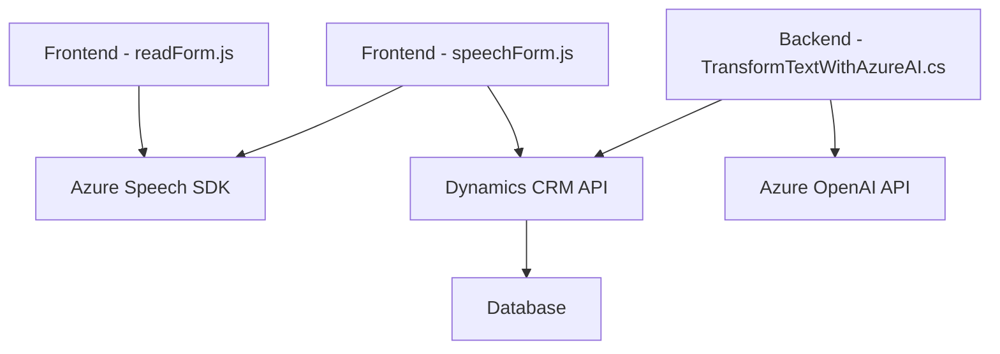

### Breve resumen técnico

El repositorio analizado es una solución tecnológica que parece integrarse dentro de Microsoft Dynamics CRM y utiliza herramientas de **Azure Speech SDK** y **Azure OpenAI API**. La solución tiene tres principales componentes:

1. **Frontend (JavaScript)**: Relacionado con manejar la entrada por voz y sintetizar texto en voz. 
2. **Backend / Plugin (C#)**: Implementa un plugin extendido del CRM para procesar texto dinámicamente con Azure OpenAI y transformar datos en formato estructurado.
3. **Integración**: Dependencias externas a servicios SaaS como Azure Speech SDK, Dynamics CRM APIs y Azure OpenAI API.

---

### Descripción de arquitectura

La arquitectura es híbrida que combina elementos de multi-capa y microservicios:

1. **Multi-capa**:
   - `Frontend` basado en **JavaScript** permite reconocer voz, generar texto y actualizar formularios.
   - `Backend` basado en un plugin **C#** implementado en Dynamics CRM complementa las funcionalidades de procesamiento más complejo mediante Azure OpenAI API.

2. **Arquitectura event-driven**:
   - Uso intensivo de eventos y callbacks para procesos como carga del SDK dinámico y ejecución de APIs.

3. **Uso de servicios SaaS**:
   - La solución se basa en componentes externos, como el **Azure Speech SDK** y **Azure OpenAI API**.

Aunque el proyecto muestra elementos de modularidad, no implementa una arquitectura desacoplada como la **hexagonal**. La fuerte dependencia del contexto de Dynamics CRM y los SDK externos sugiere una integración directa entre capas.

---

### Tecnologías usadas

1. **Frontend (JavaScript)**:
   - Tecnología principal: **JavaScript (ES6+)**
   - Integración con Microsoft Dynamics CRM (probablemente mediante su API de formularios y `Xrm.WebApi`).
   - Uso del **Azure Speech SDK** para reconocimiento y síntesis de voz.
   - Seguimiento de patrones como módulos y separación de responsabilidades.

2. **Backend (C#)**:
   - Plataforma base: **Microsoft Dynamics CRM**
   - Framework utilizado: **.NET Framework/Core**
   - Servicio externo: **Azure OpenAI API**
   - Manipulación JSON: `System.Text.Json` y `Newtonsoft.Json.Linq`.
   - Uso de interfaces (`IPlugin`) para la extensión de Dynamics CRM con plugins.

3. **Servicios Externos (dependencias)**:
   - **Azure Speech SDK**: Reconocimiento y síntesis de voz.
   - **Azure OpenAI API**: Procesamiento de datos basado en inteligencia artificial.

---

### Diagrama Mermaid válido para GitHub Markdown

---

### Conclusión final

Este repositorio parece ser parte de una solución destinada a extender la funcionalidad de Dynamics CRM utilizando **procesamiento de voz** y **transformación de texto con AI**. Observamos una integración robusta con servicios SaaS como Azure Speech SDK y OpenAI API, además de modularidad en el diseño de frontend y plugins. 

Sin embargo, la arquitectura tiene un fuerte acoplamiento al contexto de Dynamics CRM, lo que implica que esta solución sería difícil de portar o usar en sistemas independientes. Por otro lado, al centrarse en el uso de eventos y servicios distribuidos, tiene características que podrían evolucionar hacia una arquitectura más flexible, como los microservicios.